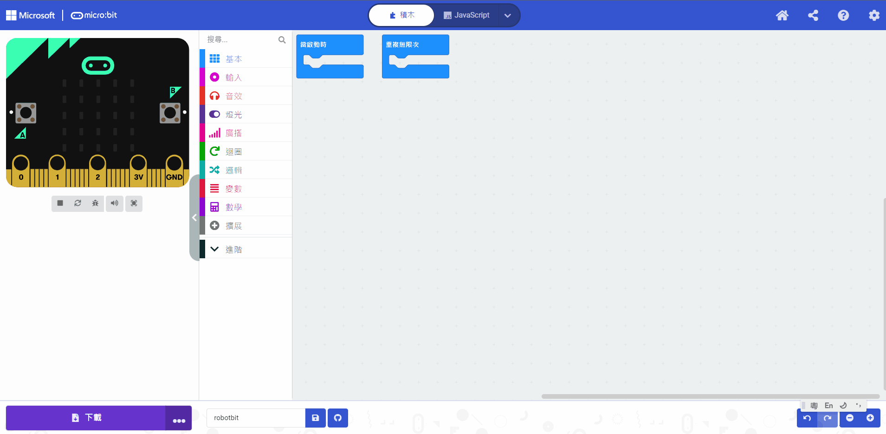

# Sugar 雷射模組

這是一個雷射模組，啟動時會發出紅色的雷射光點，適合作雷射筆或逗貓之用。

## 產品參數

## 產品接線

## 編程教學

# MakeCode編程教學

### 加載Sugar插件：

### 在擴展頁直接搜尋sugar (sugar已經過微軟認證，可以直接搜尋)

### 你亦可以用插件地址搜尋

Sugar插件：https://github.com/KittenBot/pxt-sugar

### [詳細方法](../../Makecode/powerBrickMC)