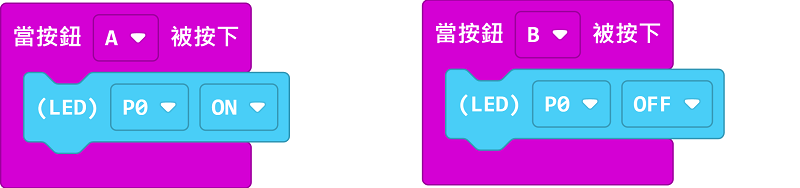

# Sugar LED模組

這是一粒LED模組。背後亦設有塑膠積木孔，可以完美配搭塑膠積木使用。

## 產品參數

- 尺寸：24 x 24 x 23 mm
- 重量：5.6g
- 訊號：1為點亮，0為熄滅

## 產品接線

用3Pin 連接線將模組與Robotbit Edu連接起來。

## 編程教學

## MakeCode編程教學

### 加載PowerBrick插件：https://github.com/KittenBot/pxt-sugar

### [詳細方法](../../Makecode/powerBrickMC)

[參考程式](https://makecode.microbit.org/_Ap5FxKHA6EPj)

### Kittenblock 編程教學

### MicroPython 編程教學

    LED(pin)
    state(sta)

- state(sta): 1為點亮，0為熄滅

參考程式

    from sugar import *
    import time
    
    # P0、P1、P2、P3、P8、P13、P14、P15、P16
    led = LED('P1')

    led.state(1)
    time.sleep(1)
    led.state(0)
    time.sleep(1)

---

    brightness(val)

brightness(val): 亮度百分比，0~100

參考程式

    from sugar import *
    import time

    # P0、P1、P2、P3、P8、P13、P14、P15、P16
    led = LED('P1')
    
    for i in range(100):
        led.brightness(i)
        time.sleep_ms(5) # 改变延时可改变呼吸速率
    for i in range(100, -1, -1):
        led.brightness(i)
        time.sleep_ms(5)