# Sugar Lens

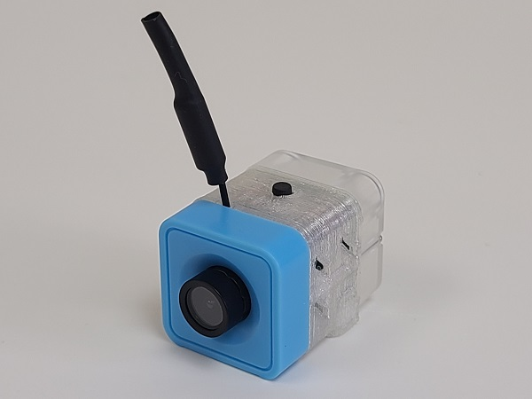

Sugar Lens是Sugar感應器系列入面的FPV鏡頭模組，配合接收器可以達到即時圖傳的效果。Sugar Lens可以配合頭戴式顯示器、便攜式顯示器或接收器在電話或電腦上顯示影像，做到即時影像顯示的功能。在模組背後和下方更有兼容塑膠積木的插孔，方便融合到各種機器人。透過編程，可以控制鏡頭的開關。

## 產品參數

- 尺寸：24 x 24 x 32 mm
- 重量：11g
- 接口：3Pin
- 頻率：5300MHz~5900MHz
- 頻道：40條
- 支援接收器：頭戴式顯示器、便攜顯示屏、手機／電腦接收器

## 產品展示

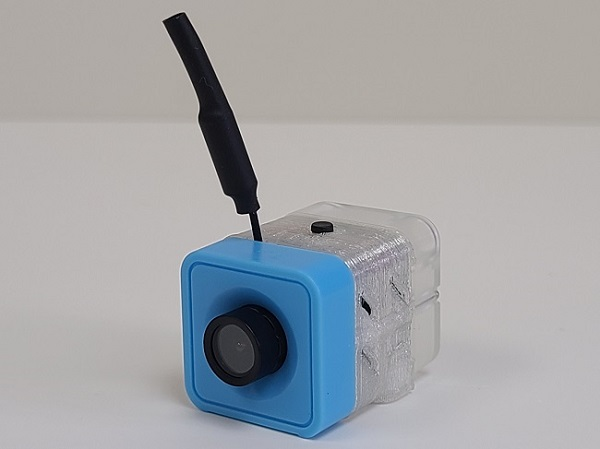

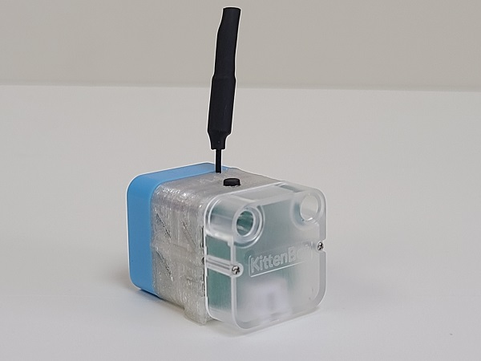

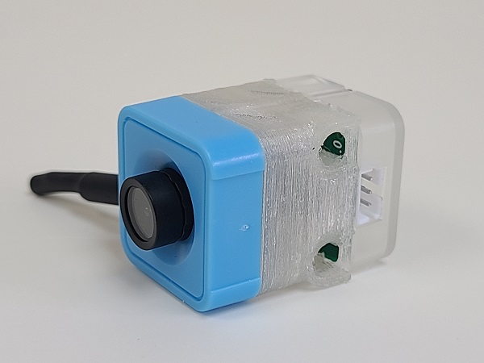

## 產品接線

用3Pin 連接線將模組與Robotbit Edu連接起來。

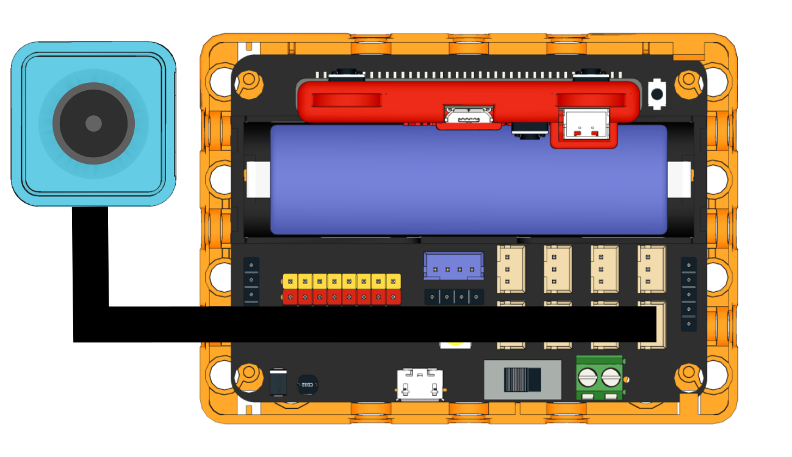

## MakeCode編程教學

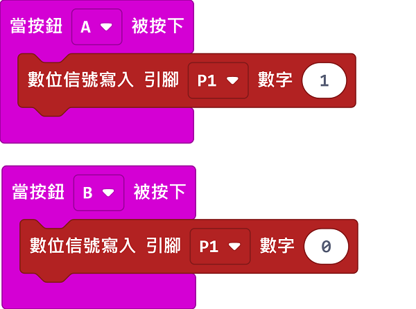

用數位寫入就可以控制鏡頭的開關。

[參考程式](https://makecode.microbit.org/_MoR9hkbRjLsh)

## 操作教學

Sugar Lens的頂部有一粒黑色按鍵，這個按鍵可以設置鏡頭的頻道設定。

### 1. 一般運作時，鏡頭會亮起紅燈及藍燈。

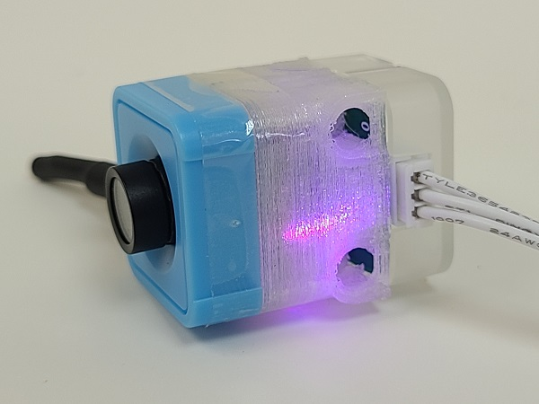

### 2. 長按按鍵，鏡頭就會進入設定模式。

### 3. 紅燈閃一下，代表正在設定小頻道。籃色燈閃的次數表示現時小頻道的數值(片段中閃了三下，代表小頻道為3)。輕按一下按鍵，改變小頻道(0至8)。

### 4. 再長按按鍵，紅燈閃兩下，代表正在設定大頻道。藍色燈閃的次數代表大頻道的數值(片段中閃一下，代表大頻道為A)。輕按一下按鍵，改變大頻道(A至E)。

### 5. 再長按按鍵，紅燈閃三下，代表正在設定影像方向(片段中閃一下，代表影像方向為正常)。輕按一下按鍵，改變影像方向(正常/上下倒轉)。

## 鏡頭接收器使用教學

Sugar Lens可以配合數款接收器使用，可以即時收看鏡頭的影像。

### 1. 頭戴式顯示器

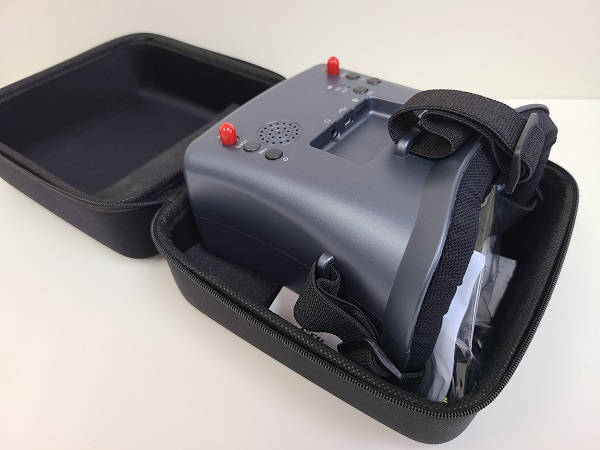

#### 產品參數

- 屏幕尺寸：4.3寸
- 解像度：800*480
- 接口：USB充電口
- 續航時間：2小時
- 功能：可自動搜台，畫面錄影，可調節亮度對比度，影像輸出(三色線)

### 使用教學

#### 將接收天線安裝好

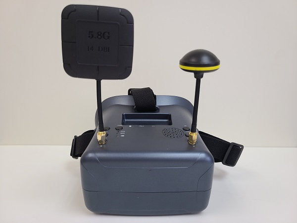

#### 打開頭戴式顯示屏的電源

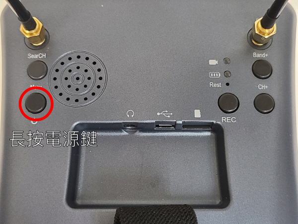

#### 輕按一下SearCH按鍵，自動搜尋頻道

#### 按一下REC按鍵開始錄影，再按一下停止錄影。(需要SD Card)

#### (進階使用方法) 按Band+按鍵切換大頻道

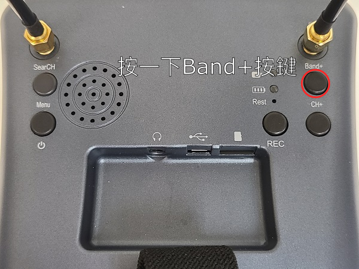

#### (進階使用方法) 按CH+按鍵切換小頻道

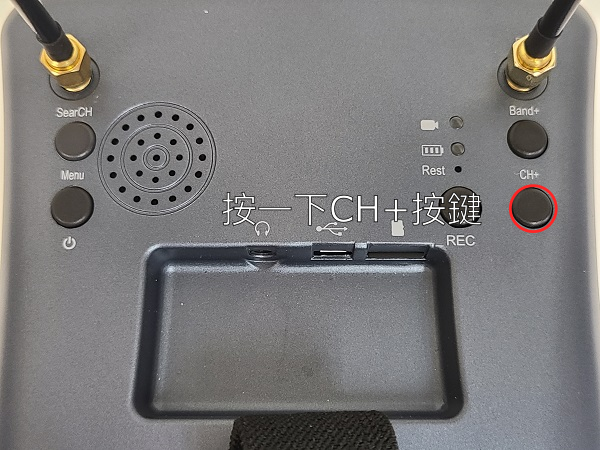

#### (進階使用方法) 按一下菜單鍵進入選項菜單

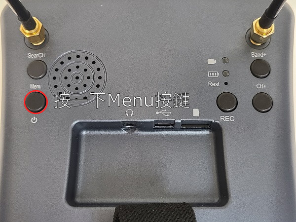

### 2. 便攜顯示屏

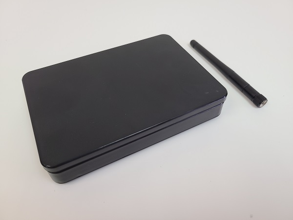

#### 產品參數

- 屏幕尺寸：5寸
- 解像度：800*480
- 接口：USB充電口
- 續航時間：2小時
- 功能：可自動搜台，可調節亮度對比度，影像輸出(三色線)

### 使用教學

#### 將接收天線安裝好

#### 打開顯示屏的電源

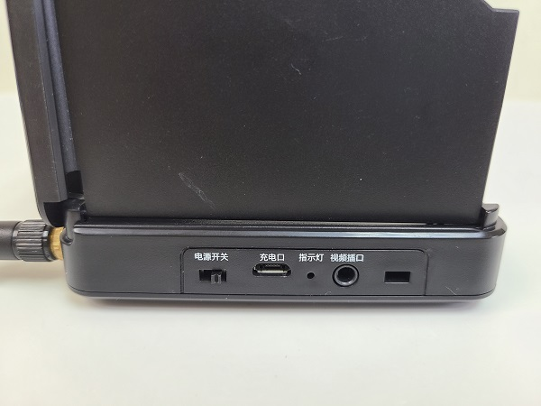

#### 輕點菜單鍵，自動搜尋頻道

#### (進階使用方法) 按-鍵切換大頻道

#### (進階使用方法) 按+鍵切換小頻道

#### (進階使用方法) 輕按菜單鍵進入選項菜單

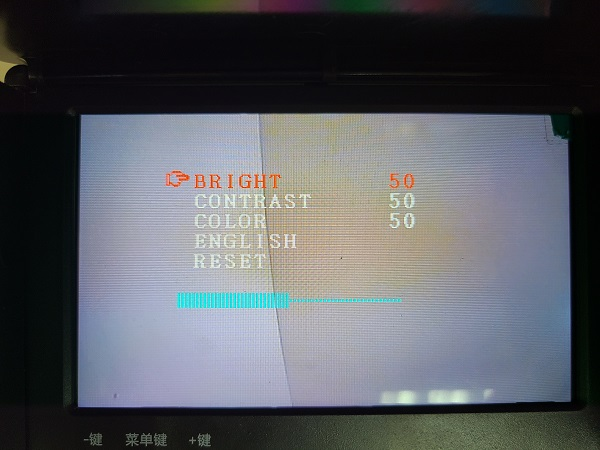

### 3. 手機/電腦接收器

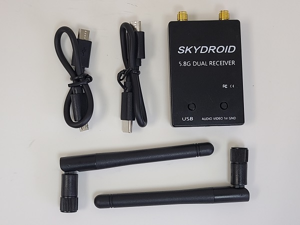

#### 產品參數

- 接口：USB
- 功能：在電腦上即時顯示影像，在Android手機上顯示影像

### 使用教學

#### 將雙天線連接到接收器

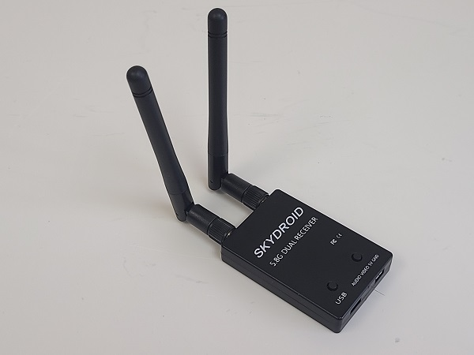

#### 長按左或右按鍵，自動搜尋頻道

#### 按左或右鍵調節頻率

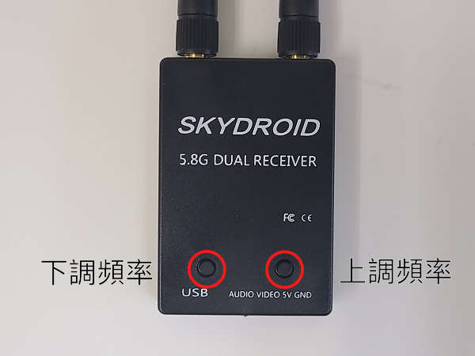

### 電腦使用教學

#### 使用USB連接線連接接收器與電腦

#### 在電腦上搜尋”相機”

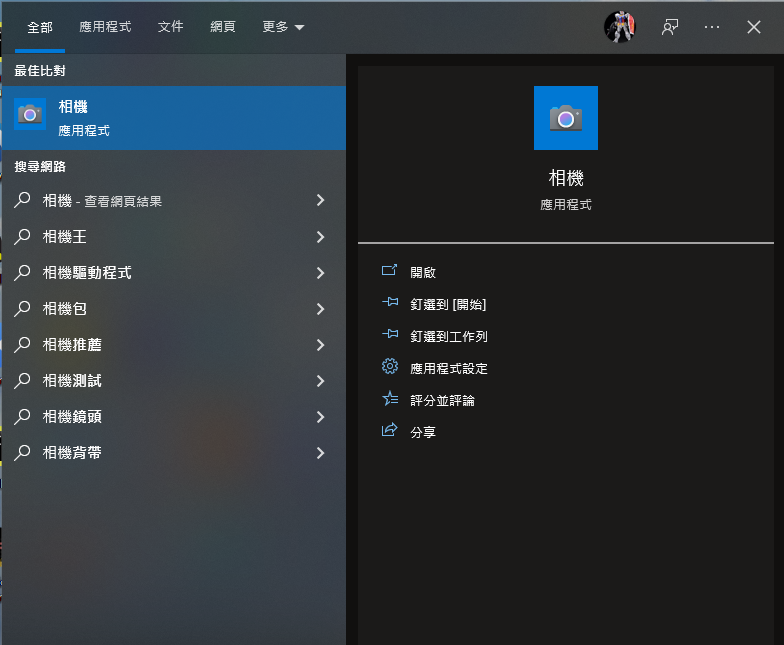

#### 假如你的電腦有網絡攝影機，你需要按切換鏡頭按鍵

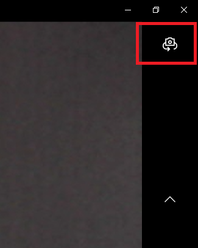

#### 畫面就會即時顯示出來

### 電話使用教學

#### 下載apk檔案

[下載apk(右鍵->另存連結為)](./images/fuav.apk)

#### 安裝apk

#### 使用USB連接線連接接收器與電話

#### 開啟Skydroid FPV應用程式

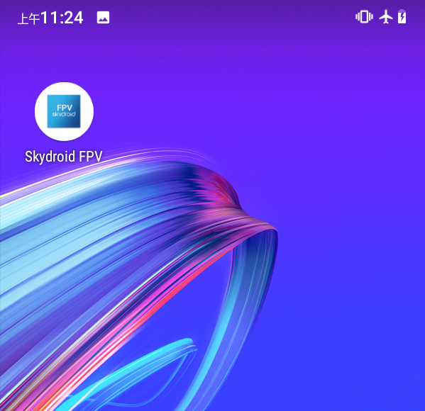

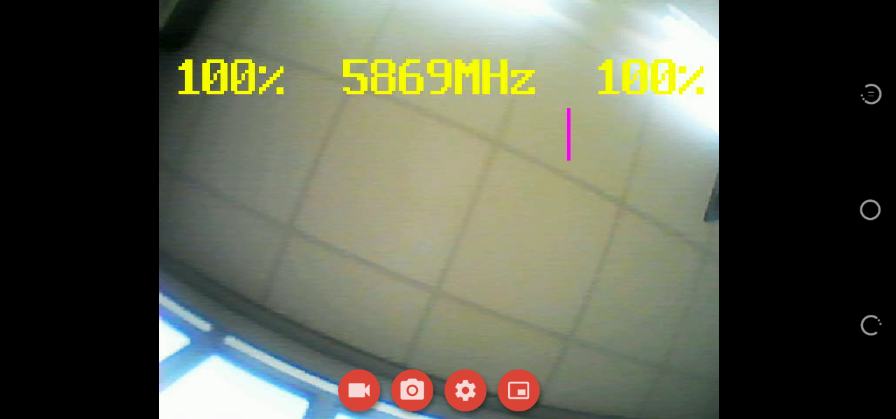