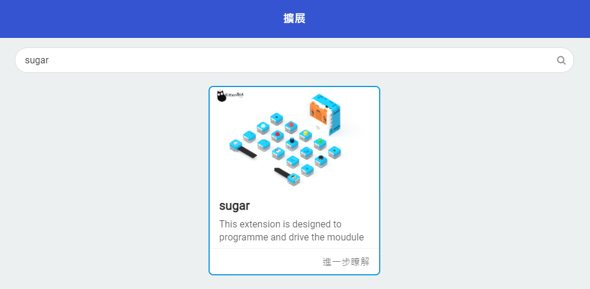

# Sugar Lens

Sugar Lens是Sugar感應器系列入面的FPV鏡頭模組，配合接收器可以達到即時圖傳的效果。

## 產品參數

## 產品接線

用3Pin 連接線將模組與Robotbit Edu連接起來。

## MakeCode編程教學

### 加載Sugar插件：

### 在擴展頁直接搜尋sugar (sugar已經過微軟認證，可以直接搜尋)

### 你亦可以用插件地址搜尋

Sugar插件：https://github.com/KittenBot/pxt-sugar

### [詳細方法](../../Makecode/powerBrickMC)

### Kittenblock 編程教學

### MicroPython 編程教學

