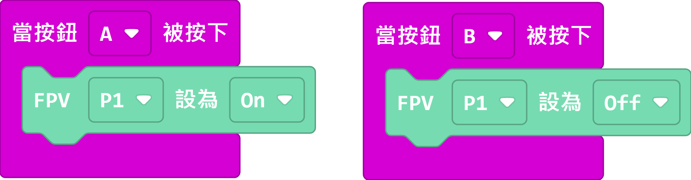

# Sugar Lens

Sugar Lens是Sugar感應器系列入面的FPV鏡頭模組，配合接收器可以達到即時圖傳的效果。Sugar Lens可以配合頭戴式顯示器、便攜式顯示器或接收器在電話或電腦上顯示影像，做到即時影像顯示的功能。在模組背後和下方更有兼容塑膠積木的插孔，方便融合到各種機器人。透過編程，可以控制鏡頭的開關。

## 產品參數

- 尺寸：24 x 24 x 32 mm
- 重量：11g
- 接口：3Pin
- 頻率：5300MHz~5900MHz
- 頻道：40條

## 產品展示

## 產品接線

用3Pin 連接線將模組與Robotbit Edu連接起來。

## 操作教學

Sugar Lens的頂部有一粒黑色按鍵，這個按鍵可以設置鏡頭的頻道設定。

### 1. 一般運作時，鏡頭會亮起紅燈及藍燈。

### 2. 長按按鍵，鏡頭就會進入設定模式。

### 3. 紅燈閃一下，代表正在設定小頻道。籃色燈閃的次數表示現時小頻道的數值(片段中閃了三下，代表小頻道為3)。輕按一下按鍵，改變小頻道(0至8)。

### 4. 再長按按鍵，紅燈閃兩下，代表正在設定大頻道。藍色燈閃的次數代表大頻道的數值(片段中閃一下，代表大頻道為A)。輕按一下按鍵，改變大頻道(A至E)。

### 5. 再長按按鍵，紅燈閃三下，代表正在設定影像方向(片段中閃一下，代表影像方向為正常)。輕按一下按鍵，改變影像方向(正常/上下倒轉)。

## MakeCode編程教學

用數位寫入就可以控制鏡頭的開關。

[參考程式](https://makecode.microbit.org/_MoR9hkbRjLsh)

