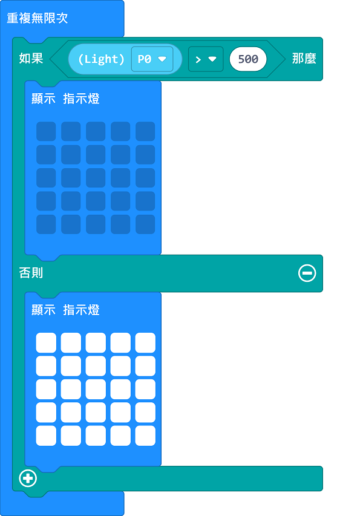

# Sugar 光敏感應模組

這是一隻光敏感應模組，可以檢測環境亮度。背後亦設有塑膠積木孔，可以完美配搭塑膠積木使用。

## 產品參數

- 尺寸：24 x 24 x 23 mm
- 重量：6.7g
- 訊號：模擬信號0~1023/0~4095

## 產品接線

用3Pin 連接線將模組與Robotbit Edu連接起來。

## 編程教學

## MakeCode編程教學

### 加載Sugar插件：https://github.com/KittenBot/pxt-sugar

### [詳細方法](../../Makecode/powerBrickMC)

[參考程式](https://makecode.microbit.org/_2fHAo4aYLTy0)

### Kittenblock 編程教學

### MicroPython 編程教學

    Light(pin)
    value()

- value(): 模擬信號0~1023/0~4095

參考程式

    from future import *
    
    from sugar import *
    
    light_P0 = Light('P0')
    
    x = 0
    
    screen.sync = 0
    while True:
      screen.fill((0, 0, 0))
      screen.text(light_P0.value(),5,10,2,(0, 119, 255))
      screen.refresh()

