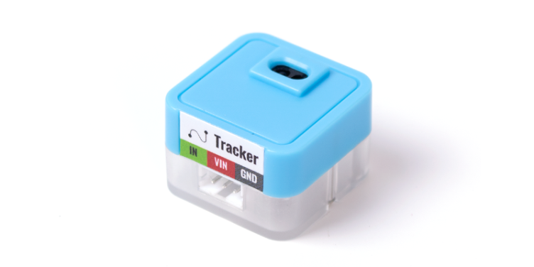
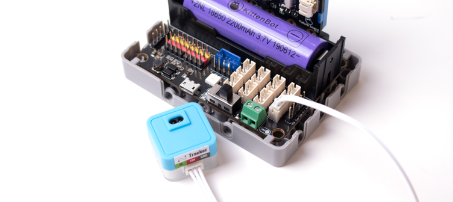
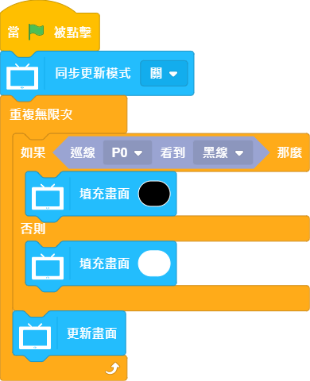

# Sugar 巡線模組

這是一隻紅外線巡線模組，主要用來檢測黑線。背後亦設有塑膠積木孔，可以完美配搭塑膠積木使用。

## 產品參數

- 尺寸：24 x 24 x 16 mm
- 重量：5g
- 訊號：檢測到黑線為1，否則為0
- 檢測距離：1~14mm

## 產品接線

用3Pin 連接線將模組與Robotbit Edu連接起來。

## 編程教學

### Kittenblock編程教學

### MicroPython編程教學

    Tracker(pin)
    value()

- value(): 檢測到黑線為1，否則為0

參考程式

    from future import *
    from sugar import *
    
    tracker = Tracker('P1')
    
    screen.sync = 0
    while True:
        if tracker.value() == 1:
            screen.fill(0)
        else:
            screen.fill(255)
        screen.refresh()