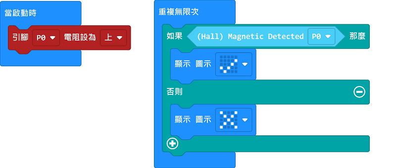

# Sugar 磁力感應模組

這是一隻磁力感應模組，可以感應附近是否有磁石。背後亦設有塑膠積木孔，可以完美配搭塑膠積木使用。

## 產品參數

- 尺寸：24 x 24 x 16 mm
- 重量：4.7g
- 訊號：有磁石時返回0，否則返回1

## 產品接線

用3Pin 連接線將模組與Robotbit Edu連接起來。

## 編程教學

## MakeCode編程教學

### 加載PowerBrick插件：https://github.com/KittenBot/pxt-sugar

### [詳細方法](../../Makecode/powerBrickMC)

[參考程式](https://makecode.microbit.org/_FkxHJCWpLTCk)

### Kittenblock 編程教學

### MicroPython編程教學

    Hall(pin)
    value()

- value(): 有磁石時返回0，否則返回1

參考程式

    from future import *
    from sugar import *
    
    hall = Hall('P1')
    
    while True:
        if hall.value():
            buzzer.tone(440, -1)
        else:
            buzzer.stop()