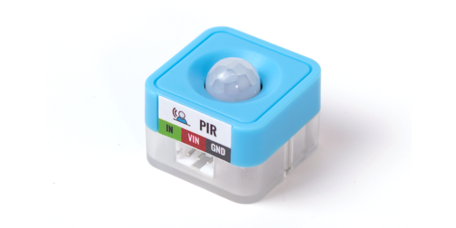
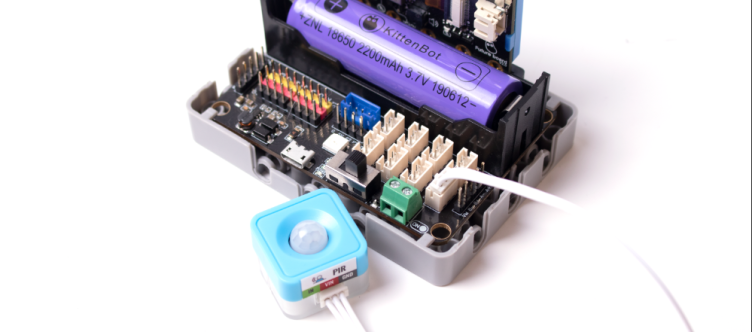
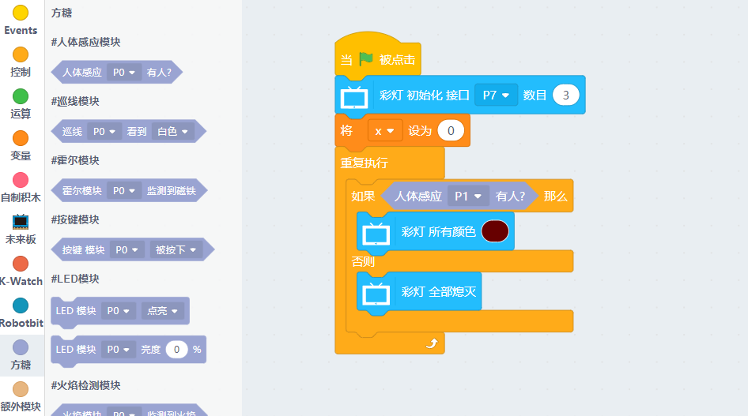

# Sugar 人體紅外感應模組

這是一隻人體紅外感應模組，可以感測附近是否有人走過。背後亦設有塑膠積木孔，可以完美配搭塑膠積木使用。

## 產品參數

- 尺寸：24 x 24 x 19 mm
- 重量：5.6g
- 訊號：有人靠近時返回0，否則返回1
- 感測距離：5m

## 產品接線

用3Pin 連接線將模組與Robotbit Edu連接起來。

## 編程教學

### Kittenblock編程教學

### Micropython 編程教學
    PIR(pin)
    value()

- value(): 有人靠近時返回0，否則返回1

參考程式

    from future import *
    from sugar import *
    
    pir = PIR('P1')
    
    neopix=NeoPixel("P7",3)
    
    while True:
        if pir.value():
            neopix.setColorAll((103, 0, 0))
        else:
            neopix.setColorAll((0,0,0))