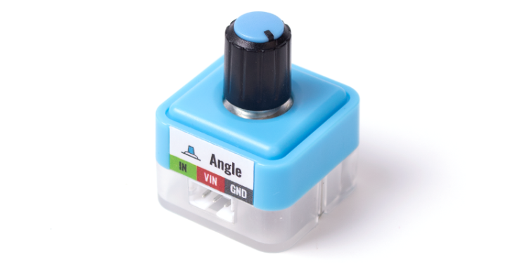
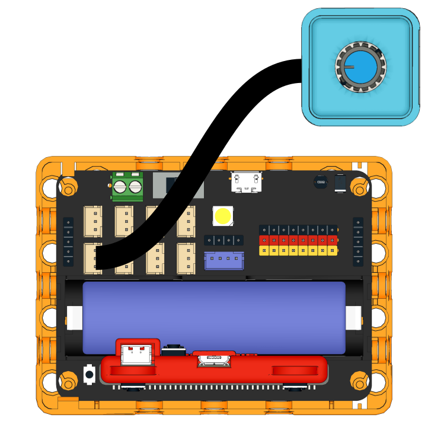
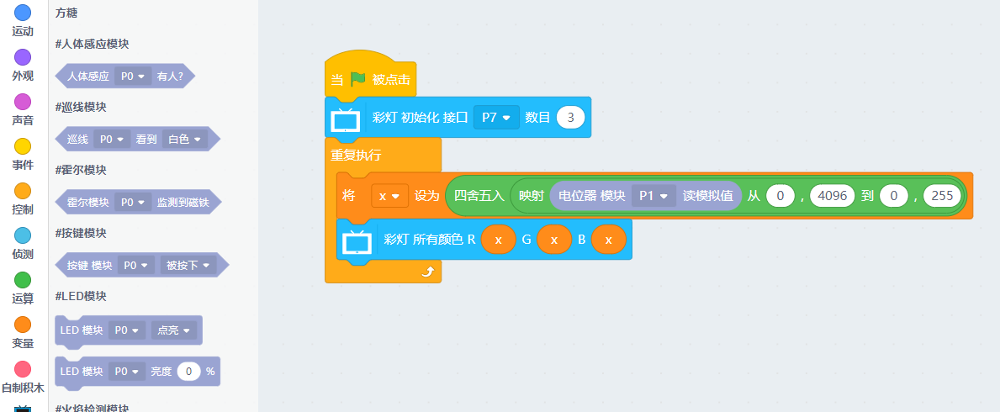

# Sugar 電位器模組

這是一隻電位器模組，可以檢測旋轉的角度。背後亦設有塑膠積木孔，可以完美配搭塑膠積木使用。

## 產品參數

- 尺寸：24 x 24 x 23 mm
- 重量：6.7g
- 訊號：模擬信號0~1023/0~4095
- 角度：270

## 產品接線

用3Pin 連接線將模組與Robotbit Edu連接起來。

## 編程教學

## MakeCode編程教學

### 加載Sugar插件：

### 在擴展頁直接搜尋sugar (sugar已經過微軟認證，可以直接搜尋)

### 你亦可以用插件地址搜尋

### 加載Sugar插件：

### 在擴展頁直接搜尋sugar (sugar已經過微軟認證，可以直接搜尋)

### 你亦可以用插件地址搜尋

Sugar插件：https://github.com/KittenBot/pxt-sugar

### [詳細方法](../../Makecode/powerBrickMC)

[參考程式](https://makecode.microbit.org/_EY328ibCD7oR)

### Kittenblock 編程教學

### MicroPython 編程教學

    Rotation(pin)
    value()

- value(): 模擬信號0~1023/0~4095

參考程式

    from future import *
    from sugar import *
    
    rotation = Rotation('P1')
    
    x = 0
    
    # 区间映射公式，不需要了解太详细，直接套用就可以了
    def valmap(x, in_min, in_max, out_min, out_max):
        return int((x-in_min) * (out_max-out_min) / (in_max-in_min) + out_min)
    
    neopix=NeoPixel("P7",3)
    while True:
        x = (round(valmap(rotation.value(), 0, 4096, 0, 255)))
        neopix.setColorAll((x,x,x))
