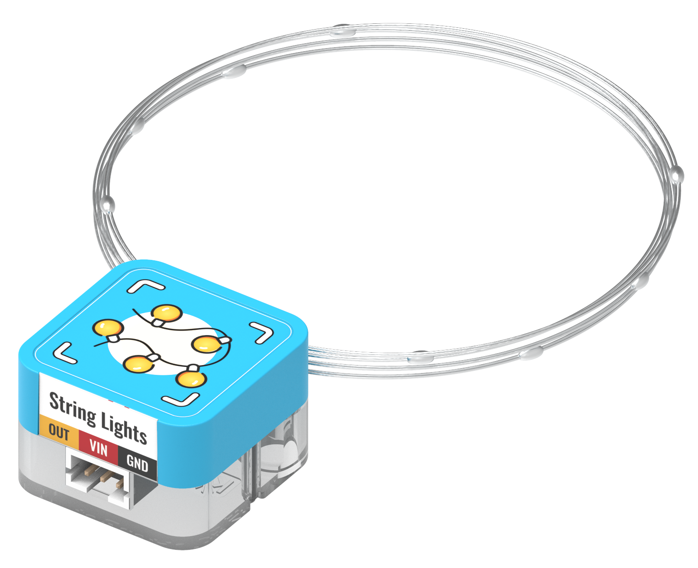
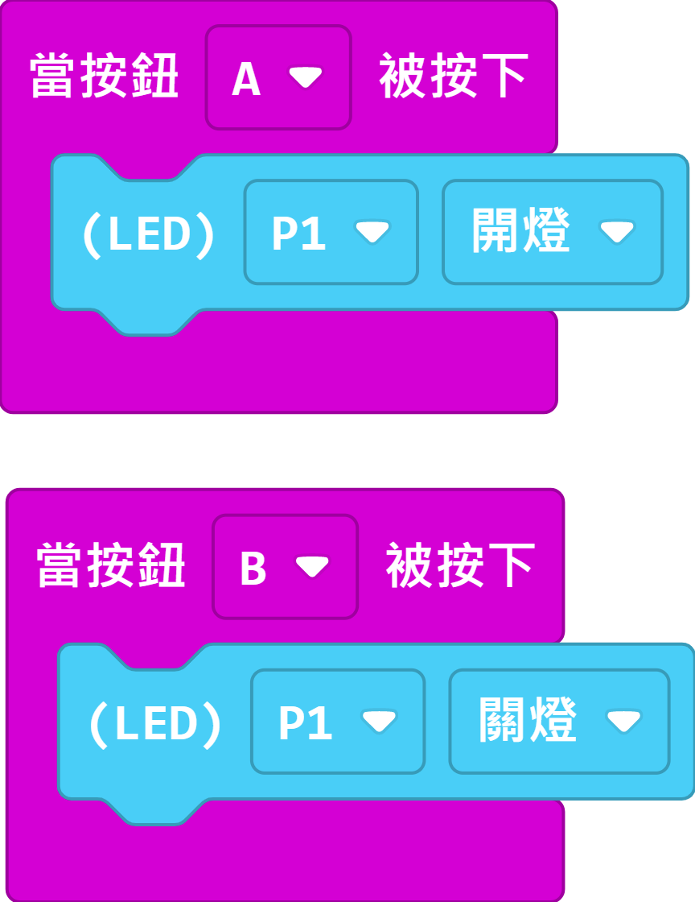

# Sugar二期 燈串模組

這是一個燈串模組，柔軟的電線容許將模組繫在各種物件上作裝飾之用。

## 產品參數

## 產品接線

用3Pin 連接線將模組與Robotbit Edu連接起來。

## 編程教學

### MakeCode編程教學

### 加載Sugar插件：

### 在擴展頁直接搜尋sugar (sugar已經過微軟認證，可以直接搜尋)

### 你亦可以用插件地址搜尋

Sugar插件：https://github.com/KittenBot/pxt-sugar

### [詳細方法](../../Makecode/powerBrickMC)

[參考程式](https://makecode.microbit.org/_VktUAwDdWcHD)
