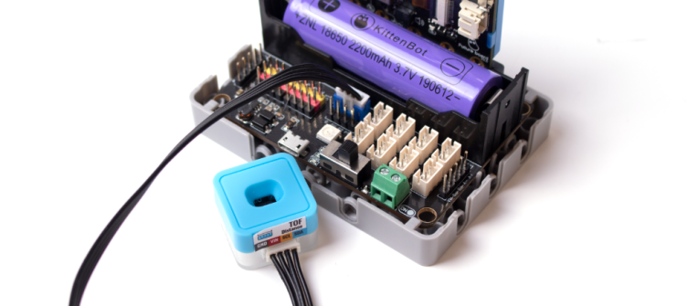

# Sugar 激光測距模組

這是一隻激光測距模組，可以檢測距離，比起超聲波測距，激光測距的精準度更加高。背後亦設有塑膠積木孔，可以完美配搭塑膠積木使用。

## 產品參數

- 尺寸：24 x 24 x 23 mm
- 重量：4.6g
    - 訊號：I2C
    - 距離: 20~1200mm

## 產品接線

用4Pin 連接線將模組連接到Robotbit Edu的藍色4Pin接口。

## 編程教學

### Kittenblock 編程教學

### MicroPython 編程教學
  
    TOFDistance()
    value()

- value(): 返回距離（20~1200mm）

參考程式

    from future import *
    from sugar import *
    
    distance = TOFDistance()
    screen.sync = 0
    
    while True:
        screen.fill((0, 0, 0))
        screen.text(str("distance ")+str(distance.value()),x = 5, y = 10)
        screen.refresh()