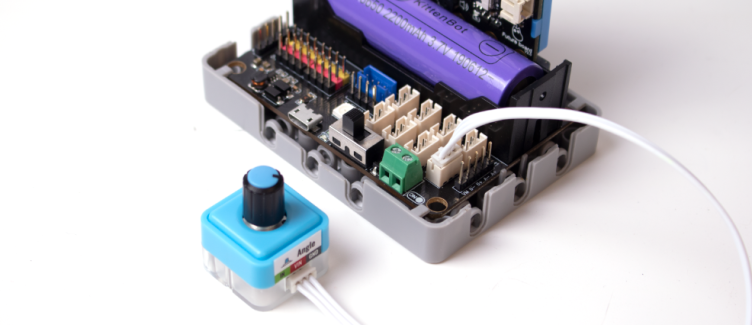

# Sugar 雨滴水位模組

這是一隻雨滴水位模組，可以檢測雨滴和水位。背後亦設有塑膠積木孔，可以完美配搭塑膠積木使用。

## 產品參數

- 尺寸：24 x 24 x 23 mm
- 重量：6.7g
- 訊號：模擬信號0~1023/0~4095

## 產品接線

用3Pin 連接線將模組與Robotbit Edu連接起來。

## 編程教學

### Kittenblock 編程教學

### MicroPython 編程教學

    WaterLevel(pin)
    value()

- value(): 模擬信號0~1023/0~4095

參考程式

    from future import *
    
    from sugar import *
    
    waterlevel_P0 = WaterLevel('P0')
    
    x = 0
    
    screen.sync = 0
    while True:
      screen.fill((0, 0, 0))
      screen.text(waterlevel_P0.value(),5,10,2,(0, 119, 255))
      screen.refresh()

