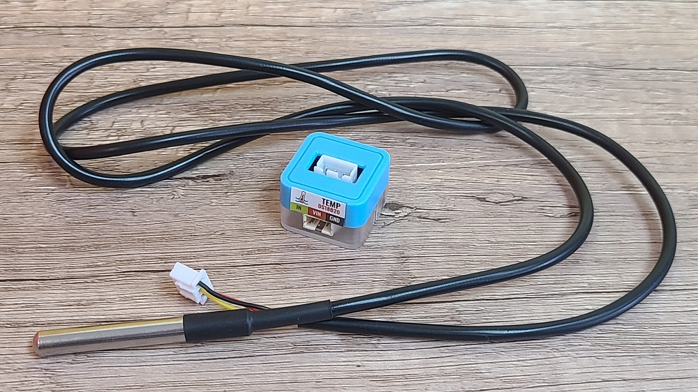

# Sugar 水溫模組

這是一個水溫模組，防水的溫度感應器可以探測得到水溫。

## 產品參數

## 產品接線

用3Pin 連接線將模組與Robotbit Edu連接起來。

## 編程教學

### MakeCode編程教學

### 加載Robotbit插件：

### 在擴展頁直接搜尋Robotbit (Robotbit已經過微軟認證，可以直接搜尋)

### 你亦可以用插件地址搜尋

Sugar插件：https://github.com/KittenBot/pxt-robotbit

### [詳細方法](../../Makecode/powerBrickMC)

[參考程式](https://makecode.microbit.org/_YMC0uoKHKfw4)