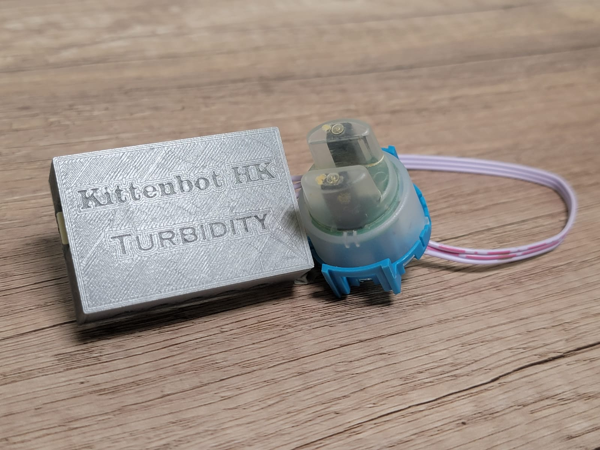
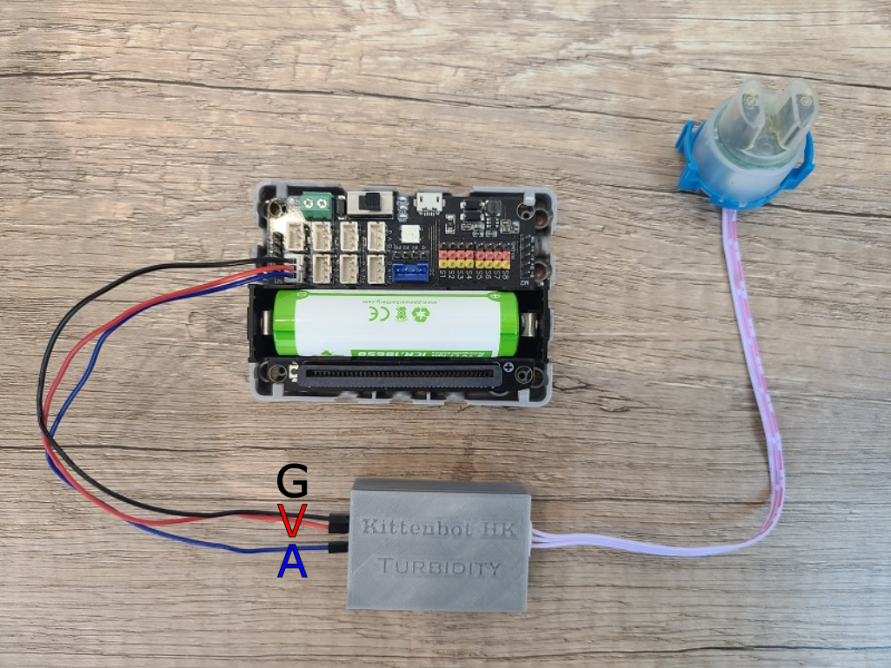
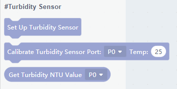
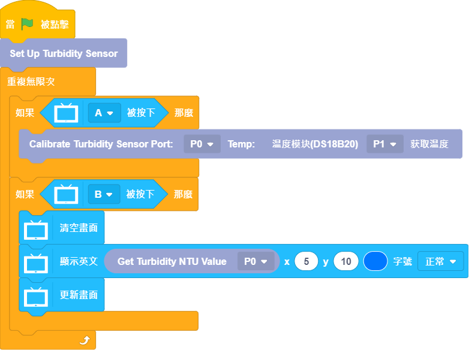
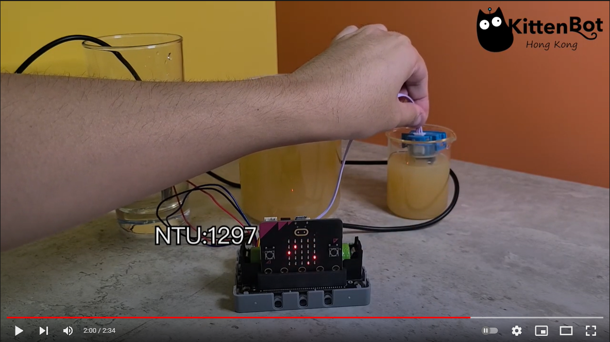
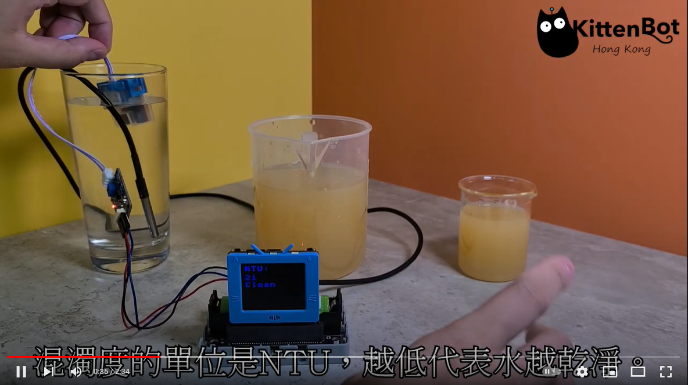

# 污水混濁度感應器

污水混濁度感應器可以感測水的混濁程度。

## 產品參數

- 工作電壓：3V~5V
- 接口：3pin防反插接口
- 工作溫度：5°C~85°C
- 重量：30g

## 接線教學

將感應器的A引腳接到Robotbit Edu的接口，將G和V接到電源。
    
    污水混濁度感應器需要類比訊號，如使用Micro:bit，請接到P0/P1/P2；如使用未來板，請接到P0/P1/P2/P12/P14/P15。
    污水混濁度感應器建議配合水溫感應器一同使用，以下圖表忽略去水溫感應器的接線，請自行參考有關教學。

## MakeCode 編程教學

### 在擴展頁直接搜尋Robotbit (Robotbit已經過微軟認證，可以直接搜尋)

### 感應器Plus插件：https://github.com/kittenbothk/pxt-SensorPlus

### [詳細方法](../Makecode/powerBrickMC)

### 污水混濁度感應器積木塊：

### 污水混濁度感應器編程

    污水混濁度感應器可以配合水溫感應器作校正使讀數更加準確。
    注意：濁度感應器的頂部沒有防水，請不要將感應器完全浸入水中。

[參考程式網址](https://makecode.microbit.org/_WjmH6zahVTUe)

### 插件版本與更新

插件可能會不定時推出更新，改進功能。亦有時候我們可能需要轉用舊版插件才可使用某些功能。

詳情請參考: [Makecode插件版本更換](../Makecode/makecode_extensionUpdate)

## 未來板KittenBlock編程教學

### 在硬件欄選擇『未來板』

### 污水混濁度感應器積木塊：

### 污水混濁度感應器編程

    污水混濁度感應器可以配合水溫感應器作校正使讀數更加準確。
    注意：濁度感應器的頂部沒有防水，請不要將感應器完全浸入水中。

## 示範短片

### Micro:bit

### 未來板

