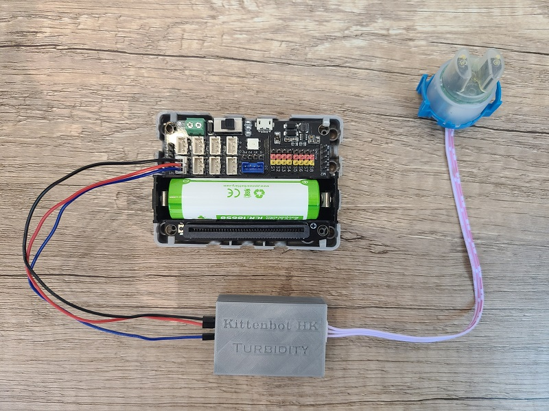
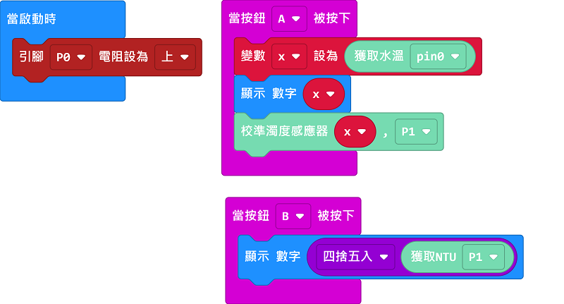

# 污水混濁度感應器

污水混濁度感應器可以感測水的混濁程度。

## 產品參數

- 工作電壓：3V~5V
- 接口：3pin防反插接口
- 工作溫度：5°C~85°C
- 重量：30g

## 接線教學

將感應器接口連接到Robotbit Edu的接口上面。

    污水混濁度感應器建議配合水溫感應器一同使用，以下圖表忽略去水溫感應器的接線，請自行參考有關教學。

## MakeCode 編程教學

### 加載污水混濁度感應器插件：https://github.com/kittenbothk/pxt-KittenTurbidity

### [詳細方法](../Makecode/powerBrickMC)

### 污水混濁度感應器積木塊：

### 污水混濁度感應器編程

    污水混濁度感應器可以配合水溫感應器作校正使讀數更加準確。
    注意：濁度感應器的頂部沒有防水，請不要將感應器完全浸入水中。

[參考程式網址](https://makecode.microbit.org/_WjmH6zahVTUe)

## 插件版本與更新

插件可能會不定時推出更新，改進功能。亦有時候我們可能需要轉用舊版插件才可使用某些功能。

詳情請參考: [Makecode插件版本更換](../../Makecode/makecode_extensionUpdate)