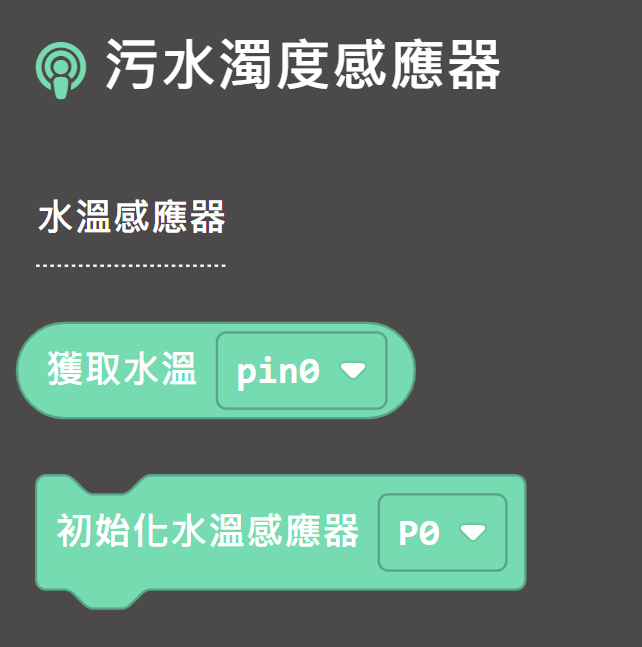

# 水溫感應器

使用水溫感應器可以測量水的溫度。

## 產品參數

- 感應器：DS18B20
- 工作電壓：3V~5V
- 接口：3pin防反插接口
- 測量範圍：-55°C~125°C

## 接線教學

將感應器接口連接到Robotbit Edu的接口上面。

## MakeCode 編程教學

### 加載水溫感應器插件：https://github.com/kittenbothk/pxt-KittenTurbidity

### [詳細方法](../Makecode/powerBrickMC)

### 水溫感應器積木塊：

### 水溫感應器編程

    使用水溫感應器必須將電阻設為上，否則會不能運作。
    V1.5和V1的Micro:bit暫時未支援水溫感應器，請見諒。

[參考程式網址](https://makecode.microbit.org/_CA4EcbK879x2)

## 插件版本與更新

插件可能會不定時推出更新，改進功能。亦有時候我們可能需要轉用舊版插件才可使用某些功能。

詳情請參考: [Makecode插件版本更換](../Makecode/makecode_extensionUpdate)

## KittenBlock 編程教學

### 加載未來板插件

### 水溫感應器積木塊：

### 水溫感應器編程

