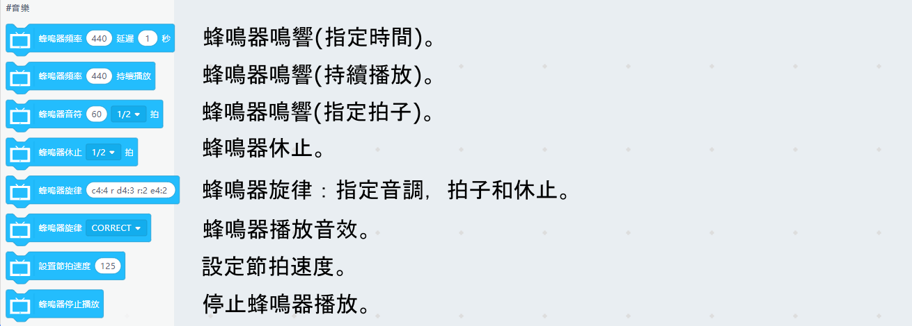
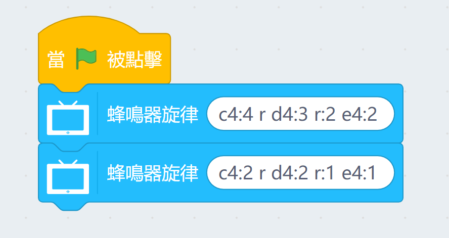
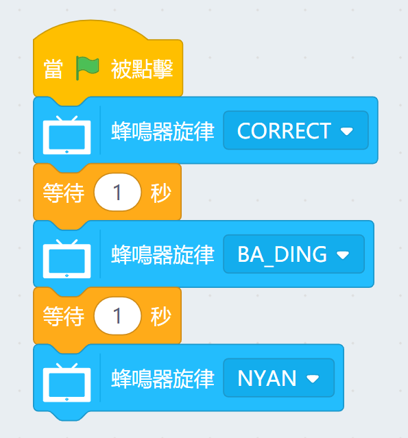
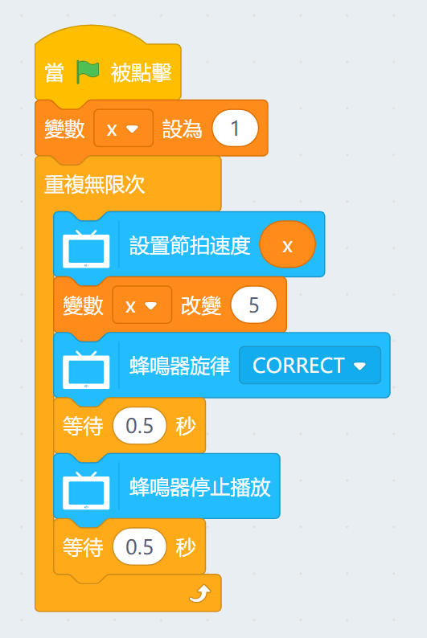

# 未來板蜂鳴器KittenBlock編程教學

使用蜂鳴器可以為你的項目添加聲音，增加趣味。

## 蜂鳴器積木塊

### 範例程式：蜂鳴器頻率發聲

使用頻率控制蜂鳴器。

頻率與音調對照表可以參考： <https://pages.mtu.edu/~suits/notefreqs.html>

### 範例程式：蜂鳴器持續發聲

持續發聲適合製作琴鍵等的項目。

### 範例程式：蜂鳴器根據音符發聲

播放中八度的所有音調。

### 範例程式：播放旋律

- 以c4:2為例子：
    - C代表音調
    - 4代表八度
    - :2代表持續時間
    

### 範例程式：播放內置音樂

可以播放預設的旋律，

### 範例程式：改變播放速率

可以改變播放的速率。

