# 未來板固件更新

Kittenbot會不定期推出未來版的固件更新，提升功能與穩定性。

## 未來版固件更新方法

首先下載更新軟件。

[更新軟件](https://drive.google.com/file/d/1_M4EzolaJWpYXts_FwUIqH8pZWqy-fye/view?usp=sharing)

將檔案解壓縮。

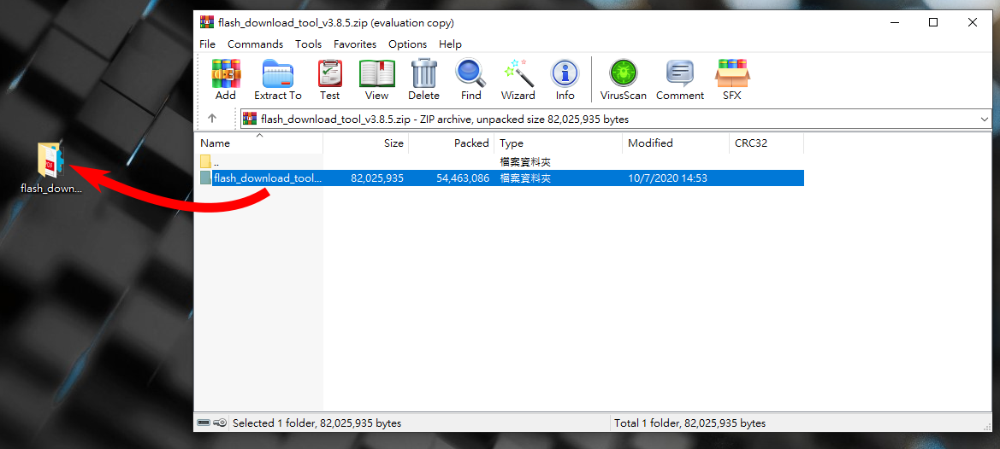

打開flash_download_tool_3.8.5.exe。

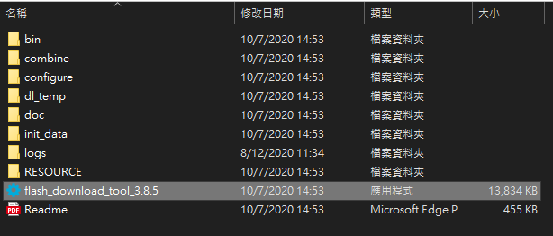

選擇Factory Mode。

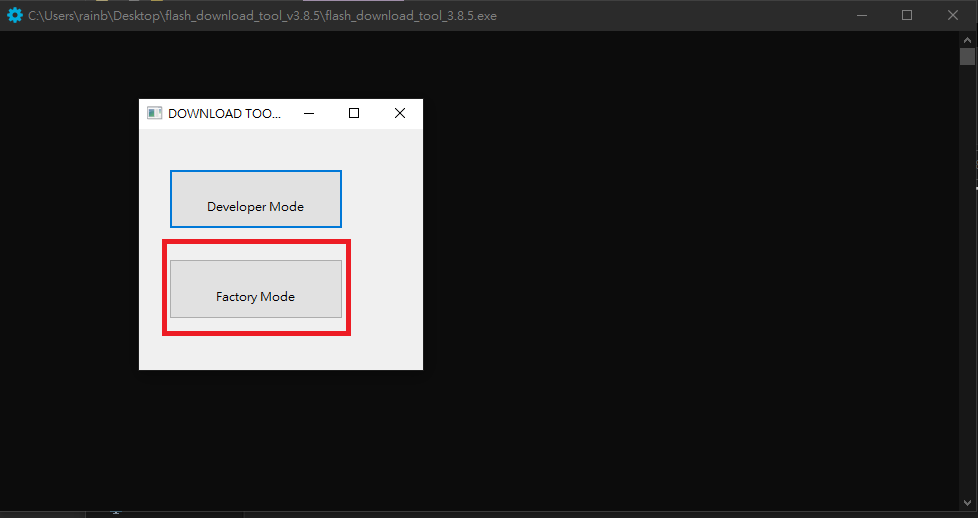

選擇ESP32 Download Tool。

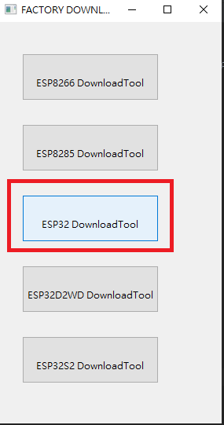

解鎖用戶界面。

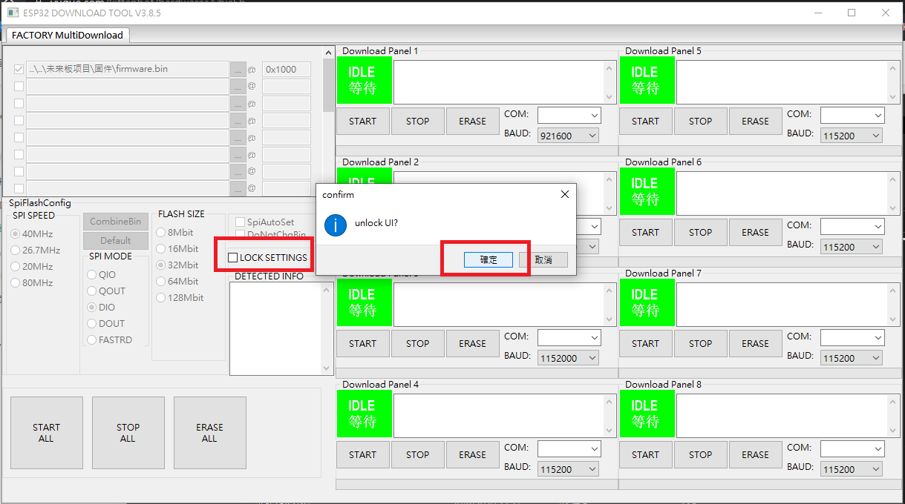

選擇.bin固件文件。

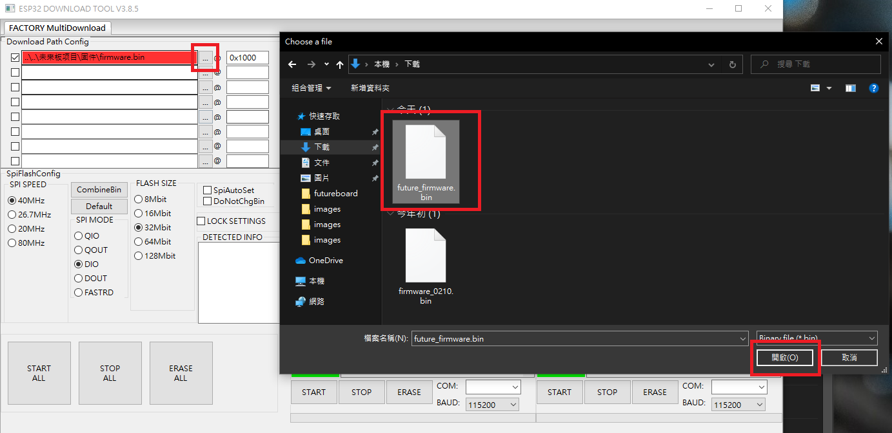

確保已剔選固件文件和欄位中文字為0x1000。

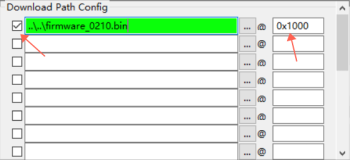

選擇未來板的串口和選擇1152000波特率，點擊Start直至完成。

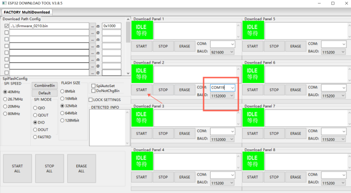

完成之後按一下未來板背後的重置鍵。

假如更新後未來板提示你重置未來板，請參考[重置未來板](./reset.md)。

## 未來板還原出廠固件

假如你的未來板的固件出現了什麼問題，您可以回復到原廠固件。

打開Kittenblock並連接上未來板。

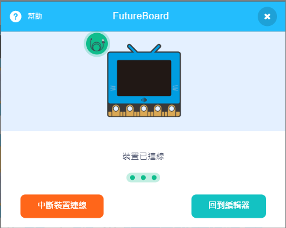

點擊恢復固件。

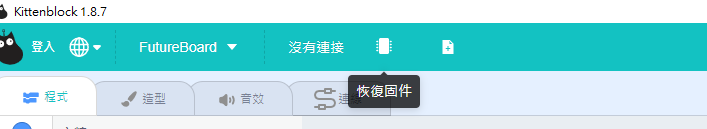

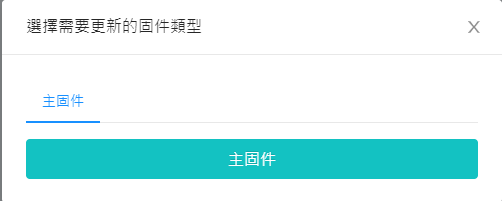