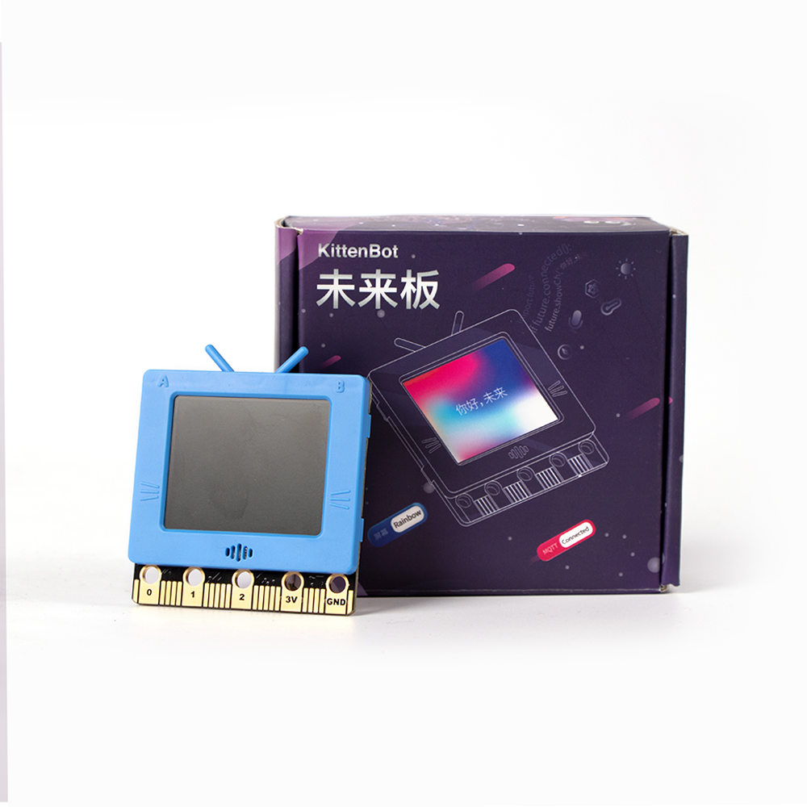
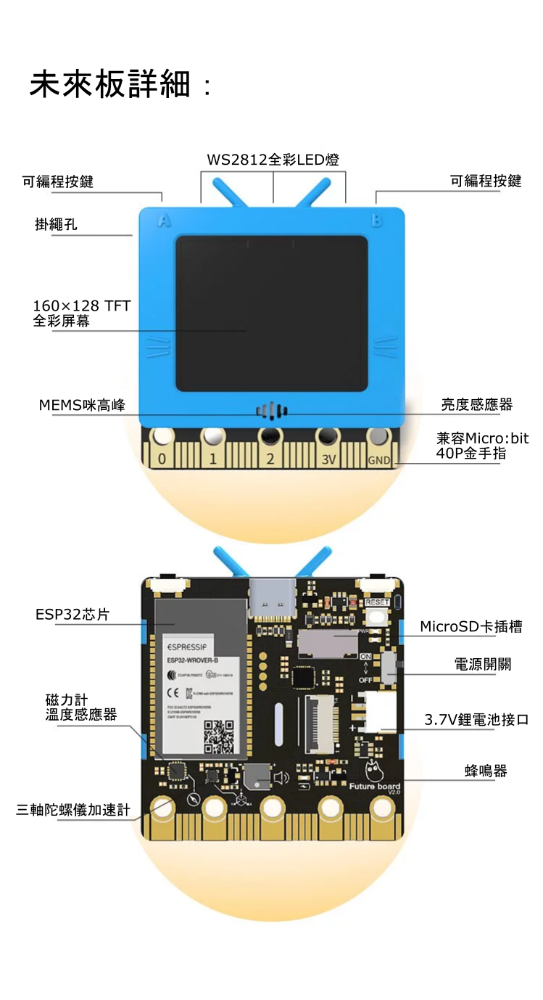
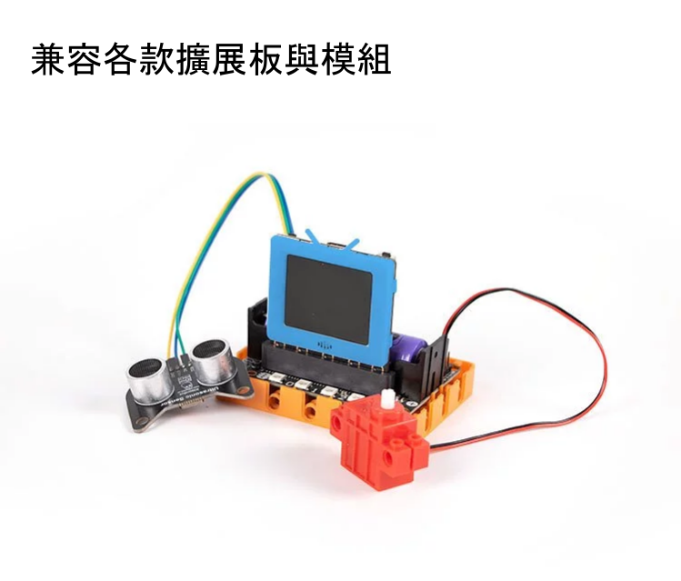
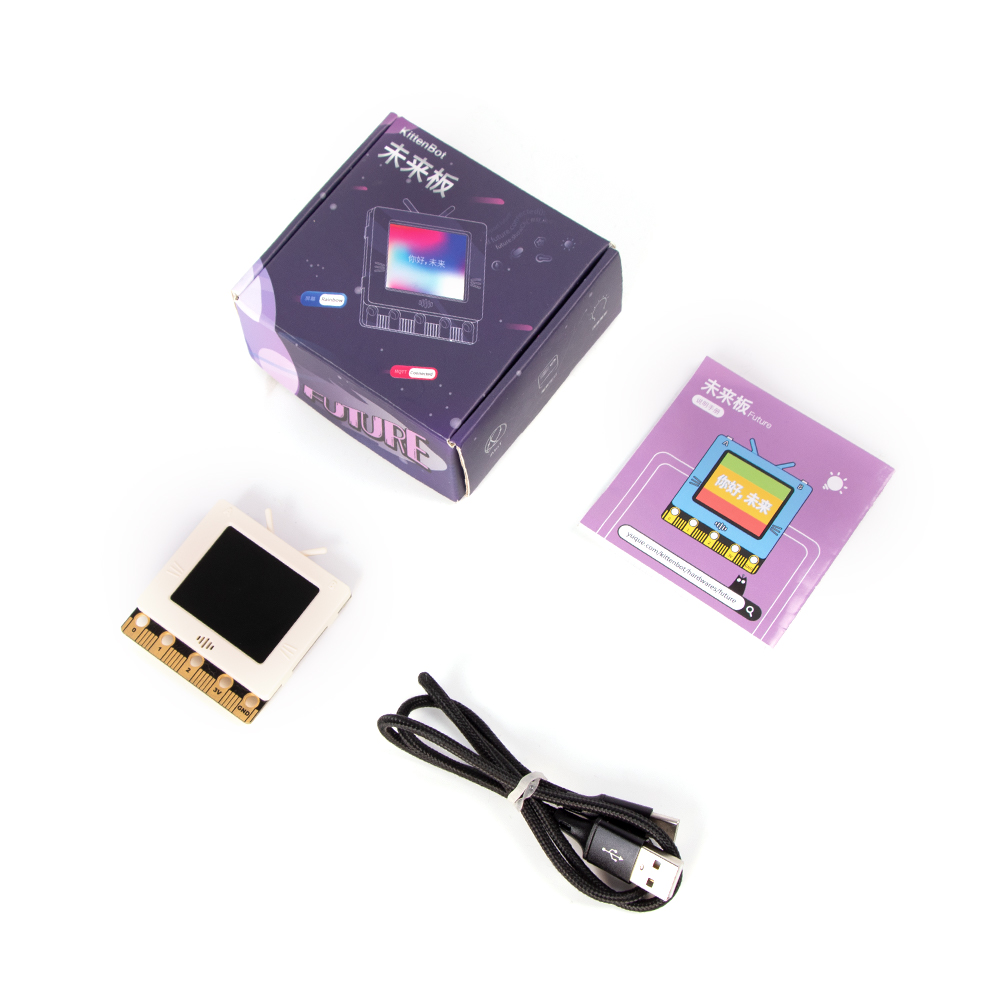
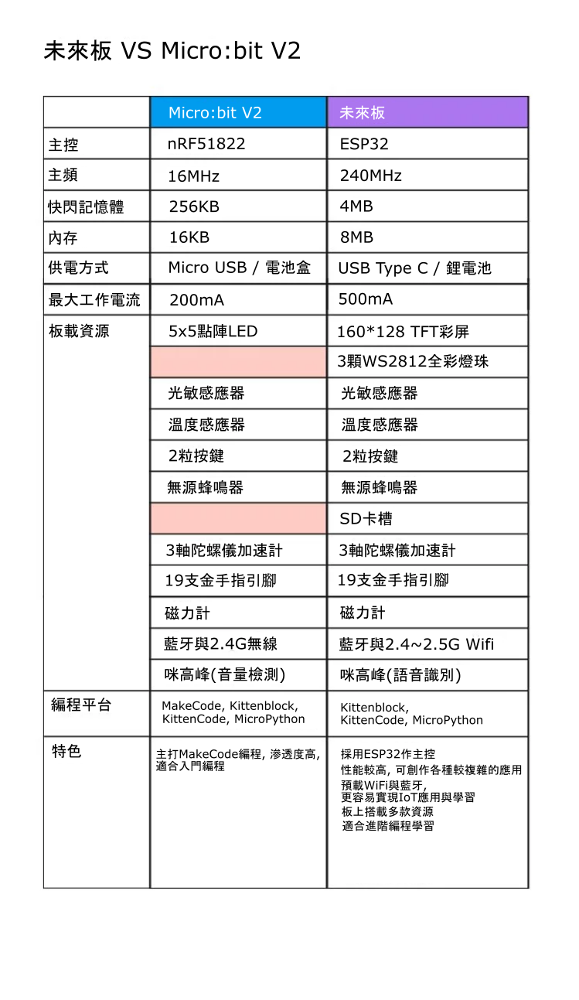
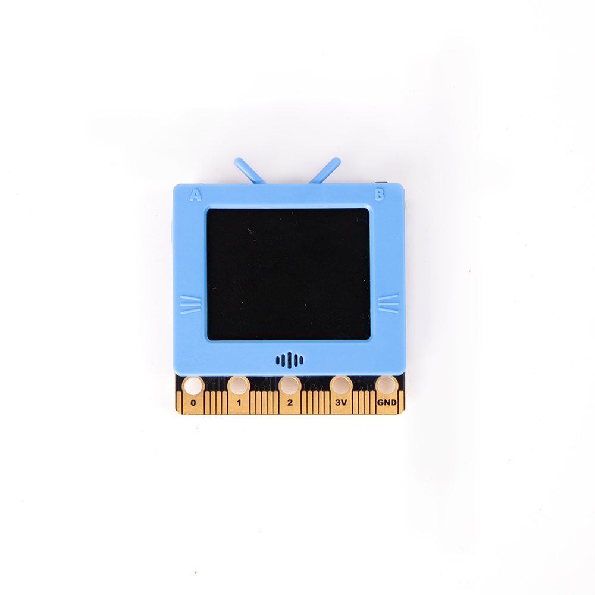
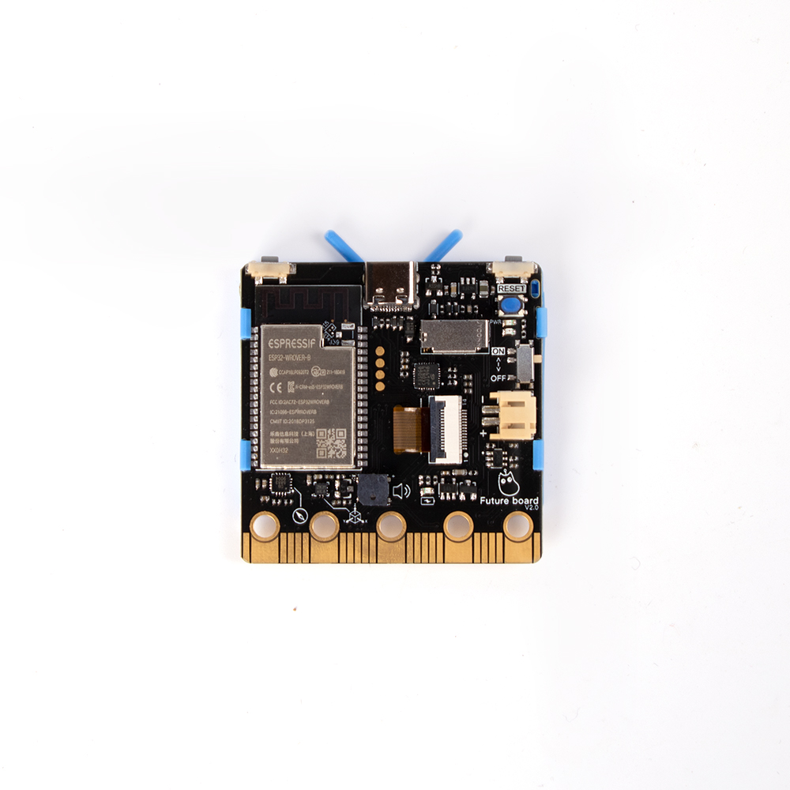
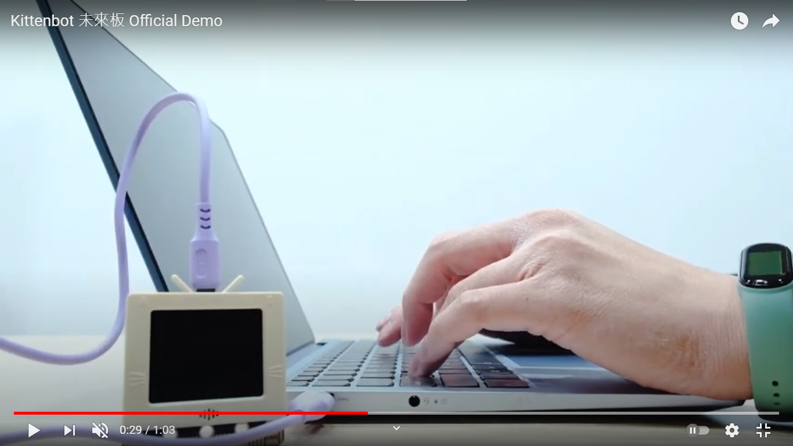
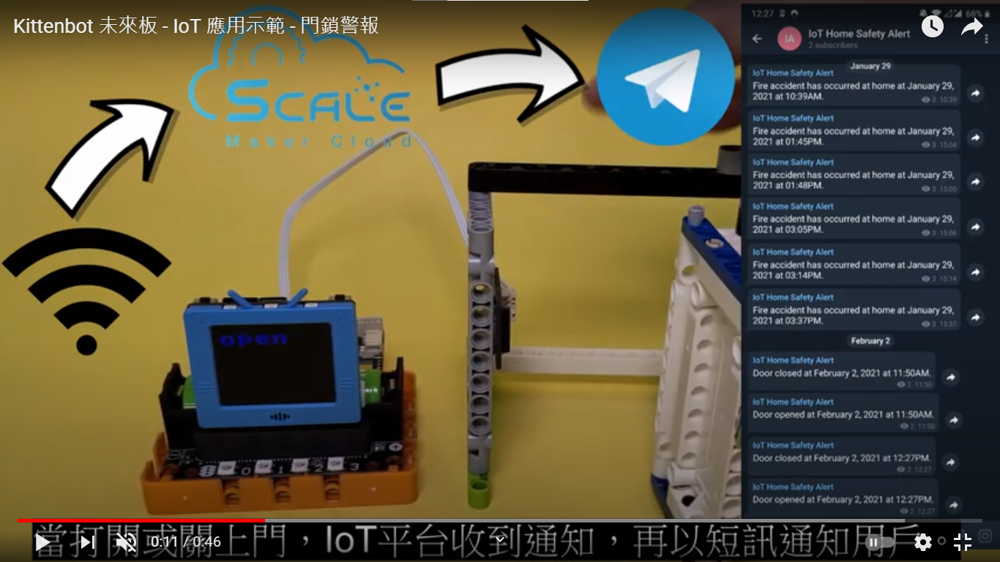
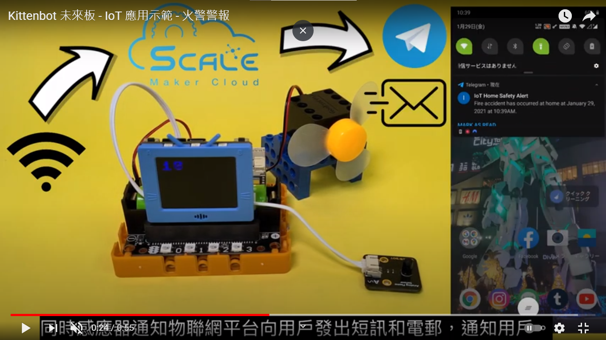

# 未來板介紹

未來板顧名思義，是一塊為了未來的編程教育而打造的主控板。它上面不但搭載了多款實用的感應器，更加有一塊全彩的TFT屏幕，資訊可以實時顯示在屏幕上，方便大家製作更多有趣的編程作品。

現時STEM教育逐步偏向AI與IoT的方向發展，而未來板就正正是基於AI與IoT而設計。以強大的ESP32晶片作基礎，自帶WiFi與藍牙等的功能，切合當前STEM教育的需要。此外未來板亦沿用了BBC Micro:bit的金手指引腳設計，令未來板與現時的設備有承接性，即使是為未來而設計亦不會忘卻現在。

未來板的確是下一代學習編程的好拍檔。

## 適合人群

- 學校，培訓機構
- 對編程有興趣的大眾

## 產品特色

- 支援圖像化編程，令新手也容易上手。
- 支援純代碼編程，讓大家容易學習代碼式編程。
- 自帶全彩TFT顯示屏，各種資訊能實時顯示在屏幕上，做到實時反饋。
- 支援普通話，粵語與英語的語音識別，輕鬆地實現AI的應用。
- 搭載揚聲器與RGB燈條，為你的創作添聲添色。
- 專門設計的FutureOS GUI主介面配合SD卡插槽，可以實現儲存大量程序並選擇運行的功能。
- 自帶WiFi功能，輕易實現IoT的應用。
- 外殼為ABS塑膠硬殼，不但美觀而且保護性高。
- 延續Micro:bit的金手指設計，兼容學校現有的各種感應器和擴展板。
- 搭載2.4GHz無綫通訊的功能，令未來板可以與其他主控板溝通。
- 搭載3.7V鋰電池和充電線路，讓大家可以完全脫離數據線。
- 採用USB Type C接口，拔插更容易。
- 袖珍尺寸並帶有掛繩孔，方便收納和攜帶。
- 支援無線下載程序，即使用平板電腦也能學編程。

## 產品參數

- 產品大小：51.6x51.6x11mm
- 淨重：22.6g
- 主控芯片：	EPS32-WROVER-B
- 主頻：240MHz
- 快閃記憶體：4M
- 內存：8M
- 接口：USB Type C / 3.7v 鋰電池JST接口 (可充電)
- 卡槽：MicroSD卡 (必須使用Class 10或以上)
- 螢幕類型：TFT全彩螢幕
- 屏幕解像度：160x128
- 螢幕尺寸：1.8吋
- IO引腳：19PIN金手指(與Microbit相容)

## 板上感應器和接口：

- 160x128 TFT彩屏
- 2顆按鍵
- 蜂鳴器
- 光敏感應器
- 溫度感應器
- 磁力感應器
- 咪高峰
- 3軸陀螺儀
- 19PIN IO引腳
- 蜂鳴器
- 3顆RGB燈珠
- Wifi與藍牙
- USB Type C接口
- JST電池插口
- SD卡插槽

## 產品內容：

- 未來板
- USB Type C數據線
- 掛繩

## 與Micro:bit對比：

## 產品展示：

## 支援編程平台：

- Kittenblock
- KittenCode
- MicroPython

## 介紹短片：

### 未來板介紹

### 未來板Demo

