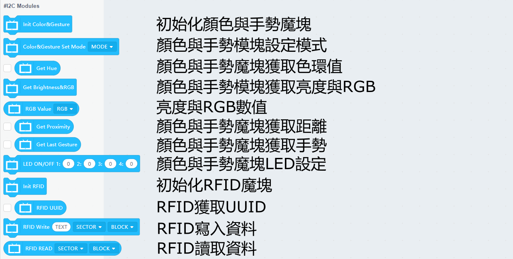
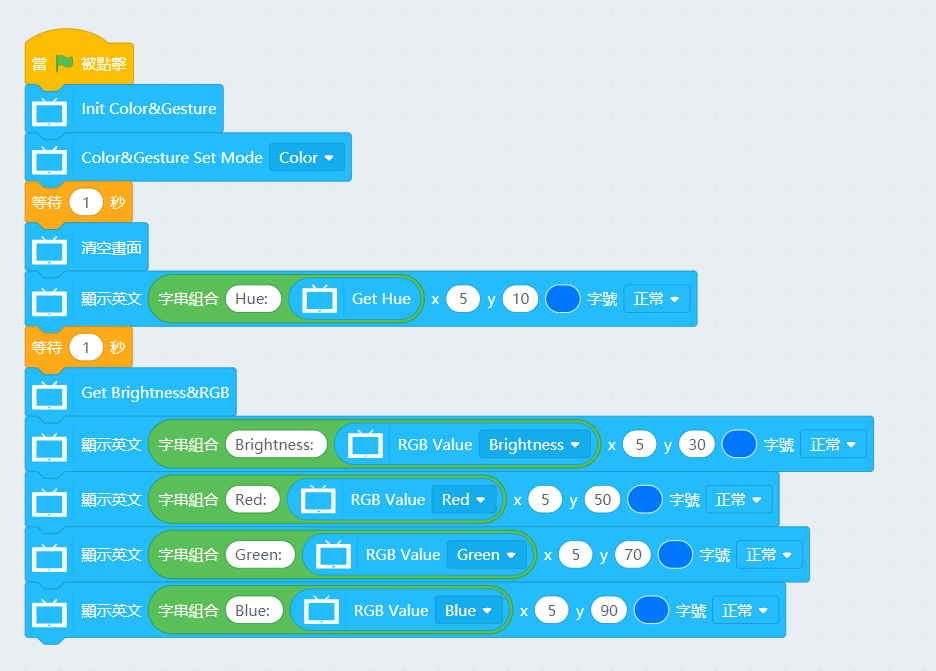
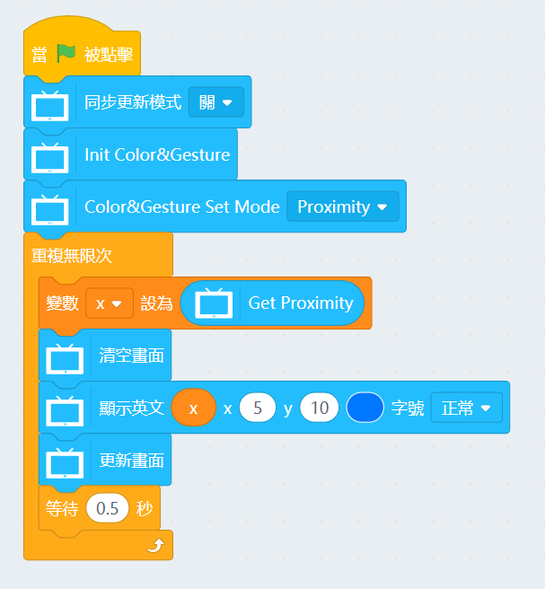
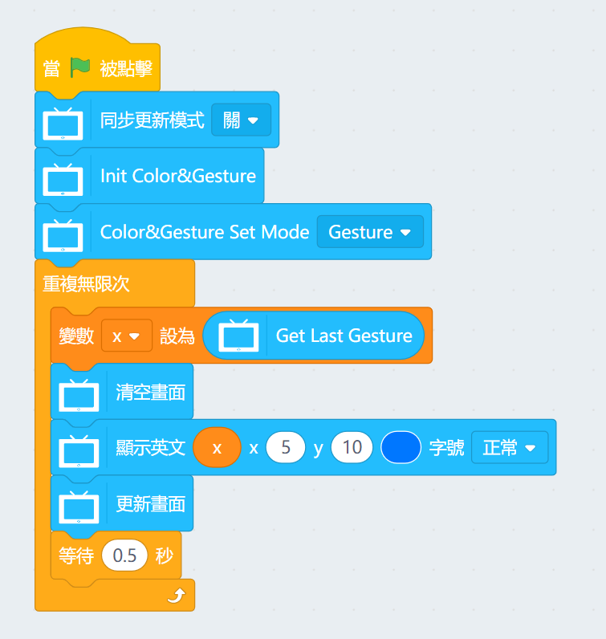
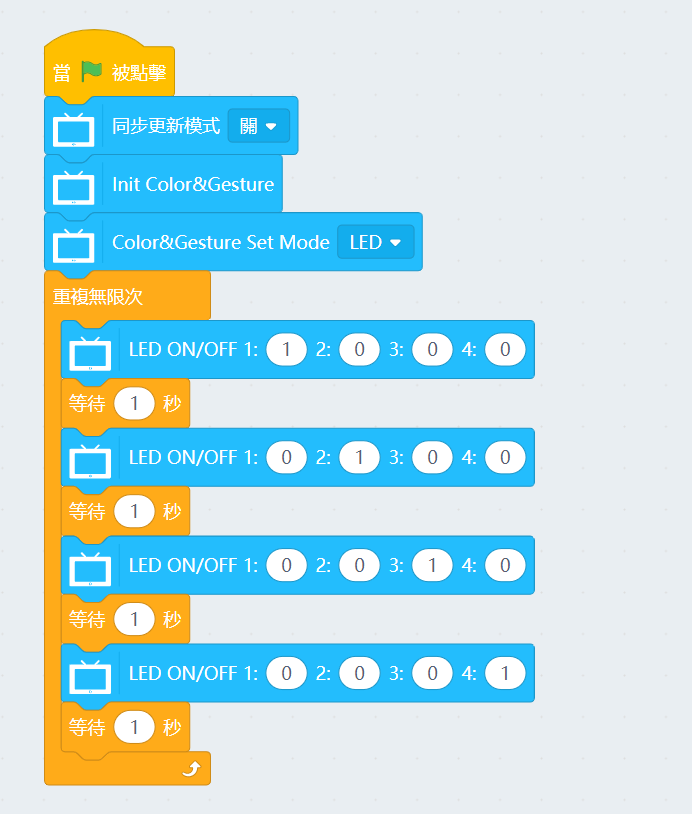
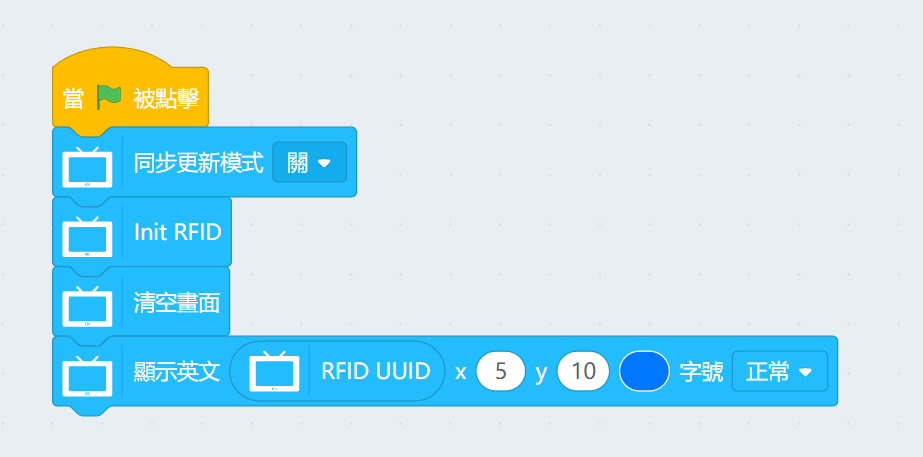
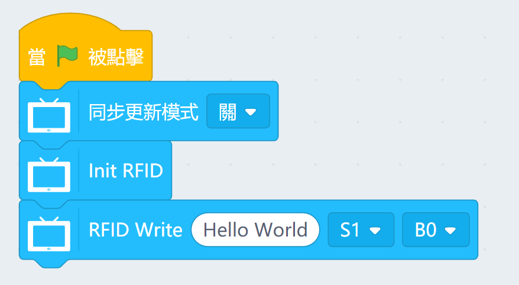
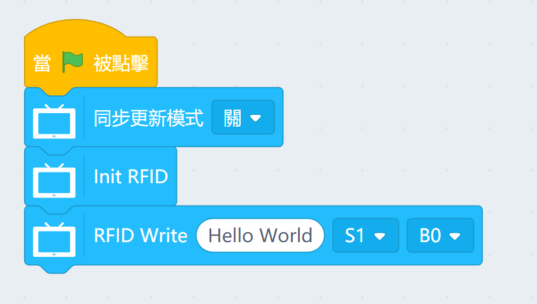

# 未來板I2C魔塊KittenBlock編程教學

未來板用KittenBlock可以輕鬆地使用PowerBrick的I2C魔塊，包括顏色與手勢模塊和RFID魔塊。

## I2C魔塊積木塊

### 範例程式1：顏色與手勢魔塊顏色模式

### 範例程式2：顏色與手勢魔塊距離模式

### 範例程式3：顏色與手勢魔塊手勢模式

### 範例程式4：顏色與手勢魔塊LED模式

### 範例程式5：RFID讀取UUID

### 範例程式6：RFID寫入資料

### 範例程式7：RFID讀取資料

