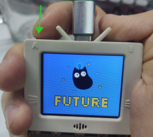
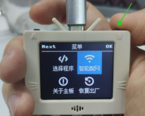
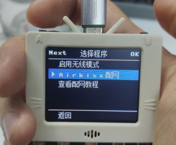
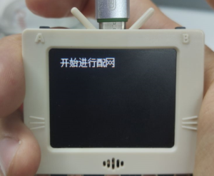
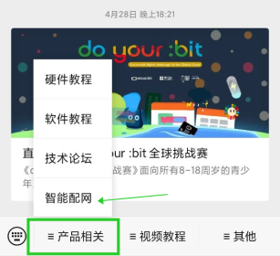
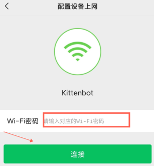
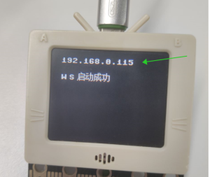
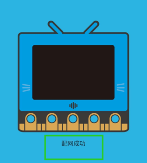
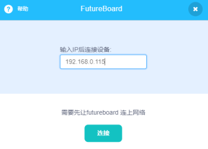
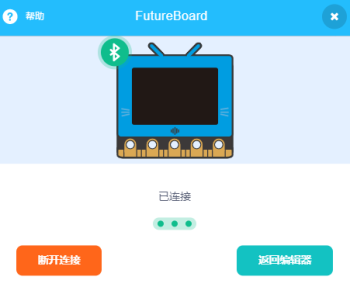

# 未來板Kittenblock編程快速入門

Kittenblock是未來板的主要編程平台。

Kittenblock下載: [Kittenblock安裝](../../KittenBlock/kittenblockGreen.md)

## 使用數據線連接未來板

要在Kittenblock對未來板編程，我們首先要與未來板建立連接。

### 1. 將未來板連接電腦，並打開電源。

### 2. 打開Kittenblock，在硬件欄選擇未來板。

### 3. 點擊感嘆號，連接未來板。

選擇數據線連接。

等待數秒，未來板會自動連接Kittenblock。

等待數秒，未來板上會顯示hello world的字句。

假如你使用Windows 7作業系統，系統可能缺乏所需的串口驅動程式。請下載此檔案，手動安裝驅動程式。

### 4. 點擊積木，測試連接。

點擊Kittenblock的積木，未來板應該會即時作出反應。

假如點擊後沒有反應，請點擊恢復固件。

## 使用無綫網絡連接未來板(需要微信賬號)

要在Kittenblock對未來板編程，我們首先要與未來板建立連接。

### 1. 將未來板打開電源。

### 2. 打開Kittenblock，在硬件欄選擇未來板。

### 3. 點擊感嘆號，連接未來板。

選擇無綫連接。

手機連上路由器(5Ghz 網絡不適用)。

未來板開啟Airkiss模式。

在微信關注Kittenbot帳號，然後在下方點擊智能配網。

在Kittenblock輸入未來板的IP地址。

## Windows 7用家注意事項

由於Windows 7可能缺乏驅動程式，請下載此檔案，手動安裝驅動程式。

[未來板Windows 7驅動程式](https://drive.google.com/file/d/1Ldx1baDITzg-bHGvWpbgyQ0NdWDFdGD4/view?usp=sharing)