# 未來板Kittenblock編程快速入門

Kittenblock是未來板的主要編程平台。

Kittenblock下載: [Kittenblock安裝](../../KittenBlock/kittenblockGreen.md)

## 在Kittenblock中連接未來板

要在Kittenblock對未來板編程，我們首先要與未來板建立連接。

### 1. 將未來板連接電腦，並打開電源。

### 2. 打開Kittenblock，在硬件欄選擇未來板。

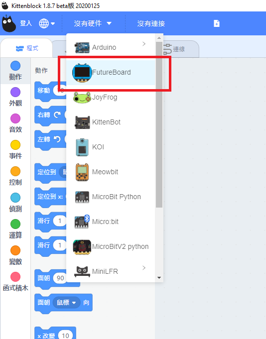

### 3. 點擊感嘆號，連接未來板。

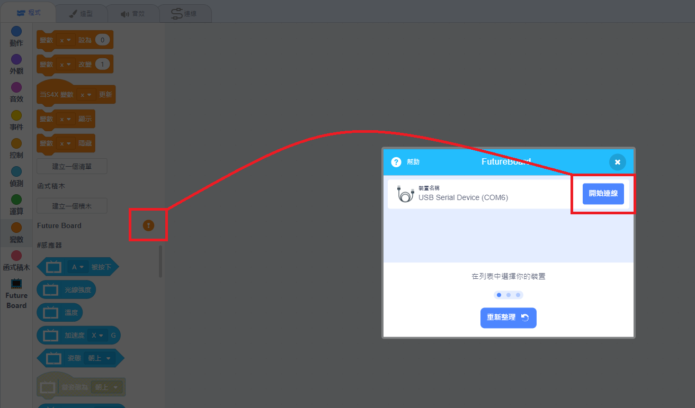

選擇數據線連接。

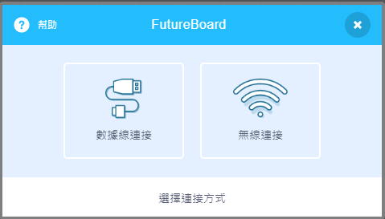

等待數秒，未來板會自動連接Kittenblock。

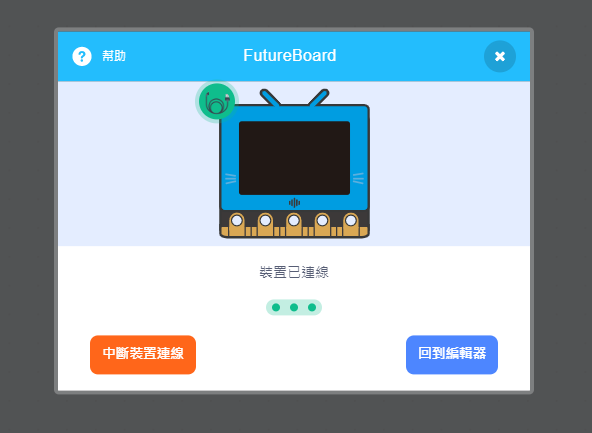

等待數秒，未來板上會顯示hello world的字句。

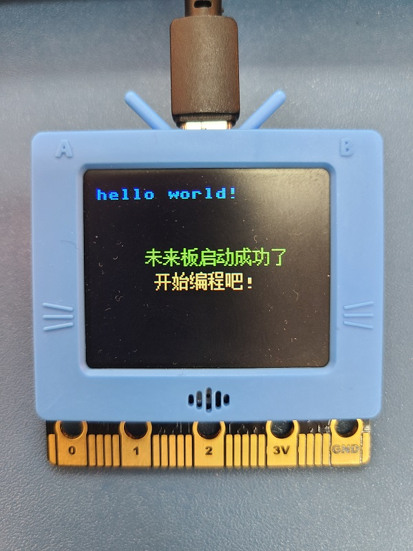

假如你使用Windows 7作業系統，系統可能缺乏所需的串口驅動程式。請下載此檔案，手動安裝驅動程式。

### 4. 點擊積木，測試連接。

點擊Kittenblock的積木，未來板應該會即時作出反應。

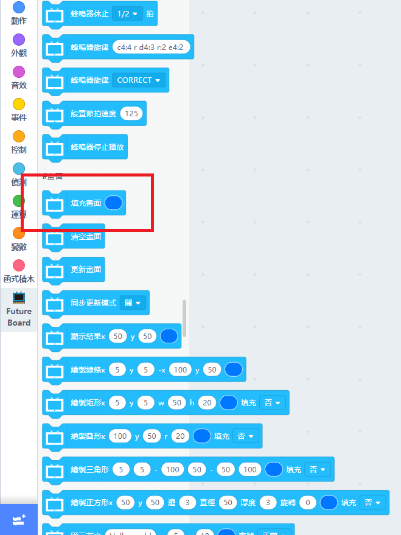

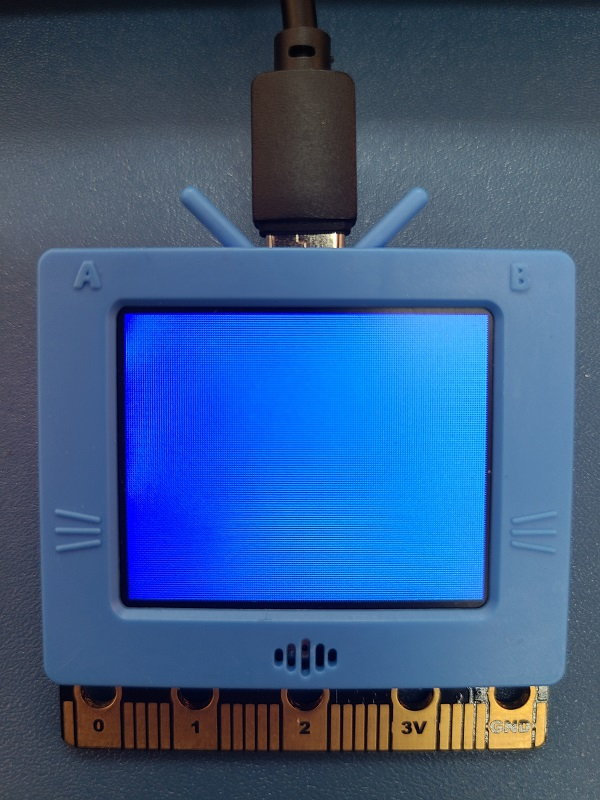

假如點擊後沒有反應，請點擊恢復固件。

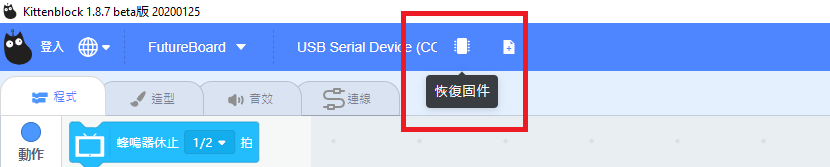

## 在Kittenblock上編程教學

### 1. 感應器類

### 2. 音樂類

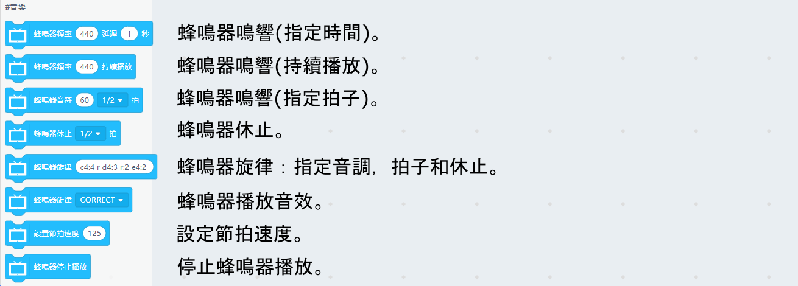

### 3. 顯示屏類

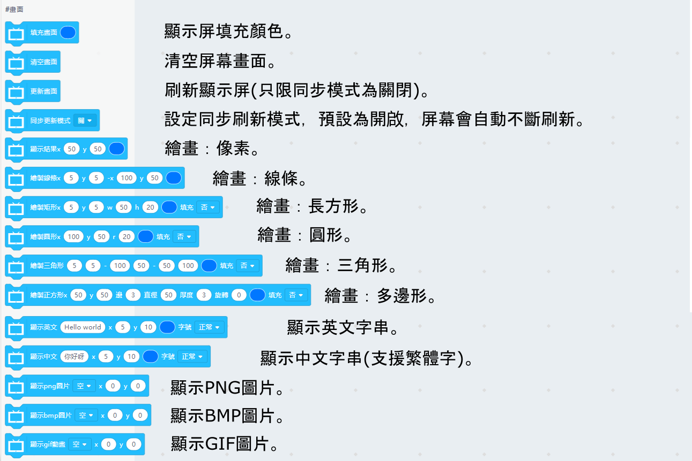

### 4. 海龜繪圖類

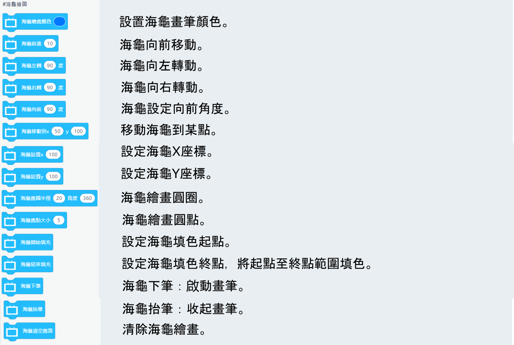

### 5. 引腳類

### 6. 彩燈類

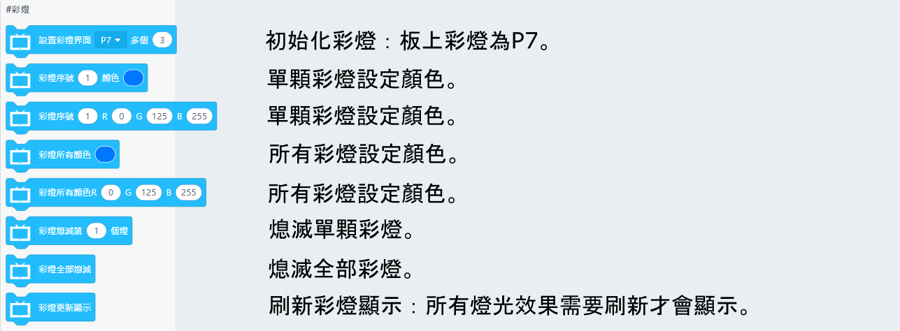

### 7. 咪高峰類

### 8. WiFi網絡類

### 9. 無線通訊類

### 10. Robotbit類

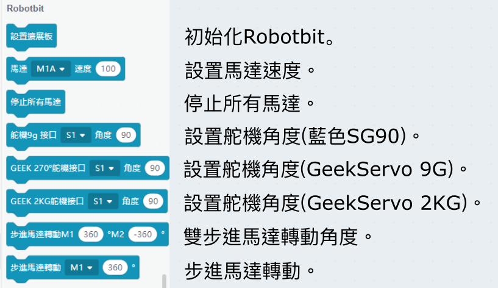

### 11. Powerbrick類

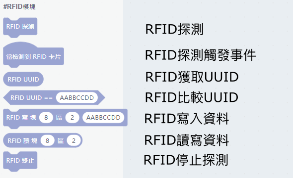

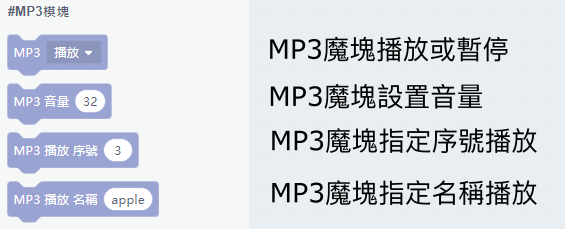

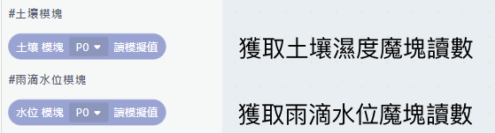

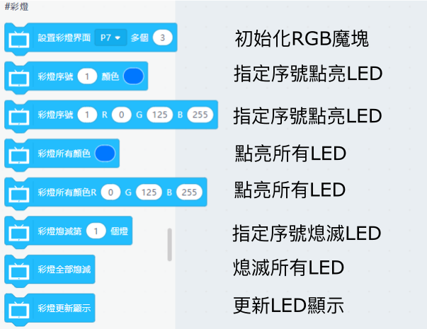

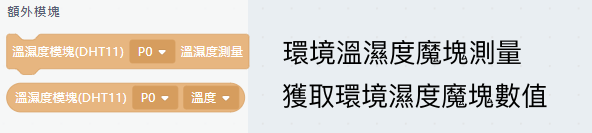

### 12. Sugar類

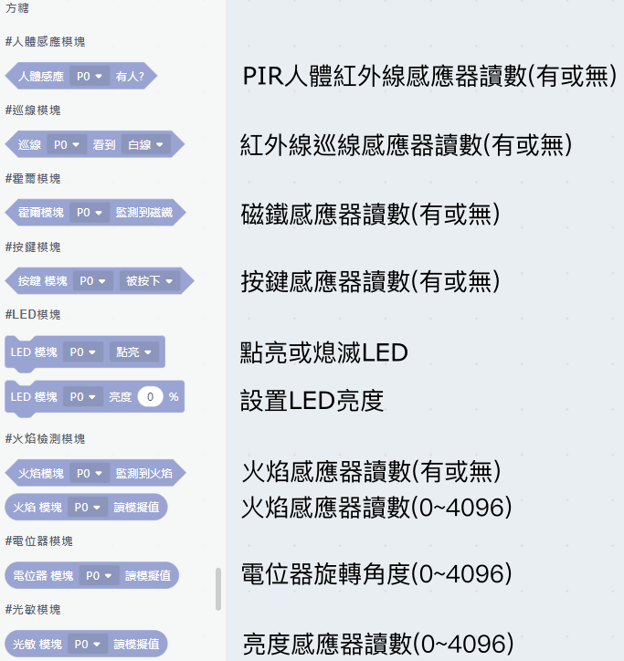

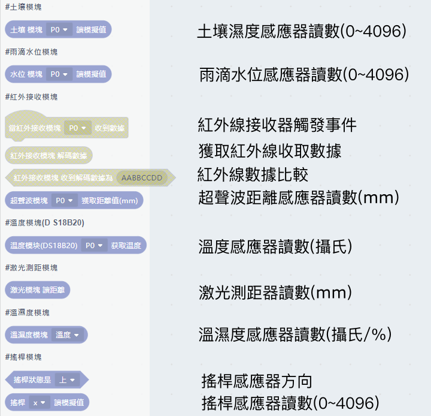

### 13. 天文台API

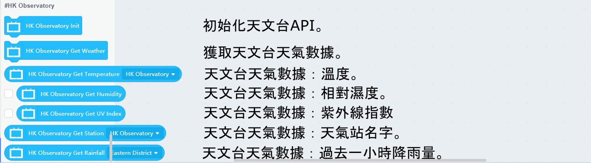

### 14. KMB到站時間API

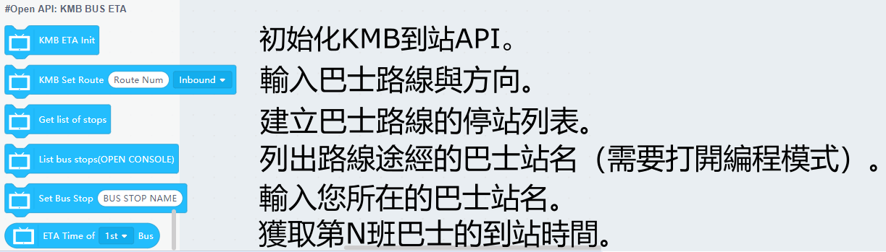

## Windows 7用家注意事項

由於Windows 7可能缺乏驅動程式，請下載此檔案，手動安裝驅動程式。

[未來板Windows 7驅動程式](https://drive.google.com/file/d/1Ldx1baDITzg-bHGvWpbgyQ0NdWDFdGD4/view?usp=sharing)