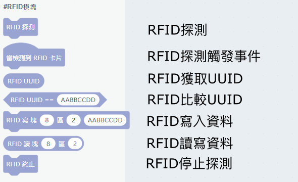
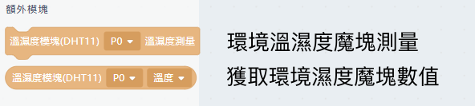
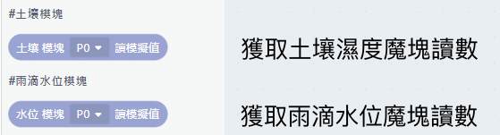

# 未來板Powerbrick魔塊 KittenBlock編程教學

未來板也可以使用Powerbrick的各款魔塊，例如RFID魔塊，MP3魔塊，顏色手勢魔塊等。

## Powerbrick積木塊

### AB按鍵魔塊

### IR巡線魔塊

### MP3魔塊

### RFID魔塊

### 顏色手勢魔塊

### 環境溫濕度魔塊

### 土壤濕度魔塊與雨滴水位魔塊

### RGB魔塊

## 注意事項

由於未來板不能夠使用Armourbit，請使用Robotbit連接各種魔塊。