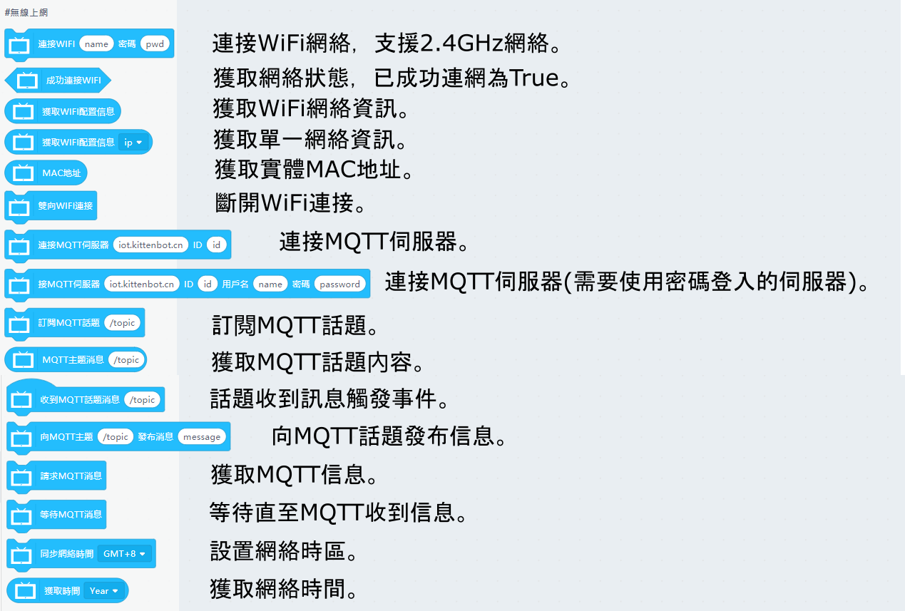
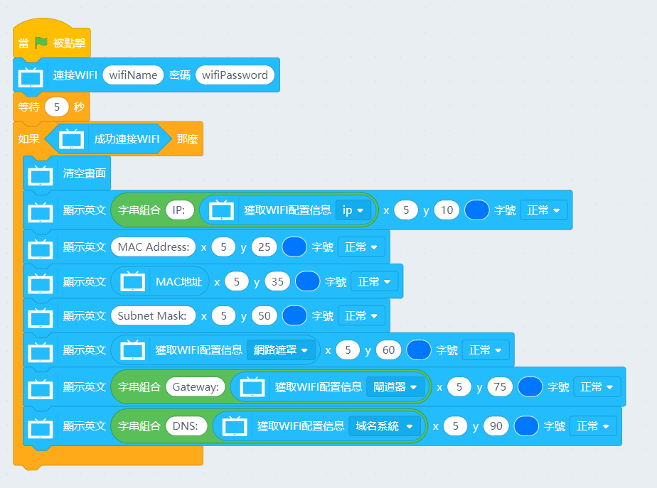
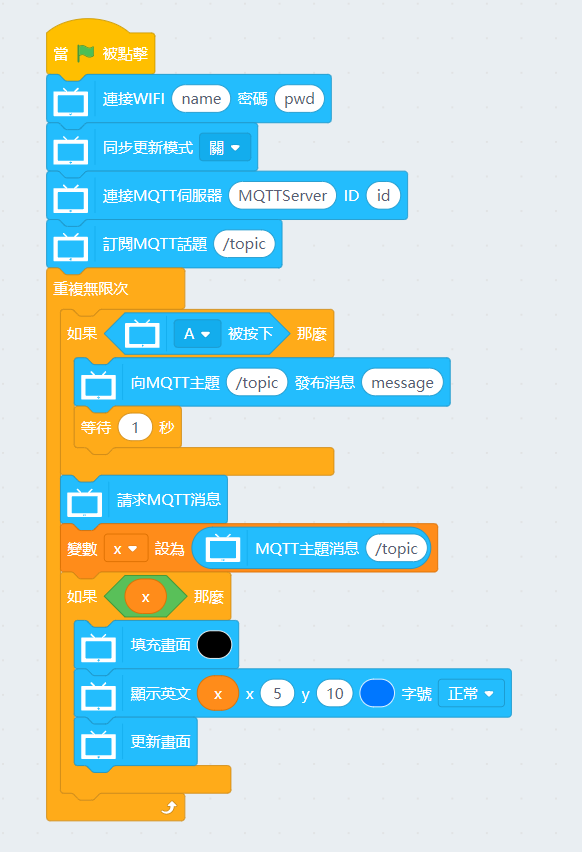
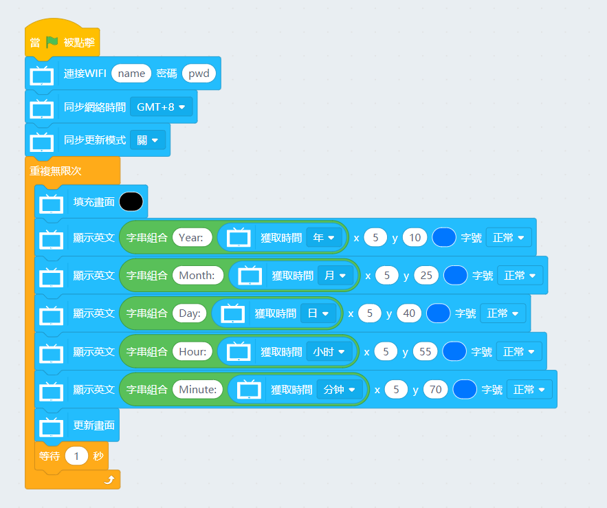

# 未來板IoT KittenBlock編程教學

使用未來板內置的WiFi，可以實現IoT的功能。

## 未來板與IoT平台教學

此頁面是針對一般普遍的MQTT平台作教學，連接方法或數據格式請用戶自行參考自己使用的IoT平台的官方指引。

KittenBot亦有提供個別平台的IoT使用教學，如有興趣請參考以下篇章。

[未來板與ThingSpeak快速入門](../../Wifibrick/futureboard/thingspeak.md)

## IoT積木塊

### 範例程式：連接WiFi與獲取WiFi配置信息

### 範例程式：MQTT伺服器通訊

### 範例程式：獲取網絡時間

