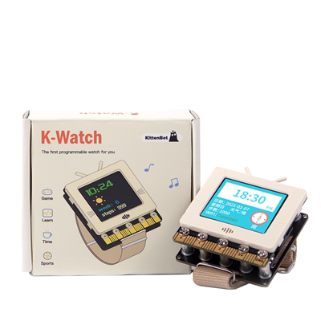
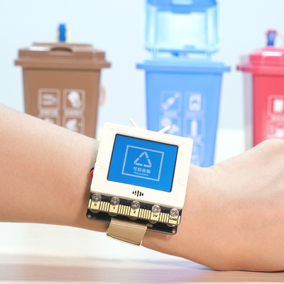

# K-Watch 未來板擴展板

K-Watch擴展板是為未來板而設計的擴展板，它的手錶式設計容許用家設計各款穿戴式裝置應用。板上搭載鋰電池及時鐘模組，輕便地為未來板加上發展空間。

## K-Watch 產品特色

- 體積細小
    - 適合設計穿戴式裝置
- 自由選擇錶帶或腰帶
    - 穿戴方式靈活
- 板載鋰電池
- 板載時鐘模組
- 板載喇叭
- 無綫發放語音，實現對講機功能

## K-Watch 產品參數

- 尺寸:	78 x 57 x 23 mm
- 重量:	37.5g
- 供電:	5V(USB供電)、3.7~4.2V（鋰電池）
- 電壓:	3V/5V
- 板載資源:	時鐘模組，喇叭

## 套件內容

1. K-Watch 未來板擴展板 x1
2. M3螺絲 x5
3. 鋰電池 x1
4. 螺絲批 x1
5. 魔術貼 x1
6. 錶帶 x1
7. 腰帶 x1

## K-Watch 元件介紹

## 產品圖片

