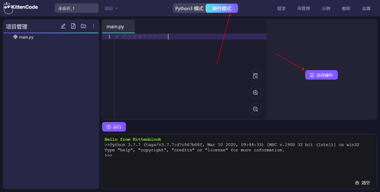
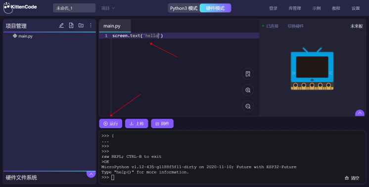

# 未來板MicroPython快速開始

未來板亦可以使用MicroPython編程，Kittenbot推薦的編程平台是KittenCode或者KittenBlock。

## 在KittenCode中使用未來板

首先確保你已經安裝KLink。

### 1. 打開KLink然後進入KittenCode。

### 2. 在KittenCode選擇硬件模式，然後選擇未來板。

### 3. 連接未來板串口。

### 4. 編寫簡單的程式顯示字符測試在線運行。

## 未來板MicroPython編程教學

有關未來板的MicroPython編程教學請參考：[MicroPython編程]()

## Windows 7用家注意事項

由於Windows 7可能缺乏驅動程式，請下載此檔案，手動安裝驅動程式。