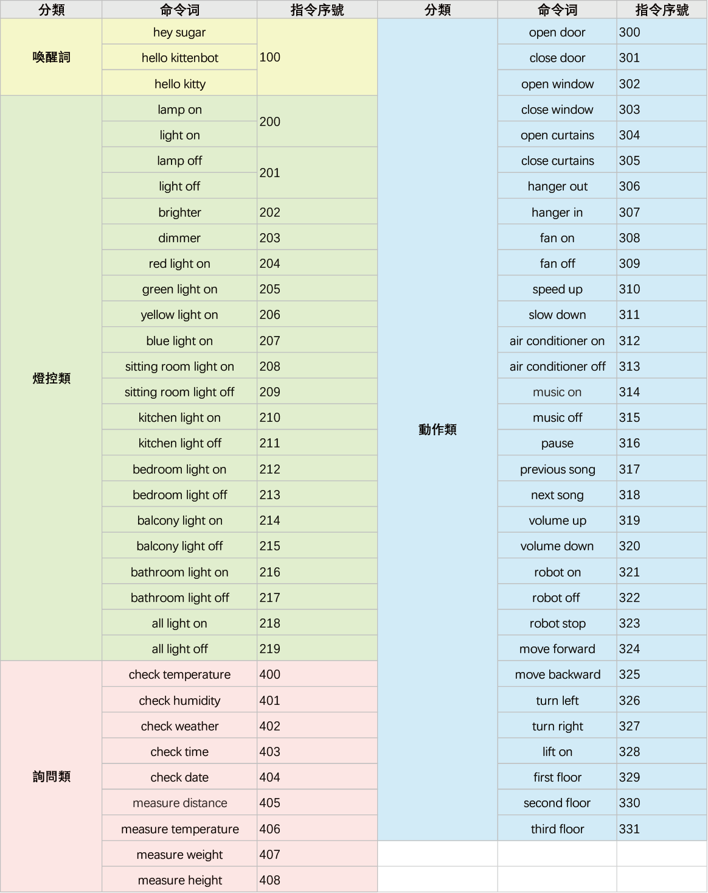
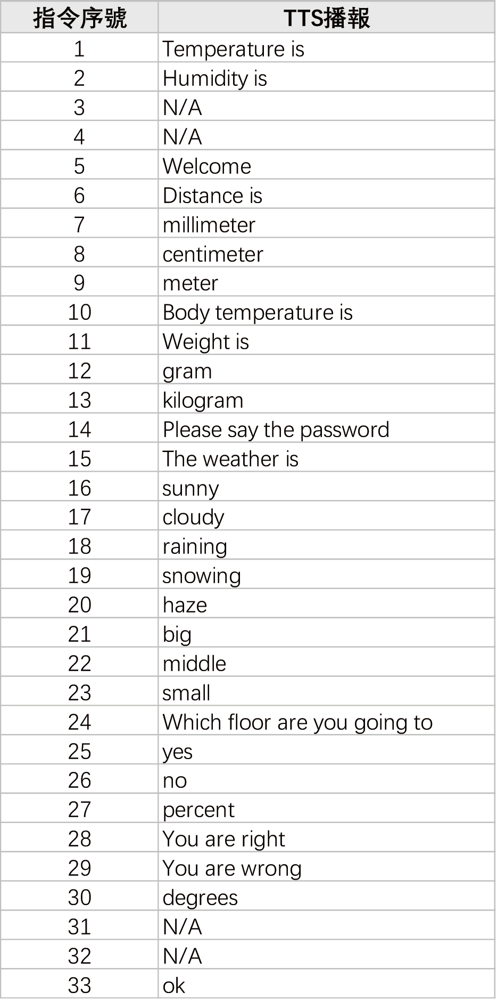

# 未來板MicroPython編程15：ASR 語音模組

## 導入ASR庫

需要先導入ASR的庫才可以使用ASR 語音模組。

    from sugar_asr import SugarASR

## 15: ASR 語音模組

## 語音模組初始化

    asr = SugarASR(tx, rx)

- tx為模組藍色線，配合Robotbit Edu使用請填"P2"。
- rx為模組綠色線，配合Robotbit Edu使用請填"P12"。

## 語音模組觸發狀態

    asr.detected()

- 聽到任何指令時為true，否則為false。

## 語音模組聽到指令

    asr.cmdParse()

- 返回語音模組所聽到的指令序號，詳細序號請參考以下列表。

## 語音模組語音播報

    asr.tts_words(1)

- 語音播報序號指令，詳細序號請參考以下列表。

## 語音播報數字

    asr.tts_int(1) #整數
    asr.tts_double(1.1) #小數 (最多2個小數位)

## 語音播報時間

    asr.tts_clock(hour, min)

- 語音播報時間，hour為小時，min為分鐘。