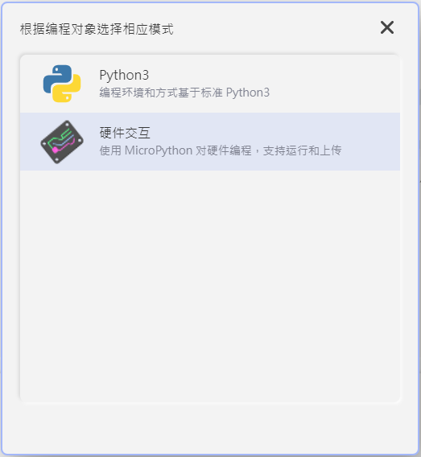
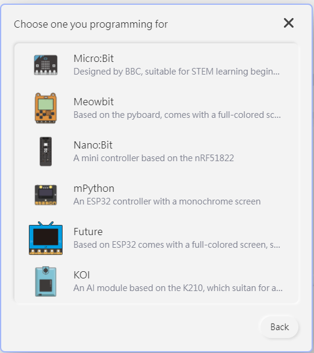
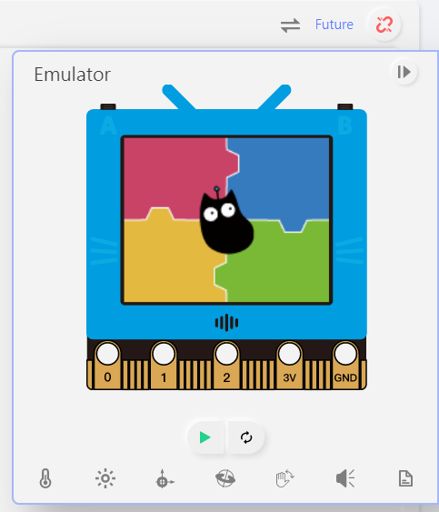
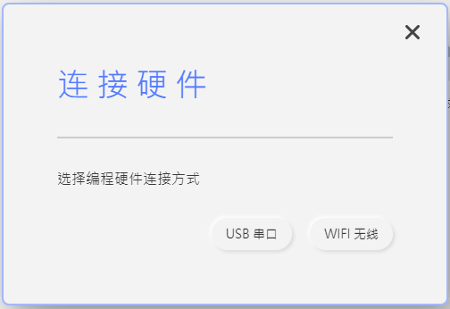
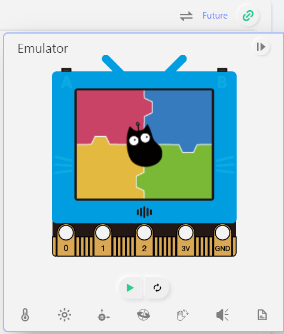
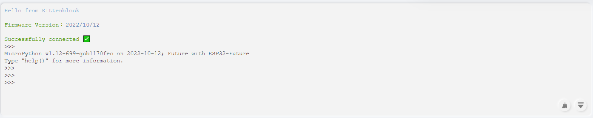

# 未來板MicroPython快速開始

未來板亦可以使用MicroPython編程，Kittenbot推薦的編程平台是KittenCode或者KittenBlock。

## 在KittenCode中使用未來板

首先確保你已經安裝KittenCode。

## 1. 打開KittenCode並切換至硬件互動模式

### 2. 在硬件欄選擇未來板

### 3. 使用USB線連接未來板，按KittenCode的連接按鍵

### 4. 選擇USB串口

### 5. 當按鍵變為綠色就代表連接成功

### 6. 在REPL控制台可以使用各種指令

