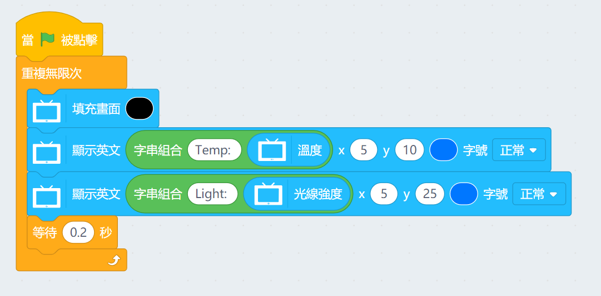

# 未來板感應器編程教學

未來板上有多款感應可以使用。

## 感應器積木塊

### 範例程式：按鍵使用

按下按鍵改變屏幕顏色。

### 範例程式：溫度與亮度感應器

實時顯示感應器的數值。

### 範例程式：陀螺儀加速度

加速度的三軸如圖所示。

讀取陀螺儀的加速度數值。

### 範例程式：姿勢判斷

未來板能偵測8種姿勢。

1. 'shake' : 搖晃
2. 'freefall' : 自由落體
3. 'tilt_up' : 正立
4. 'tilt_down' : 倒立
5. 'tilt_left' : 左傾
6. 'tilt_right' : 右傾
7. 'face_up' : 朝上
8. 'face_down' : 朝下

搖晃未來板，發出聲音。

### 範例程式：姿勢事件

搖晃未來板，發出聲音。

    注意：姿勢事件只能在上傳後可用，即是說要將程式上載到未來板才可以用！

### 範例程式：讀取姿態角度

姿態角度分別為：橫滾(roll)，旋轉(pitch)。

顯示姿勢的角度。

### 範例程式：讀取磁力計數值

磁力的檢測範圍為±800(μT)。

顯示三軸的磁場強度。

    使用磁力計前必須要進行校準。

### 範例程式：指南針

指南針的數值是遵從方位，由0~360，0指向北方。

顯示當前的方位。

