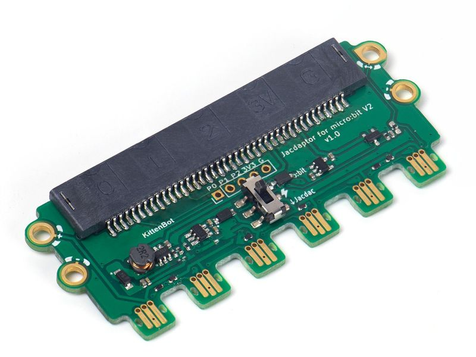
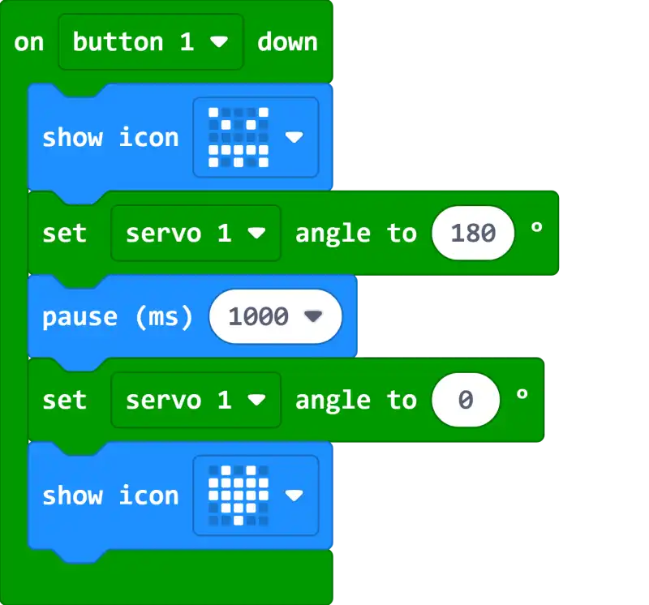
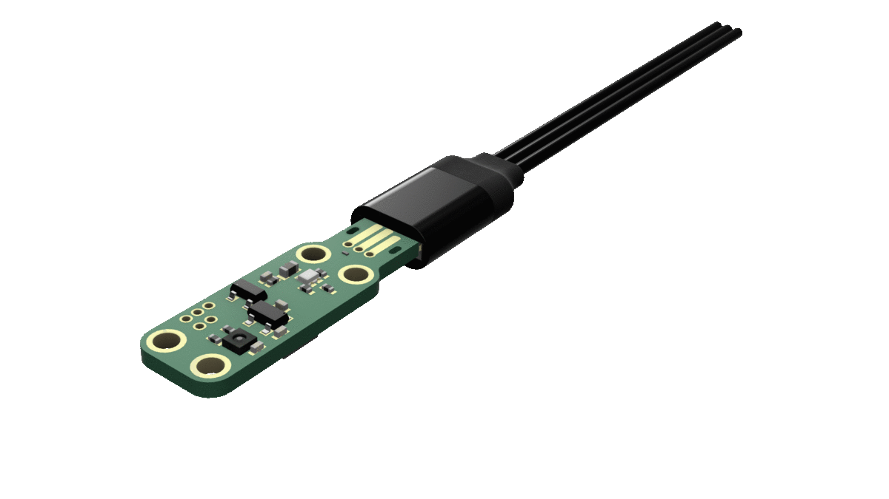
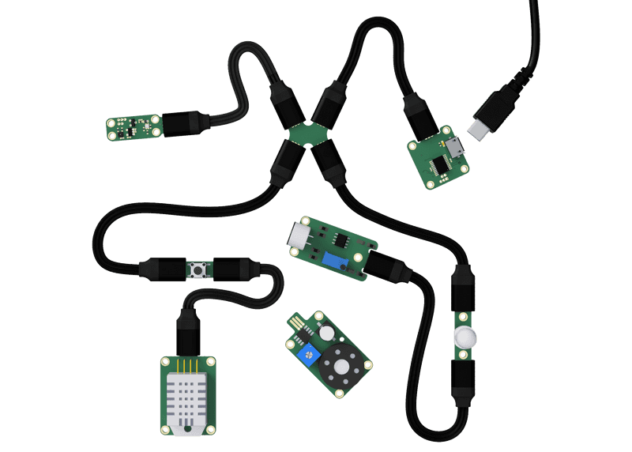

# Jacdac介紹

Jacdac是由微軟專為電子元件編程而開發的協議制式，Jacdac強調硬件的模組化，令不同電子元件可以做到即插即用(Plug and Play)。Jacdac模組化的設計令用家可以快速進行原型測試，可以快速探索創作意念，讓電子編程變得更易學習更易上手。Jacdac的設計令硬件更加靈活而且有強大擴充性，低廉的價格亦令電子編程變得更大眾化。

### [微軟JacDac官網](https://microsoft.github.io/jacdac-docs/)

## 微軟Jacdac與KittenBot

Jacdac支援多種主控，除了電腦及智能裝置之外亦支援如Arduino及Raspberry Pi等的微電腦。

### 而在Micro:bit及各款電子元件的設計和支援上，Kittenbot更加成為了微軟的官方合作夥伴，與微軟合作設計和開發符合Micro:bit甚至其他主控使用的Jacdac模組。

### [微軟官方網址: Jacdac與Micro:bit](https://medium.com/@jacdac/jacdac-for-makecode-and-the-micro-bit-887291d60f3c)

### [Hackster.io: 微軟與KittenBot合作推出市場上第一款支援Jacdac的硬件](https://www.hackster.io/news/microsoft-kittenbot-launch-the-first-jacdac-standard-microcontroller-kits-and-software-apis-9faec87abe70)

## Jacdac與Micro:bit

透過Micro:bit V2，用家就可以輕易地對Jacdac模組進行編程。目前，MakeCode已經添加對Jacdac模組的支援插件，用戶只需要在擴展欄搜尋Jacdac就可以使用得到。

由於Jacdac是一套全新的標準，用家需要使用符合Jacdac規格的硬件，目前Kittenbot為唯一生產Jacdac套件的公司。

將Micro:bit插在Jacdapter上就可以為Micro:bit帶來Jacdac接口。

## 詳細了解Jacdac

在開發Jacdac之前，微軟訪問過教育機構與硬件生產商，發現Micro:bit的擴展硬件有以下問題：

- 很難找到合適的編程積木
    - 用戶需要因應每件擴展硬件找到相應的插件，然後雖然在海量的積木當中找正確的，整個過程太繁複
- 不同插件之間的一致性
    - 由於不同廠商各有自家的插件，很容易令用家混淆
- 模擬器缺乏這些硬件的支援
    - 用戶編寫程式時不能即時看到反應
- 連接方式不適合學習用途
    - 市面上的連接線或接口為工程師設計，對學生太困難
    
為了解決以上問題，微軟對Jacdac做了特別的設計。

首先，所有Jacdac的硬件都會使用同一個官方插件，不論廠商不論硬件類型，用家都能夠輕易找到適用的編程積木。

其次，Jacdac協議並不是單純程式上的標準，它亦都為硬件訂立了標準。所有Jacdac的硬件都必須使用相同的硬件設計，包括電路板的大小，電流及安全標準，這亦都包括了連接接口的設計。所有Jacdac的模組都擁有同一款連接器，採用相同的防反插連接線，簡化接線程序。

最後，所有Jacdac模組都可以在MakeCode的模擬器裡面看到，容許免硬件的編程和測試。

除此之外，Jacdac協議亦都帶來不同特點。

首先，Jacdac的硬件的擴充性極強，每個Jacdac模組都可以以手拖手(Daisy Chain)的形式連接到另一隻模組，實現幾乎無限的擴充性。

而且，MakeCode支援在線的Jacdac硬件編程。用家可以在下載程式之前，將Micro:bit和Jacdac硬件連接到MakeCode，在線測試程式得到即時的反饋。

另外，即使手上沒有硬件亦都可以模擬到Jacdac模組的運作，方便用家先測試後實現。

其次，Jacdac模組的電路板都根據標準尺寸而設計，使各項模組可以完全對準，整齊排列和安裝。

## Jacdac短片

### [Micro:bit官方Jacdac示範](https://www.youtube.com/watch?v=Jqn2YCUkWqk)

### [外國用家率先試玩](https://www.youtube.com/watch?v=VMBNxTSGWsI)
