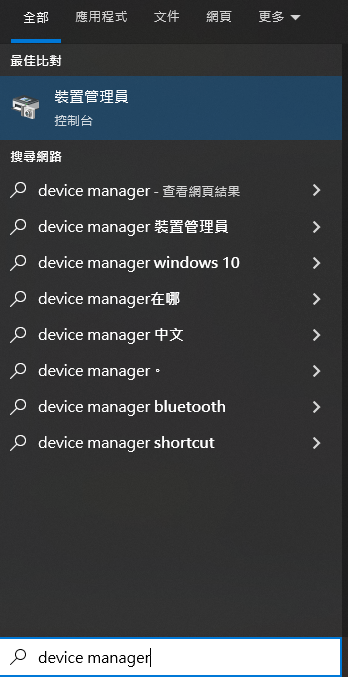
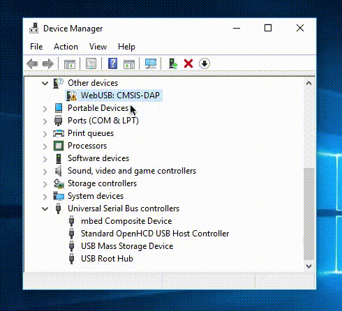

# Jacdac MakeCode編程快速開始

MakeCode已經可以支援Micro:bit V2的Jacdac編程，請細閱以下說明了解如何在MakeCode開始編程。

### 注意：Jacdac只支援Micro:bit V2

## 1. 在MakeCode專案加入Jacdac插件

## 2. 將Micro:bit V2連接到MakeCode，然後將程式hex下載到Micro:bit V2

## 3. 連接Jacdac模組MakeCode會自動更新模組清單，然後點擊加入積木就可以開始編程

### 假如你手上沒有Jacdac模組，你亦可以透過模擬器進行編程

### 在模擬器搜尋模組就可以加入相應的積木

## Micro:bit不能連接MakeCode修復方法

假如你的Micro:bit不能連接到MakeCode，請試試以下方法。

1. 更新網絡瀏覽器

2. 更新Micro:bit的韌體

3. 重新安裝mbed驅動程式

### 重新安裝mbed驅動程式方法

#### 1. 將Micro:bit連接到電腦

#### 2. 搜尋並打開裝置管理員(Device Manager)

#### 3. 選擇mbed device，移除硬件並剔選移除驅動程式

#### 4. 重新連接Micro:bit