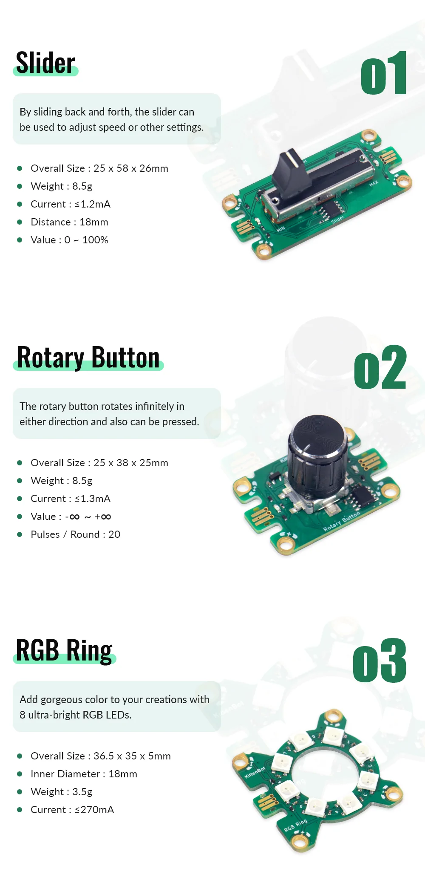
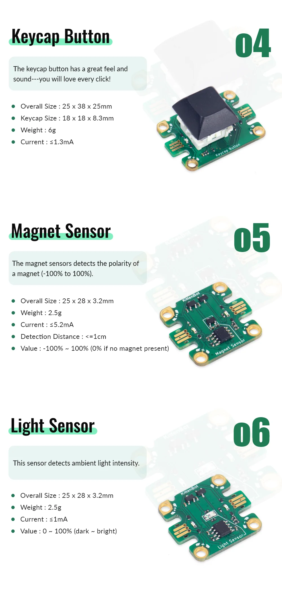
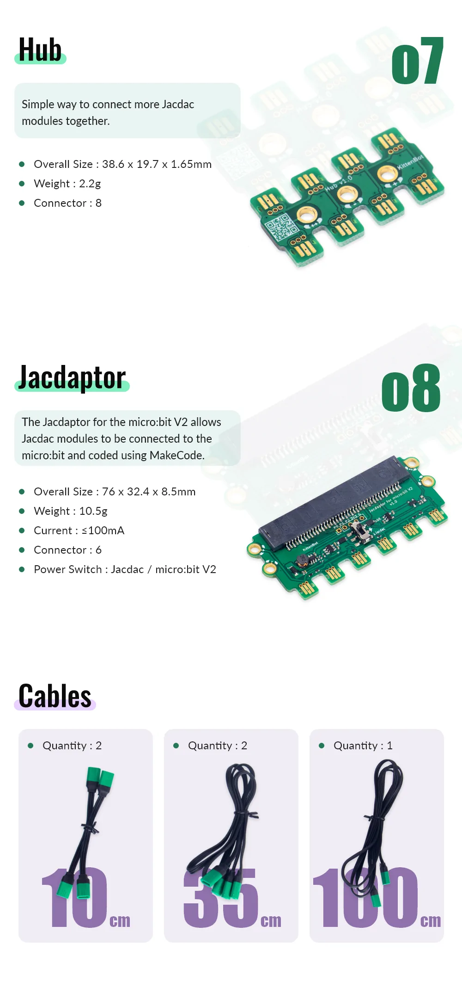

# KittenBot JacDac新手套件

Kittenbot作為微軟在Jacdac硬件上的合作夥伴，已推出市場上第一套支援Jacdac的硬件套件，套件已經包含合Micro:bit V2使用的Jacdapter和各類Jacdac模組，讓玩家們快速和輕易地開始Jacdac在MakeCode上的編程。

## 套件內容

1. Jacdapter *1
2. Jacdac按鍵模組 *2
3. Jacdac旋鈕鍵 *1
4. Jacdac滑動電位器 *1
5. Jacdac光敏感應器 *1
6. Jacdac磁力感應器 *1
7. Jacdac RGB燈圈 *1
8. Jacdac分線器 *1
8. Jacdac連接線 *5

