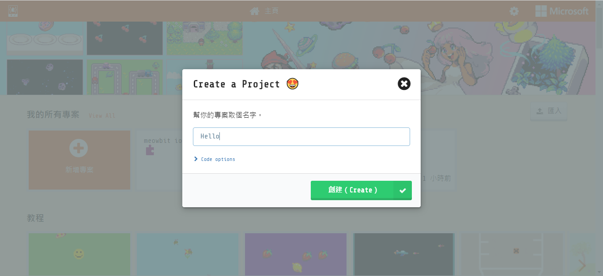
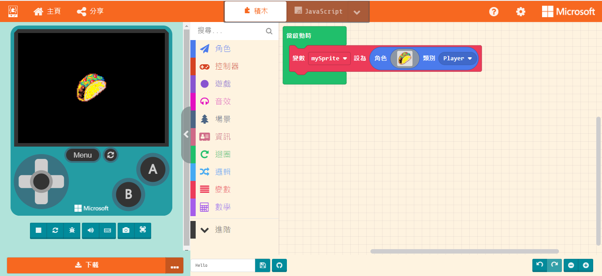
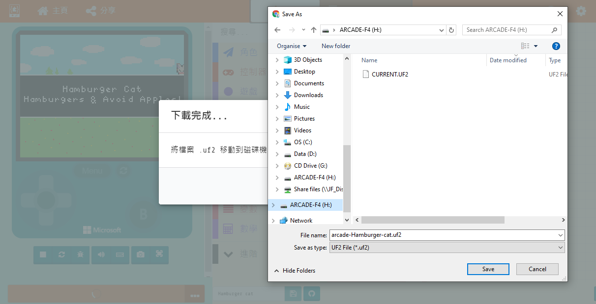

# Meowbit MakeCode編程快速入門

MakeCode Arcade是微軟開發的圖像化遊戲編寫平台，同時也是MeowBit的主要編程平台。

#### Meowbit是微軟MakeCode Arcade的其中一款官方認可硬件。

## MakeCode Arcade編程

### 用USB線連接MeowBit到電腦。

### 進入下載模式

- 按著MeowBit的A按鍵不放，打開MeowBit電源。

成功的話，電腦會出現一個叫Arcade F4的裝置。

### 打開Makecode Arcade

### <https://arcade.makecode.com>

### 建立新專案

### 編程介面

### 選擇Meowbit平台

### 進行編程

    作為示範，這裡只加入一塊積木示範。

### 編程完成之後下載遊戲到MeowBit。

