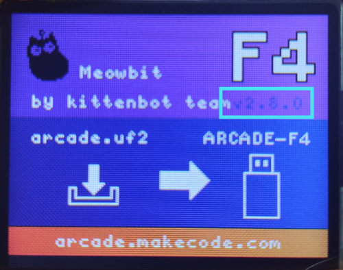

# MeowBit操作教學

這裡會教大家一些關於MeowBit的操作，例如進入下載模式，選項介面，固件更新等。

## 進入下載模式

想將遊戲下載到Meowbit的話，就一定要將Meowbit進入下載模式。

### 方法1

首先用USB線連接MeowBit到電腦。

按著MeowBit的A按鍵不放，打開MeowBit電源。

Meowbit會顯示寫著F4字樣的介面，進入模式成功。

### 方法2

首先用USB線連接MeowBit到電腦。

打開MeowBit電源。

按著MeowBit的A按鍵不放，按一下重置按鍵。

Meowbit會顯示寫著F4字樣的介面，進入模式成功。

## 進入選項介面

在遊戲中，我們可以開啟選項，調較音量和屏幕光度。

### 進入選項介面方法

按一下選項按鍵。

Meowbit會顯示選項菜單，您可以用方向鍵選擇選項，按A確認。

## 固件更新

[最新固件2.8.0下載](www.google.com)

首先進入下載模式。畫面上會顯示固件版本。

將更新檔案拖到Arcade-F4上面。  
等待MeowBit出現YAY字樣，然後按一下重置按鍵。  

