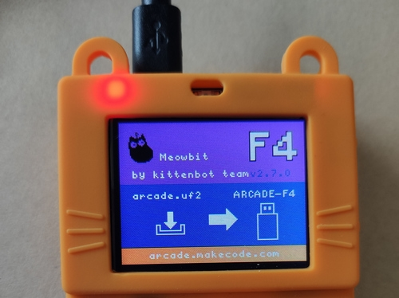
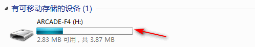
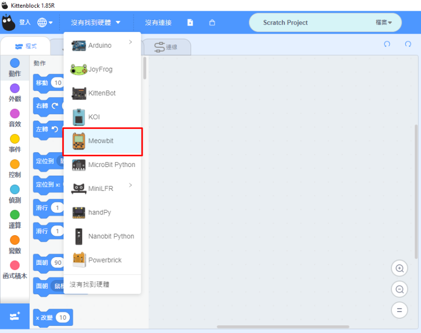
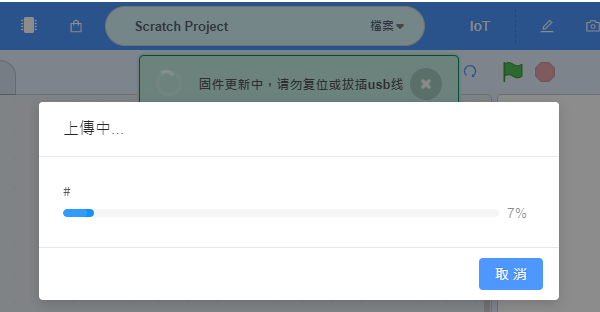
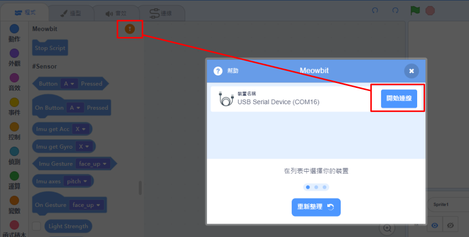
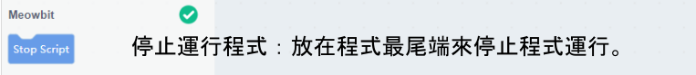
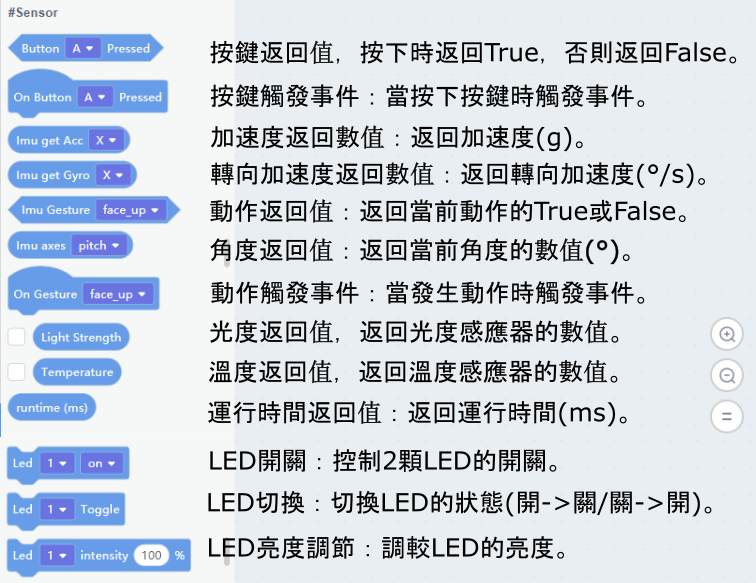
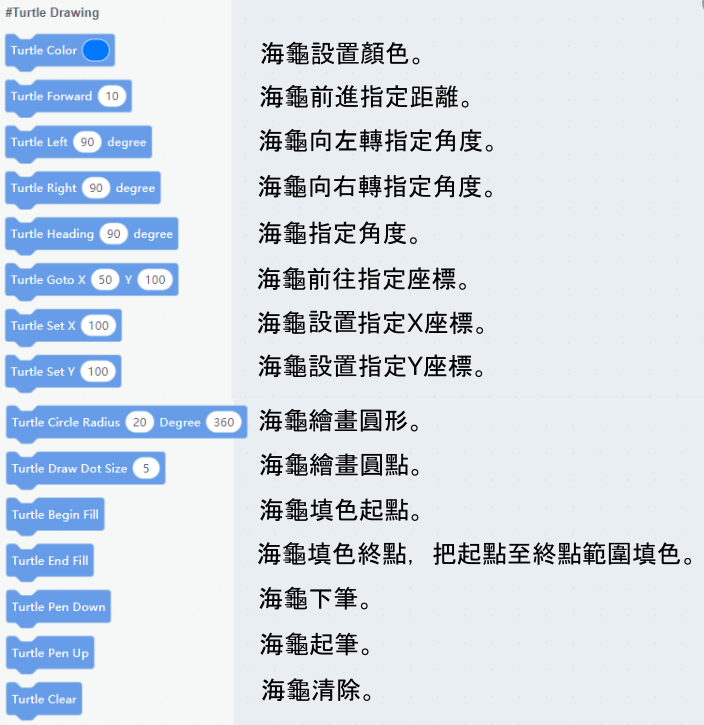
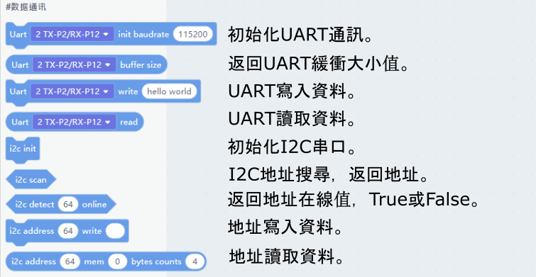

# Meowbit Kittenblock編程快速入門

Kittenblock是針對青少年STEAM教育的編程平台，是Meowbit的其中一種支援平台。

## 在Kittenblock連接Meowbit

要在Kittenblock對Meowbit編程，我們首先要與Meowbit建立連接。

### 1. 將Meowbit連接電腦，並進入下載模式。

- 按著MeowBit的A按鍵不放，打開MeowBit電源。

成功的話，電腦會出現一個叫Arcade F4的裝置。

### 2. 打開Kittenblock，在選擇硬件欄選擇Meowbit。

### 3. 點擊升級韌體。

完成後，電腦會出現一個叫PYBFLASH的裝置。

    假如電腦上只出現了可移動式磁碟(USB Drive)，你需要按著B然後按一下Reset。

### 4. 點擊感嘆號，連接Meowbit。

Meowbit上會顯示”設備已連接”的字句。

## 在Kittenblock上編程教學

在Kittenblock上Meowbit有不同種類的功能。

### 運行類

### 輸入類，感應器類

### 顯示屏類

### 蜂鳴器類

### 引腳控制類

### Robotbit控制類

### Neopixel類

### LOGO海龜類

### 串口通訊類

