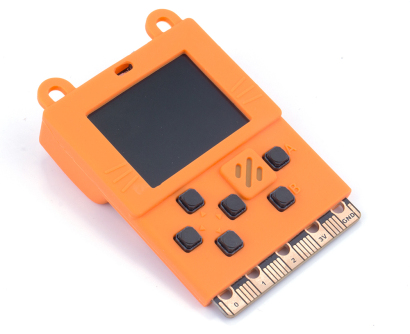

# Meowbit介紹

時下的年青人都喜歡玩電子遊戲，為了提高他們對編程的興趣，Kittenbot推出了Meowbit，一款為MakeCode Arcade而設計的一款小型掌上遊戲機。運用MakeCode Arcade，學生可以用圖像化的編程方式創作自己的遊戲然後直接上傳到Meowbit遊玩，讓大家都可以輕鬆地體驗遊戲設計，充分體現出STEAM的學習理念。  
除此之外，MeowBit還是一塊機械人主控板，它底部也有與Microbit相容的引腳金手指，兼容Kittenbot的擴展板，令Meowbit的靈活性更高，創作性更豐富。  
### **Meowbit喵比特已經受到Microsoft的官方認證，是Microsoft推薦的MakeCode Arcade硬件之一。**

## 適合人群

- 學校，培訓機構
- 對遊戲設計有興趣的大眾

## 產品特色

- 圖像化編程，令新手也容易上手。
- 將編程和藝術結合，體現STEAM教學的理念。
- 靈活性高，可作遊戲機亦可作機械人主控。
- 搭載多款感應器，令編程靈活性更高。
- 支援多款編程平台，包括MakeCode Arcade和Kittenblock。
- 可愛又懷舊的畫風。
- 體積細小，適合便攜，隨時隨地遊玩你創作的遊戲。
- 支援中文編碼，畫面可顯示中文。

## 產品參數

- 產品大小：52x76x12mm
- 淨重：42g
- 主控芯片：STM32F401RET6,32位元ARM Cortex M4核心
- 供電電壓：5V USB供電，3.7~4.2V電池盒供電
- 螢幕類型：TFT全彩螢幕
- 屏幕解像度：160x128
- 螢幕尺寸：1.8吋
- IO引腳：20PIN金手指（與Microbit相容）

## 板上感應器和接口：

- 可編程按鍵x6
- 蜂鳴器x1
- 可編程LED燈x2
- 光度感應器x1
- 溫度感應器x1
- 陀螺儀x1
- SD卡插口x1
- JacDac插口x1

## 硬件細節

**1：電源指示燈**  

**2：光度感應器**  

**3：電源開關**  

**4：可編程LED燈x2** 
 
**5：重置按鍵** 
 
**6：DFU模式/Menu按鍵**
  
**7：TFT螢幕**  

**8：溫度感應器** 
 
**9：可編程方向鍵**
  
**10：可編程蜂鳴器** 
 
**11：可編程AB按鍵**  

**12：引腳**  

**13：USB接口** 
 
**14：SD卡插槽** 
 
**15：JacDac接口**  

**16：6軸陀螺儀**  

**17：3.7V鋰電池JST接口** 
 
**18：主控晶片**
  
**19：Unicode晶片**  

**20：簽名欄**  

## 支援編程平台：

- Microsoft MakeCode Arcade
- Kittenblock

## 詳細引腳圖：

## 介紹短片：

### Meowbit介紹

### 外國用家分享

### Meowbit應用分享

