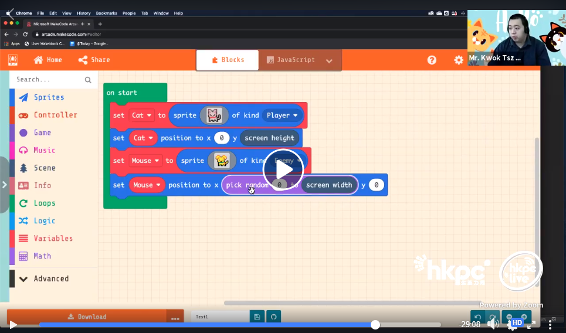
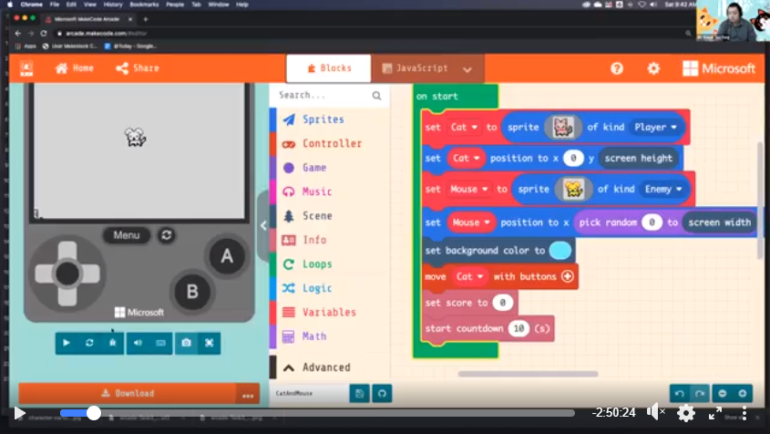

# MeowBit教學影片

我們很高興請到田家炳中學的郭老師教大家使用MakeCode Arcade，創作屬於自己的MeowBit遊戲。

從以下的兩節課堂中，大家會由零開始學習如何使用MakeCode Arcade創作遊戲。

[MakeCode Arcade](https://arcade.makecode.com/)

## 你的首隻MeowBit遊戲

### 請由1小時58分開始觀看。教程長約1小時。

## 你的第二隻MeowBit遊戲

### 教程長約1小時。

## 鳴謝：

郭Sir教室 Mr. Kwok's Classroom：

<https://www.facebook.com/kwoksirclassroom/>

轉載自香港InnoSpace HourOfCode：

<https://www.facebook.com/watch/107807216571940/728249611306184>

