# Meowbit的陀螺儀

Meowbit上搭載了陀螺儀，Meowbit上有1個3軸的陀螺儀，可以測量X,Y,Z軸的轉動角度和加速度，甚至能偵測搖晃跌落等的狀態。

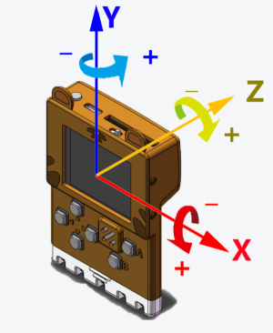

## MakeCode Arcade編程教學

### 載入控制器插件

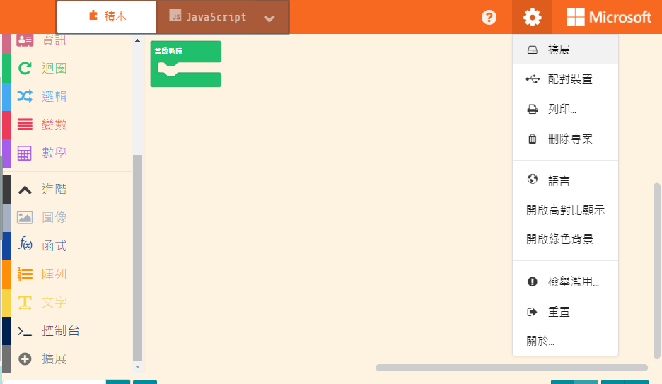

### 控制器積木塊

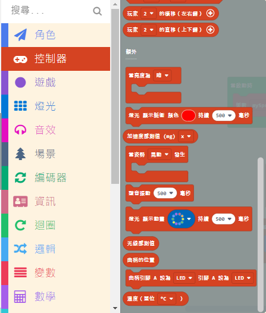

### 陀螺儀編程

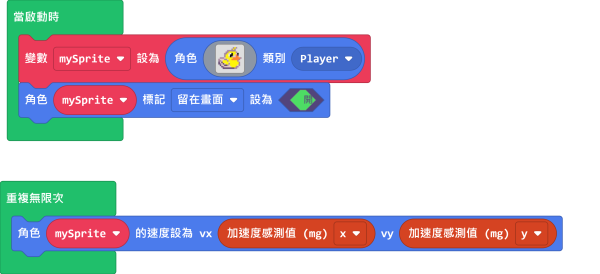

    轉動角度數值範圍由0-1023

小鴨子會跟隨我們傾斜Meowbit的幅度移動。

[參考程式](https://makecode.com/_5UrbHAFAFD2K)

### 動作檢測編程

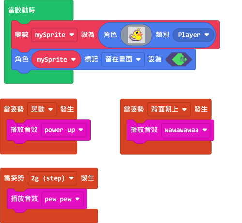

我們拿著Meowbit做不同的動作會有相應的聲效。

[參考程式](https://makecode.com/_Pc0AufXvC6DD)

##  Kittenblock編程教學

### 陀螺儀積木塊

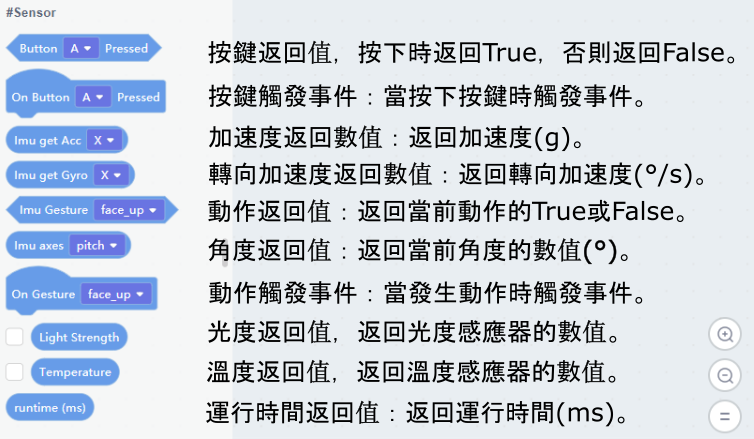

### 加速度編程

小貓會一直說出現時的加速度數值。

### 轉向加速度編程

小貓會一直說出現時的轉向加速度數值。

### 傾斜角度編程

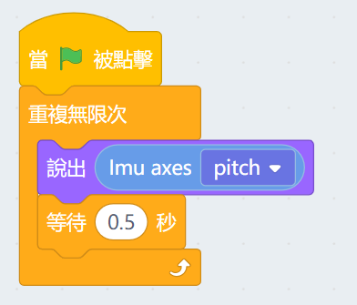

小貓會一直說出現時的傾斜角度。

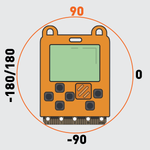
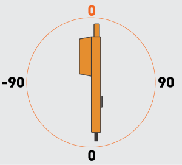

### 動作檢測編程

    動作檢測這裡有2種積木，事件觸發和返回數值。2種積木的功能基本上一樣，大家可以因編程需要而選擇。

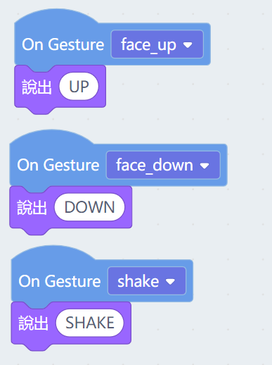

我們拿著Meowbit做不同的動作，小貓會說出相應的說話。

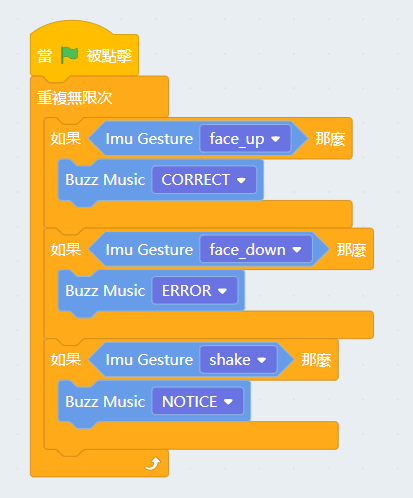

我們拿著Meowbit做不同的動作會有相應的聲效。

