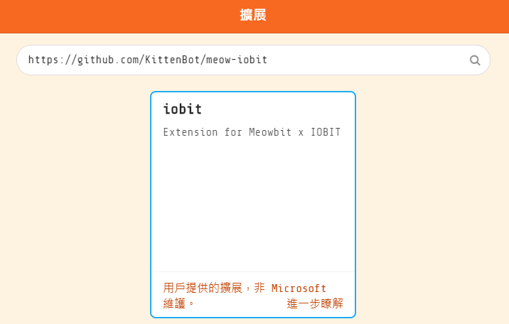
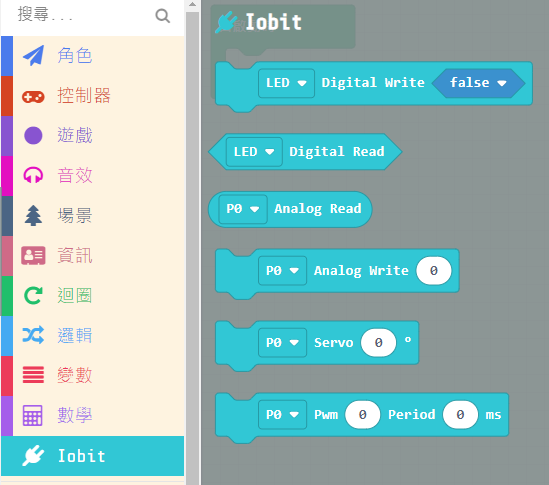
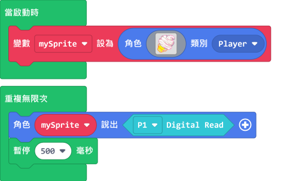
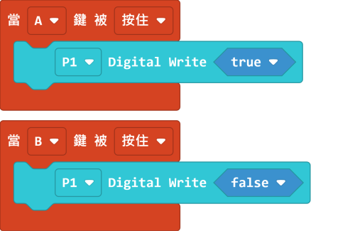
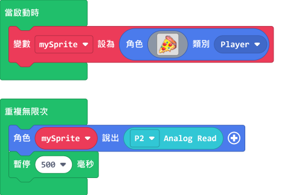
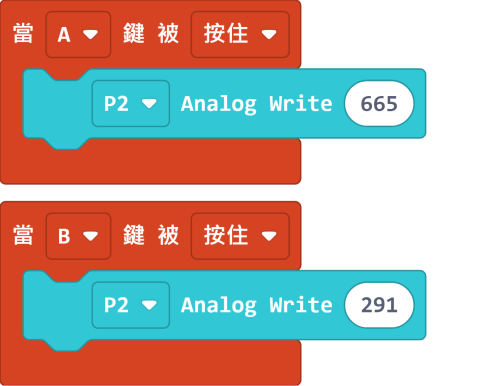
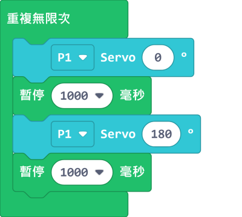

# Meowbit與IOBit

Meowbit上的引腳其實也支援Kittenbot的其他擴展板，在這節教程我們會看看Meowbit怎樣和IOBit一起使用。

## MakeCode Arcade編程教學

## IOBit 硬件與引腳編程

### 載入IOBit插件

插件地址：https://github.com/KittenBot/meow-iobit

### [詳細方法](../Makecode/powerBrickMC)

### IOBit積木塊

## Meowbit與IOBit編程

### 1. 讀寫引腳數值

#### 1.1 讀取數位數值

[參考程式](https://makecode.com/_fD2EzsE3JVPJ)

#### 1.2 寫入數位數值

[參考程式](https://makecode.com/_0Eq1XdHzWXJq)

#### 1.3 讀取類比數值

[參考程式](https://makecode.com/_cujbCAPbE5Hx)

#### 1.4 寫入類比數值

[參考程式](https://makecode.com/_2ovaa74358EC)

### 2. 舵機編程

[參考程式](https://makecode.com/_iA0YjiR3sJFz)