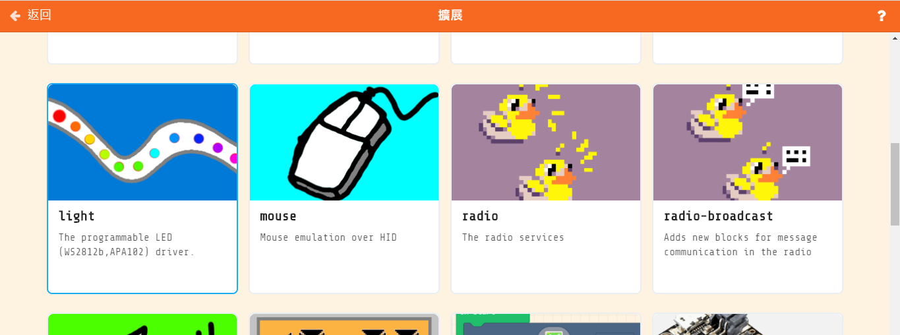
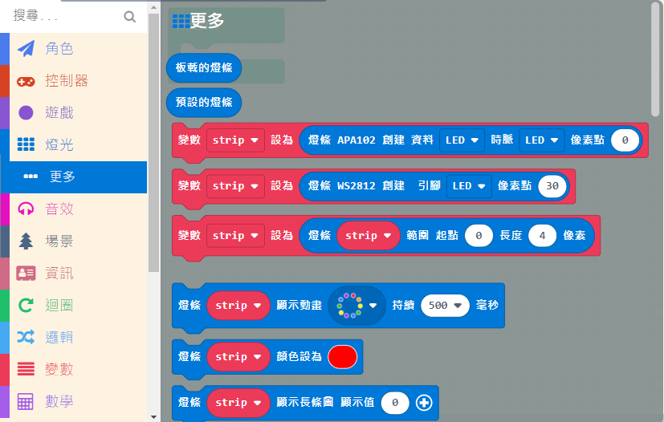
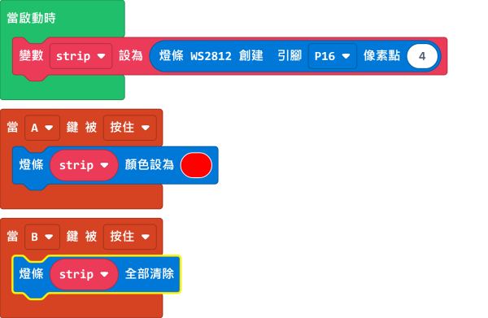
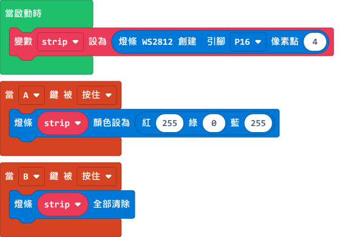
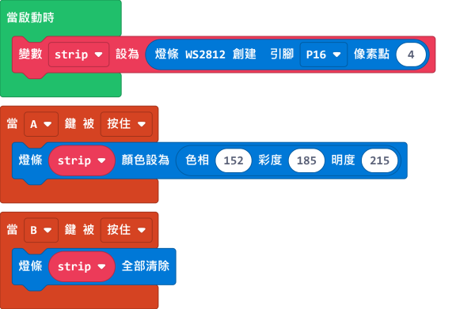
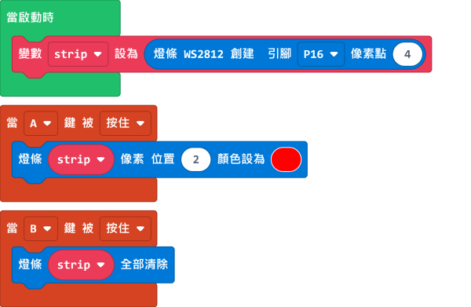
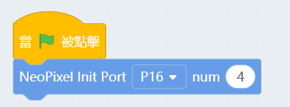
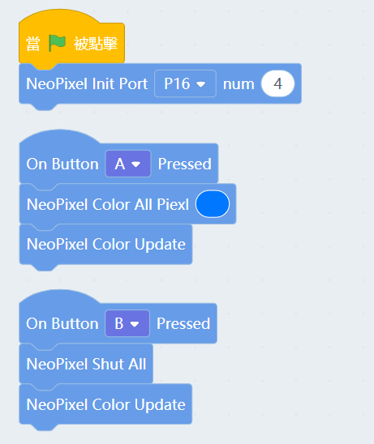
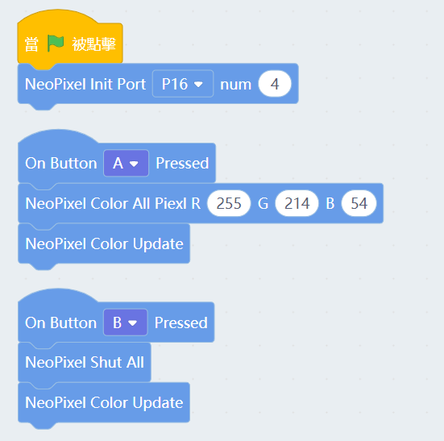
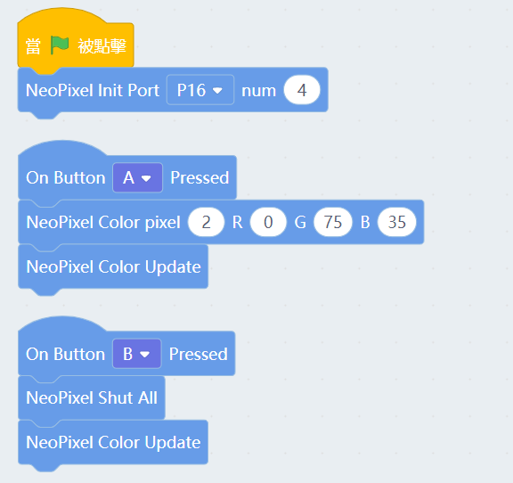

# Meowbit的燈條編程

使用Meowbit亦可對Neopixel的燈條編程，例如Robotbit上的燈條。

## MakeCode Arcade編程教學

## Robotbit 燈條編程

### 載入燈條插件

### [詳細方法](../Makecode/powerBrickMC)

### 燈條積木塊

### 燈條編程

    在Meowbit上使用Robotbit的燈條時，需要在Pin 16設置長度為4的WS2812燈條。
    

    
#### 4顆燈同時點亮

[參考程式](https://makecode.com/_XXwcLH7YpW2x)

#### 使用RGB數值指定顏色

[參考程式](https://makecode.com/_CTVgMgevD2Ks)

#### 使用HSL數值指定顏色

[參考程式](https://makecode.com/_M6M9VrHbj8dH)

#### 點亮指定一顆燈

    燈條像素數值由0開始數。

[參考程式](https://makecode.com/_89Hb2TW6LJ0a)

#### 光子效果

[參考程式](https://makecode.com/_92m20h91uL5j)

##  Kittenblock編程教學

### 燈條編程

    在Meowbit上使用Robotbit的燈條時，需要在Pin 16設置長度為4的WS2812燈條。

    
#### 4顆燈同時點亮

    所有燈效都需要運行Color Update這個積木才會顯示。

#### 使用RGB數值指定顏色

#### 點亮指定一顆燈

    燈條像素數值由0開始數。

