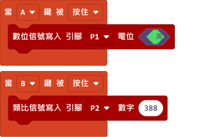
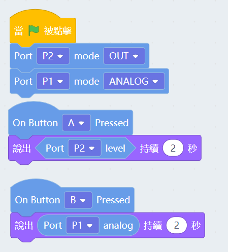
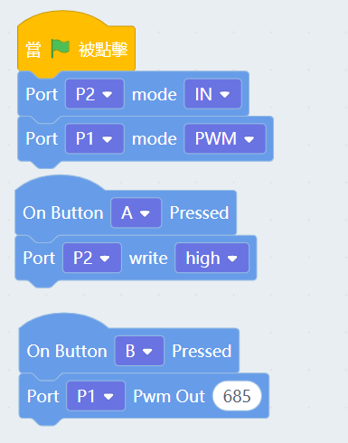

# Meowbit的引腳編程

Meowbit上有20Pin的引腳金手指，大家可以用鱷魚夾連接不同的模組在MakeCode Arcade使用。

## MakeCode Arcade編程教學

### 載入引腳插件

### 引腳積木塊

    加入Robotbit插件時也會自動一併加入引腳插件。

### 引腳編程

#### 引腳數值讀取

[參考程式](https://makecode.com/_7ubaidLXoJai)

#### 引腳數值寫入

[參考程式](https://makecode.com/_46pdR89CkTD5)

##  Kittenblock編程教學

### 引腳積木塊

#### 引腳數值讀取

按A讀取P2的數位數值，按B讀取P1的類比數值。

#### 引腳數值寫入

按A寫入P2的數位數值，按B寫入P1的類比數值。
