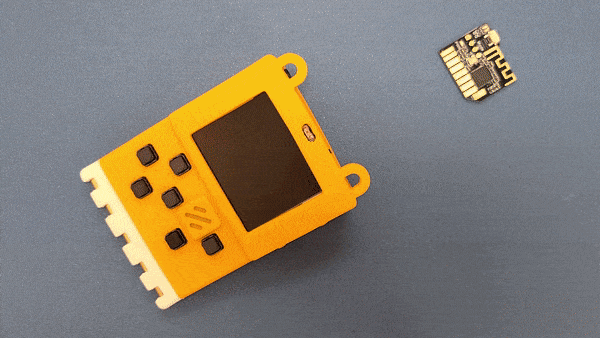
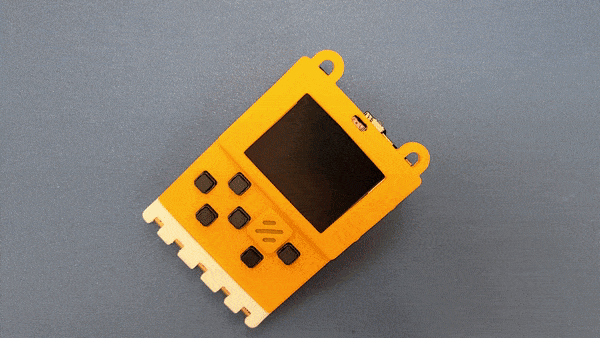
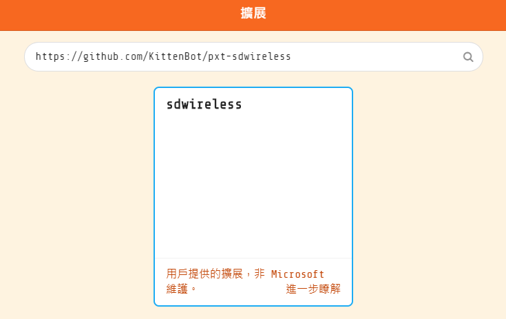
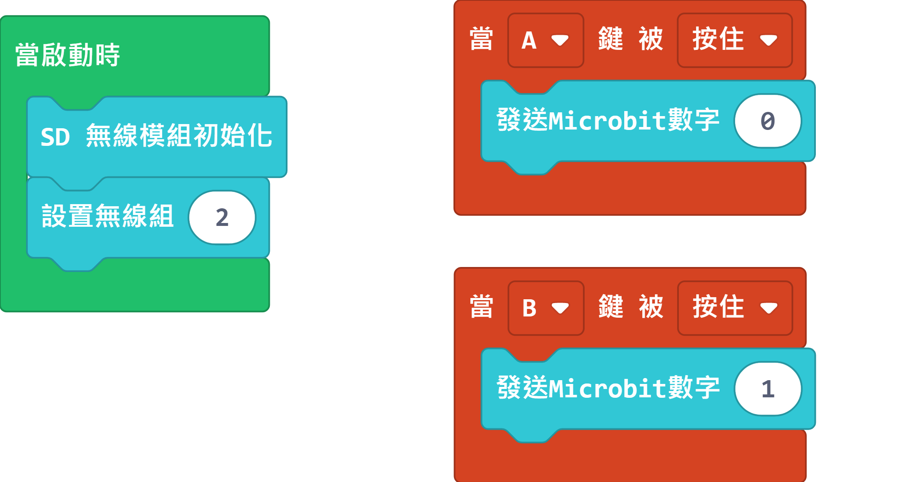
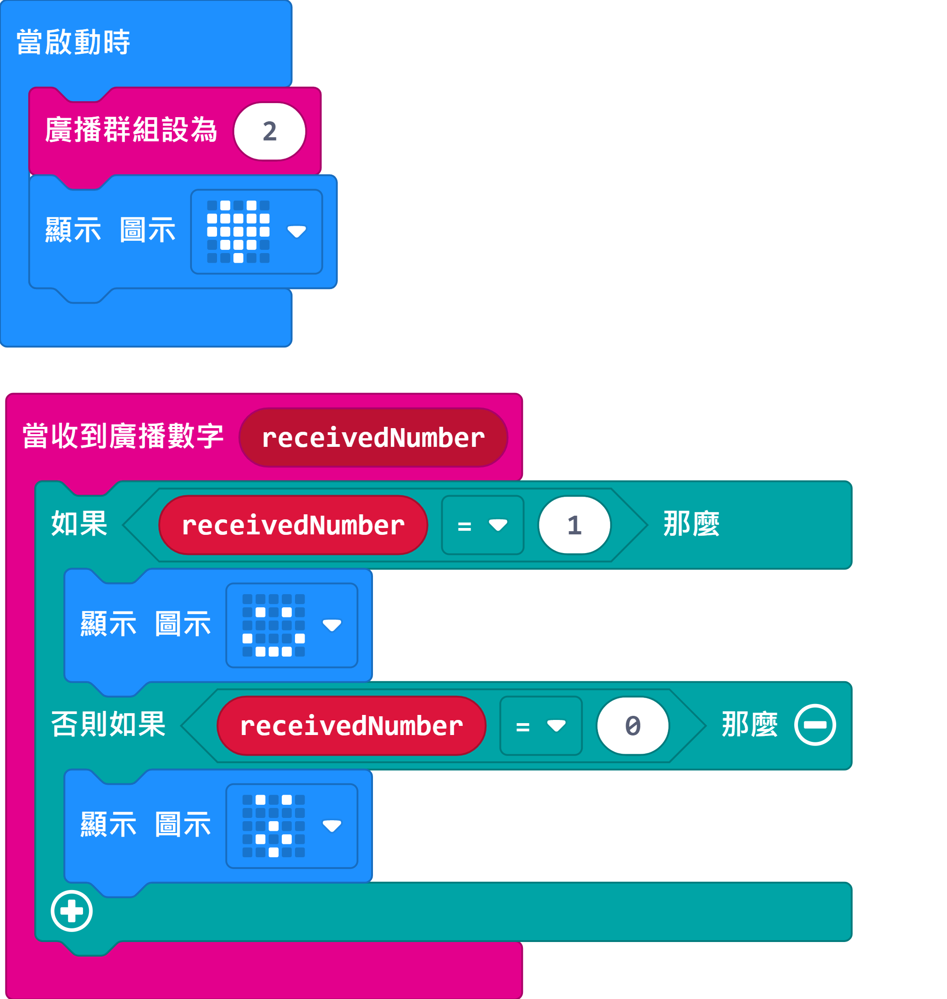
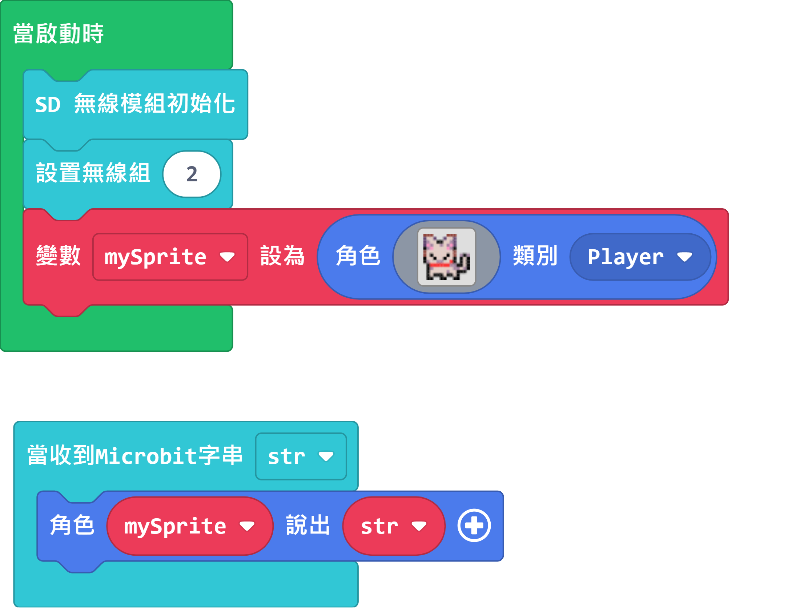

# MeowBit無綫通訊SD模組

有了這塊無綫通訊模組，我們就可以利用Meowbit與例如Microbit等的設備通訊了！

## 產品參數

- 主控芯片：nRF51822 ARM Cortex-M0
- 核心頻率：16Mhz
- 尺寸：24x21X3mm
- 重量：1.4g
- 通訊最遠距離：10m
- 工作電壓：3.3V
- 通訊模式：2.4G和藍芽2.4G
- 無綫狀態指示燈（綠色為2.4G模式、藍色為藍芽模式）
- 模式切換按鍵
- SD卡金手指接口

## 裝插方法

安裝方法：將模塊插入Meowbit頂部的SD卡插槽，金手指那一面朝自己。

拔除方法：將模組小心地拔出Meowbit。

## 模式切換

我們可以按模組頂部的按鈕在2.4G和藍芽模式中切換。

## MakeCode Arcade編程教學

### 載入無綫模組插件

插件地址：https://github.com/KittenBot/pxt-sdwireless

### [詳細方法](../Makecode/powerBrickMC)

### 無綫模組積木塊

### MakeCode Arcade錯誤警告

    MakeCode Arcade用插件時有時候會顯示以下警告，這只是因為Arcade的模擬器沒有無綫模組，不需要理會。

### 無綫傳送資料

我們會試試用Meowbit和**無綫模組2.4G模式**發送資料到Microbit。

#### Meowbit編程

[參考程式](https://makecode.com/_CTHU6hP81P6U)

#### Microbit編程

[參考程式](https://makecode.microbit.org/_R8zKEpixPazc)

#### 我們在Meowbit按A或B鍵，Microbit會顯示相應的表情。

### 無綫接收資料

我們會試試用Meowbit和**無綫模組2.4G模式**接收Microbit的資料。

#### Meowbit編程

[參考程式](https://makecode.com/_KDPdA0XccXvP)

#### Microbit編程

[參考程式](https://makecode.microbit.org/_Xx39ryM2CTp9)

#### 我們在Microbit按A或B鍵，Meowbit會顯示相應的文字。

