# Meowbit與Robotbit

Meowbit上的引腳其實也支援Kittenbot的其他擴展板，在這節教程我們會看看Meowbit怎樣和Robotbit一起使用。

## Robotbit注意事項：

### 1：電池的正負極一定要正確地安裝

### 2：將Meowbit插上Robotbit時必須要屏幕向外

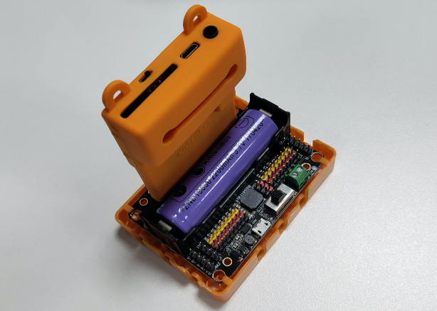

## MakeCode Arcade編程教學

## Robotbit編程

### 載入Robotbit插件

    加入Robotbit插件時也會自動一併加入引腳插件。

### 插件地址：https://github.com/KittenBot/meow-robotbit

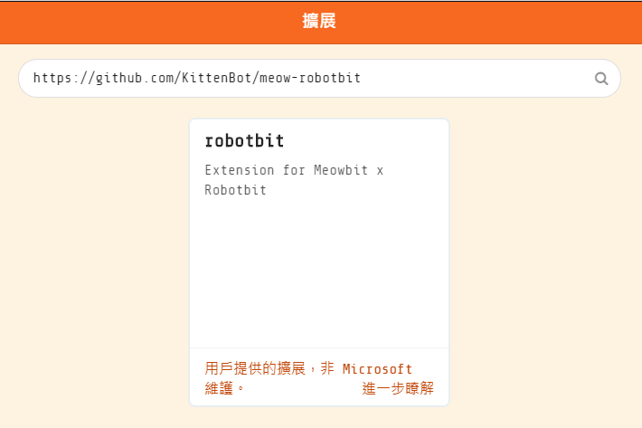

### Robotbit積木塊

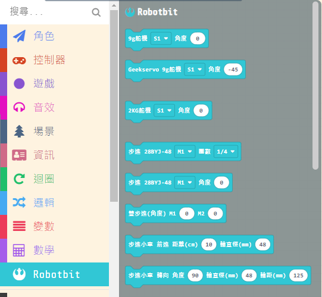

### Meowbit與Robotbit編程

#### 1. 電機編程

將電機連接在Robotbit的M1A和M1B上。

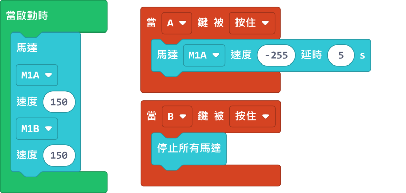

[參考程式](https://makecode.com/_PtE25Ke69X5h)

### 2. 舵機編程

將舵機連接在Robotbit的S1上。

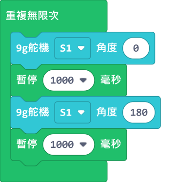

[參考程式](https://makecode.com/_FdTVtYRy55kr)

### 3. 步進電機編程

將步進電機連接到Robotbit的M1和M2上（將紅色電線連接到VM）。

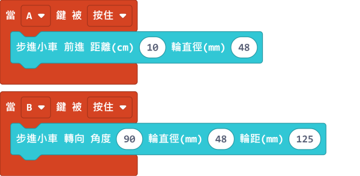

[參考程式](https://makecode.com/_9hk2UwcvsCAo)

##  Kittenblock編程教學

### Robotbit積木塊

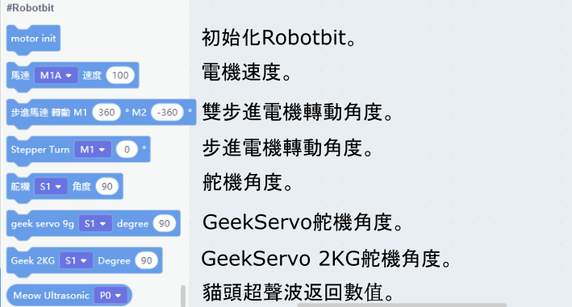

#### 1. 電機編程

將電機連接在Robotbit的M1A和M1B上。

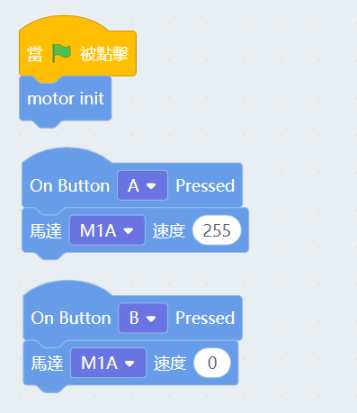

### 2. 舵機編程

將舵機連接在Robotbit的S1上。

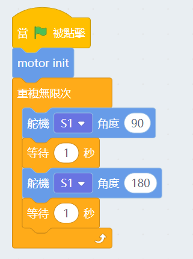

### 3. 步進電機編程

將步進電機連接到Robotbit的M1和M2上（將紅色電線連接到VM）。

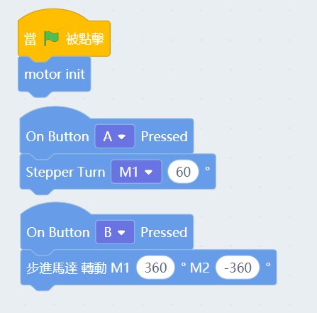

## 疑難排解

### 問：我在Kittenblock上載程序到Meowbit之後出現錯誤，畫面顯示 ”Robotbit is not defined”，應該如何解決？

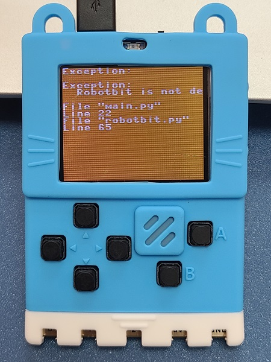

### 答：Robotbit的插件必須要在插上Robotbit時才能使用，只要將Meowbit插上Robotbit然後重啟就可以了。