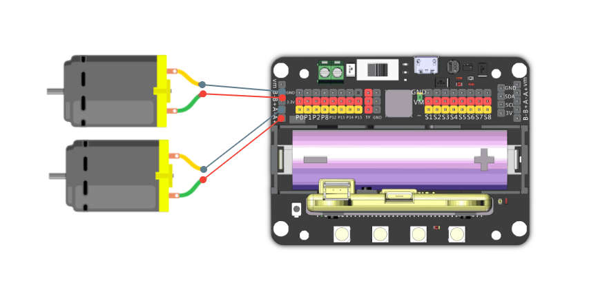
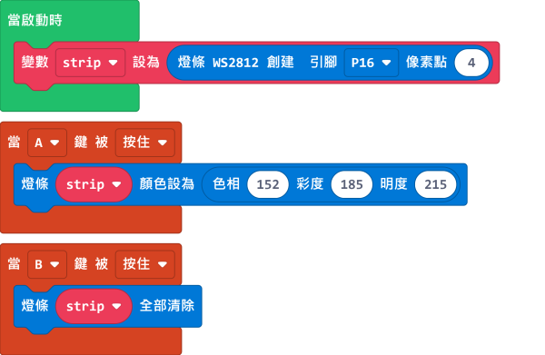
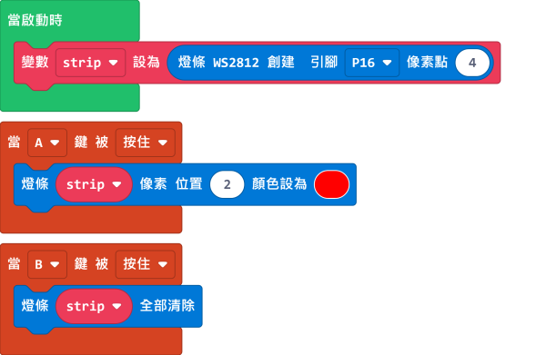
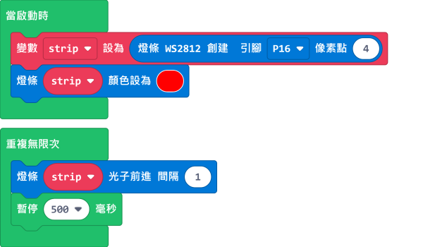

# Meowbit與Robotbit

Meowbit上的引腳其實也支援Kittenbot的其他擴展板，在這節教程我們會看看Meowbit怎樣和Robotbit一起使用。

## MakeCode Arcade編程教學

## Robotbit 硬件與引腳編程

### 載入Robotbit插件

插件地址：https://github.com/KittenBot/meow-robotbit

### Robotbit積木塊

### Meowbit與Robotbit編程

#### 1. 電機編程

將電機連接在Robotbit的M1A和M1B上。

[參考程式](https://makecode.com/_PtE25Ke69X5h)

### 2. 舵機編程

將舵機連接在Robotbit的S1上。

[參考程式](https://makecode.com/_FdTVtYRy55kr)

### 3. 步進電機編程

將步進電機連接到Robotbit的M1和M2上（將紅色電線連接到VM）。

[參考程式](https://makecode.com/_9hk2UwcvsCAo)

### 4. 引腳編程

引腳的讀寫需要用到引腳的積木塊。

#### 4.1 引腳數值讀取

[參考程式](https://makecode.com/_7ubaidLXoJai)

#### 4.2 引腳數值寫入

[參考程式](https://makecode.com/_46pdR89CkTD5)

## Robotbit 燈條編程

### 載入燈條插件

### 燈條積木塊

### 5. 燈條編程

    在Meowbit上使用Robotbit的燈條時，需要在Pin 16設置長度為4的WS2812燈條。
    

    
#### 5.1 4顆燈同時點亮

[參考程式](https://makecode.com/_XXwcLH7YpW2x)

#### 5.2 使用RGB數值指定顏色

[參考程式](https://makecode.com/_CTVgMgevD2Ks)

#### 5.3 使用HSL數值指定顏色

[參考程式](https://makecode.com/_M6M9VrHbj8dH)

#### 5.4 點亮指定一顆燈

    燈條像素數值由0開始數。

[參考程式](https://makecode.com/_89Hb2TW6LJ0a)

#### 5.5 光子效果

[參考程式](https://makecode.com/_92m20h91uL5j)

