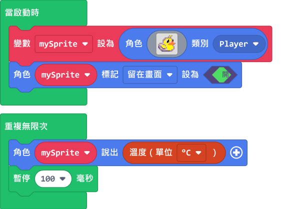
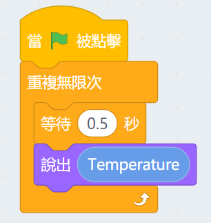

# Meowbit的溫度感應器

Meowbit上搭載了溫度感應器，可以檢測環境溫度。

## MakeCode Arcade編程教學

### 載入控制器插件

### 控制器積木塊

### 探測溫度數值編程

小鴨會一直說出現時的溫度數值。

[參考程式](https://makecode.com/_0RVU8sirC9hM)

##  Kittenblock編程教學

### 探測光度數值編程

小貓會一直說出現時的溫度數值。