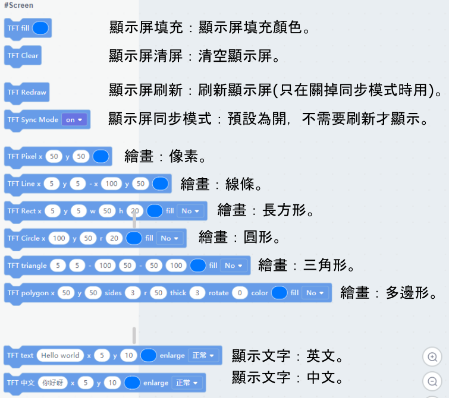
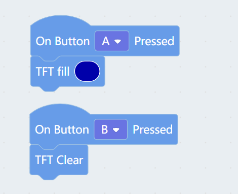
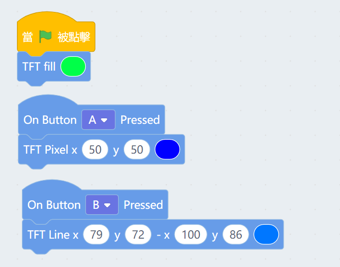
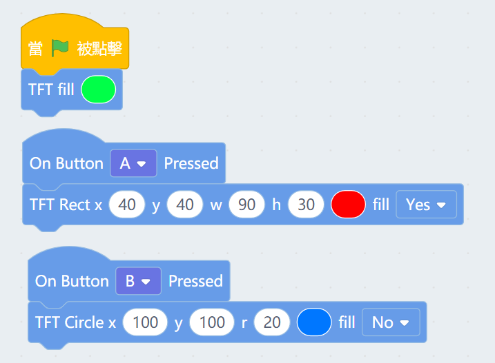
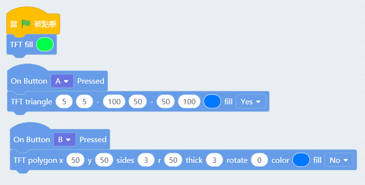
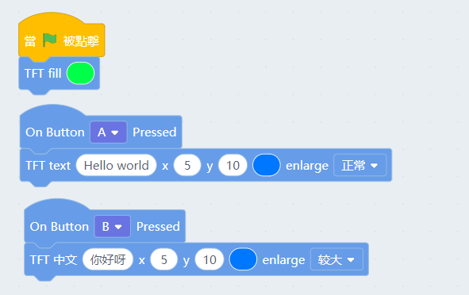

# Meowbit顯示屏(Kittenblock)

Meowbit在Kittenblock上可以對顯示屏做編程。

##  Kittenblock編程教學

### 顯示屏積木塊

### 顯示屏顏色和清屏

按A填滿顏色，按B清屏。

### 顯示屏畫點、線

    線的畫法是由第一點開始畫到第二點。例：(79,72)->(100,86)

### 顯示屏畫矩形和圓形

    矩形的座標是代表矩形的左上角，w和h分別代表長和闊，Fill代表填色。
    圓形的座標是代表圓形的圓心，r代表半徑，Fill代表填色。

    
### 顯示屏畫三角形和多邊形

    三角形的三個座標分別代表三個角，Fill代表填色。
    多邊形的座標代表圖形的正中心，可以指定邊的數量，圖形大小，邊的粗度和圖形旋轉，Fill代表填色。

### 顯示屏寫出文字

    座標代表文字的左上角。

