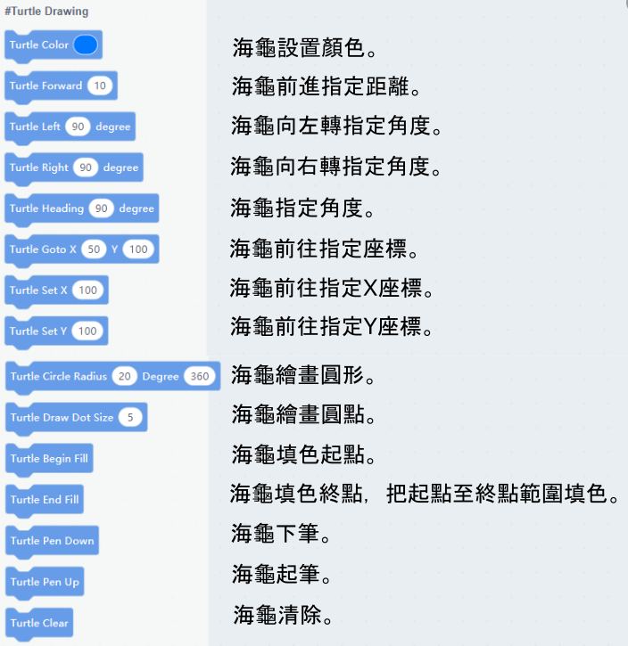
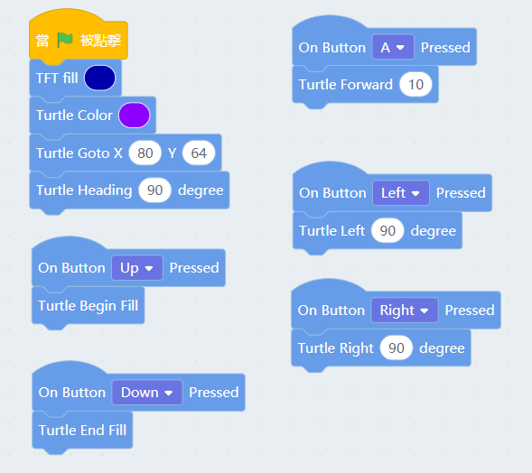
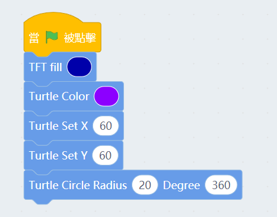
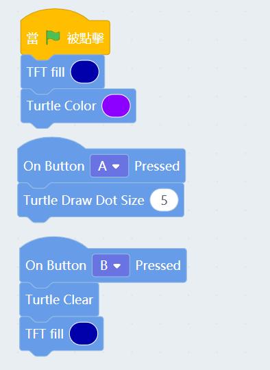
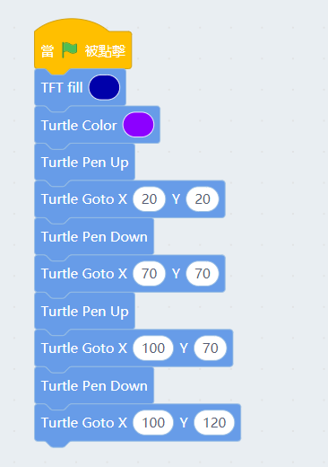

# Meowbit與海龜繪圖(Kittenblock)

海龜學園是一個設計給小孩子學習編程繪圖的平台。

Meowbit在Kittenblock上也可以玩海龜繪圖。

##  Kittenblock編程教學

### 海龜積木塊

### 海龜移動和繪圖

按上記錄填色起點，按A前進，按左或右轉向，最後按下記錄填色終點並填上顏色。

### 海龜繪畫圓形

海龜自動移動到(100,100)，然後畫一個圓圈。

### 海龜畫點和清屏

    清屏後會連背景一併清掉，所以我們清屏後再畫一次背景。

按A畫點，按B清屏。

### 海龜起筆和落筆。

    假如我們沒有起筆，海龜的所有移動都會有畫線。相反在起筆之後，海龜的移動不會畫出來，這樣就可以繪畫多個圖形了。

海龜一次過在(20,20)至(70,70)和(100,70)至(100,120)繪畫兩條線。

