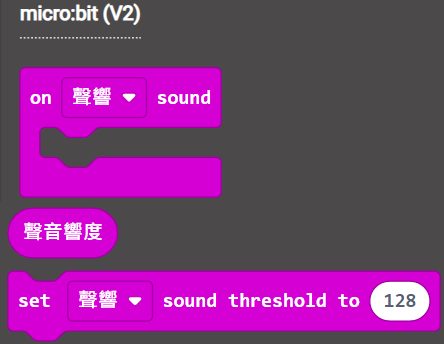
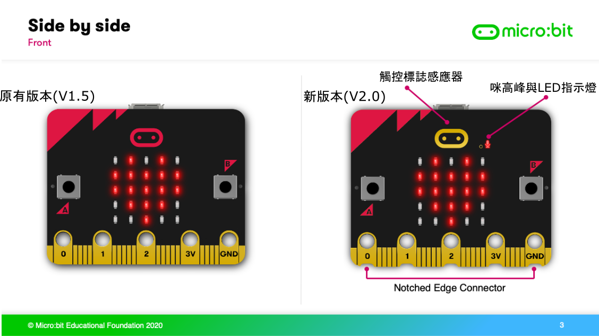
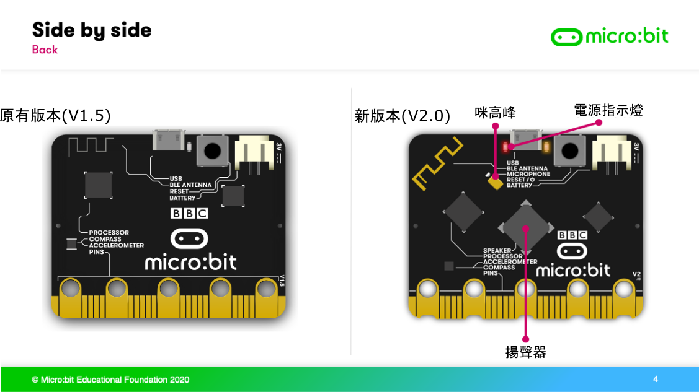
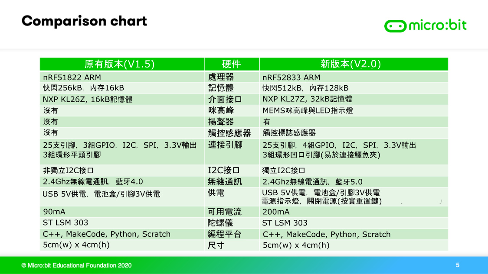

# BBC Micro:bit第二代介紹

BBC Micro:bit自從2016年推出第一代以來，在2020年11月終於也推出第二代了！第二代的Microbit比起第一代有極之大的升級，包括性能上的升級，新增感應器，甚至是主控板的設計都作出了改善。

以下篇章我們將會詳細了解Microbit第二代各方面的升級。

BBC Micro:bit第二代官網：<https://microbit.org/new-microbit/>

## 新版Microbit外貌

(Picture Credit: https://micromag.cc/microbit-v2-announcement/)

## 官方介紹短片

# Micro:bit升級逐個睇

Microbit第二代在六個方面上均有顯著的升級，現在讓我們逐項了解吧。

## 升級1：內置咪高峰

Microbit在第二代終於都加入了咪高峰，讓Microbit可以感應得到聲音的強弱從而作出反應。

能夠用聲音控制Microbit做不同的動作，肯定會讓大家創作的靈活性更大！

(Picture Credit: https://micromag.cc/microbit-v2-announcement/)

Microbit機構表示，為了教育大眾保護私隱的重要性，Microbit上亦加上了一顆配合咪高峰的LED燈，當大家使用咪高峰時就會點亮。

(Picture Credit: https://micromag.cc/microbit-v2-announcement/)

在MakeCode上對咪高峰編程亦都十分簡單，我們只需用這些簡單積木檢測聲音數值和使用聲音觸發事件。

### 效果展示：

拍拍手：利用Microbit的咪高峰，聽到拍手時顯示心形圖案。

唱歌挑戰：一直唱歌，使Microbit上的點陣屏完全點亮。

## 升級2：內置揚聲器

以往我們想用Microbit發聲的時候只能用擴展板的蜂鳴器，現在Microbit第二代上終於搭載了揚聲器，讓Microbit能夠發出聲音。

能夠讓Microbit發聲能夠讓大家發揮更大的想像力，教導學生時亦有新的反饋方式。

在MakeCode上編程亦都十分簡單，大家只需要啟用揚聲器就可以沿用大家已經熟悉的發聲積木。

### 效果展示：

大黃蜂：Microbit因應動作和速度改變發出的聲音。

鸚鵡學舌：Microbit模仿你說話的語調。

## 升級3：內置觸控感應器

在第二代的Microbit上，大家可以見到Microbit的標誌變金色了。這金色的標誌就是新的觸控感應器，這個感應器可以用作在原有的A和B鍵外的新輸入方法。

(Picture Credit: https://micromag.cc/microbit-v2-announcement/)

在編程方面，在MakeCode上則新加了這2件積木，讓大家很輕鬆地就可以使用觸控感應器。

## 升級4：待機模式/減少用電

為了應付學校課堂時的需要，Microbit的第二代加入了待機模式。讓大家可以暫停Microbit的程式，完成教導之後再繼續Microbit的程式。

大家只需要按着板背的重置按鈕數秒，紅色LED閃動就代表已經進入待機模式了。

除此之外，Microbit第二代亦都減少了耗電量，支援長時間地使用電池盒運行Microbit。

(Picture Credit: https://micromag.cc/microbit-v2-announcement/)

## 升級5：效能大升級

第二代的Microbit上搭載了新的處理器，新的處理器運算速度大幅提升，為未來推出的人工智能和機器學習功能做好準備。
此外，板上的內存亦都增加了7倍，由原本的16Kb提升到128kB。快閃記憶體亦增加1倍至512kB，支援上傳更加大的程式到Microbit。

除了運算效能之外，Microbit第二代亦都支援最新的藍芽5.0。

## 升級6：引腳升級

相信大家使用Microbit時都會利用引腳擴展Microbit的應用，所以Microbit第二代亦都對引腳作出重大的升級。

### 1. 電路板的設計

首先在電路板的設計方面，Microbit第二代的主要引腳都加設了一個小小的凹位。

(Picture Credit: https://micromag.cc/microbit-v2-announcement/)

這個凹位的設計是別有用心的，大家可能發現在舊版Microbit使用鱷魚夾時，鱷魚夾可能會鬆脫出來。

這個新的設計就正正容許更加穩固地連接鱷魚夾，不用再擔心鬆脫了。

(Picture Credit: https://micromag.cc/microbit-v2-announcement/)

### 2. I2C引腳改善

在引腳方面，第二代的Microbit將I2C的接口獨立地引出來，讓大家不再需要擔心手上的I2C配件會與Microbit不相容了。

### 3. 供電提升

Microbit的第二代亦都提升了引腳輸出的電量，由舊版的90mA提升至200mA，讓大家可以使用更多功能配件。

## Microbit第二代硬件詳解

(Picture Credit: https://mp.weixin.qq.com/s/u5Sj8DZg6oPHOOfzHbb1PA)

# 新舊Microbit的比較

## 新舊Microbit相容性

說到這裡，相信大家都對新的Microbit十分心動吧，不過大家可能心中有個疑問：

#### 我現有的hex程式能夠在第二代Microbit上運行嗎？

#### 答案是可以的，不過有一點要注意。

由於新的Microbit的改進頗大，MakeCode編程上亦要作出相應的改動才可支援新版，所以大家現有的hex程式需要更換成新版本的hex才可以在新版Microbit上使用。

不過大家不需要擔心，大家只需要將現有的hex檔案上傳到MakeCode就會自動轉換為新版的程式。新的程式下載下來後，就可以在新或舊版的Microbit上使用。

## 新舊Microbit對照

# Microbit第二代與Kittenbot擴展板

假如大家有用Kittenbot的擴展板的話，相信大家都會有以下疑問：

#### 我手上的Kittenbot擴展板與Microbit第二代互相兼容嗎？

#### 答案是兩者可以無縫兼容的！無論你是用Robotbit或者是Armourbit，都能夠完美支援Microbit第二代。所以大家可以放心繼續使用手上的擴展板，無需另購新版本。 

Microbit第二代與Robotbit：

Microbit第二代與Armourbit：

## Q&A

### 1. 問：Microbit第二代有這麼多升級，價錢上也肯定有上升吧？

#### 答：大家可以放心。雖然Microbit第二代的升級強大，不過價錢不會上漲。

### 2. 問：新版本的Microbit何時能夠買得到呢？

#### 答：Microbit第二代的正式發售日為2020年11月。

### 3. 各款編程平台還會支援我手上的舊版本Microbit嗎？

#### 答：大家可以放心，各個編程平台將會同步支援新舊版的Microbit，並不會強制要求大家購買新版本。
