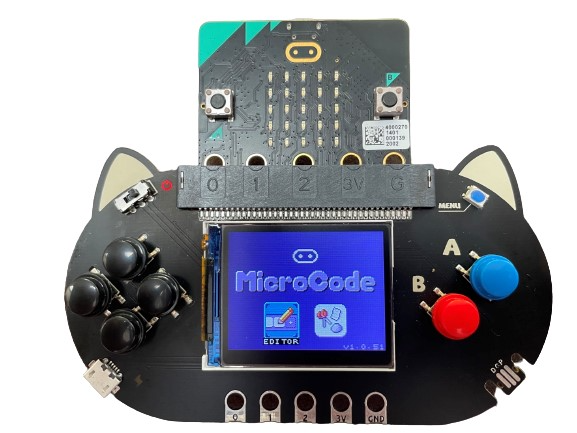
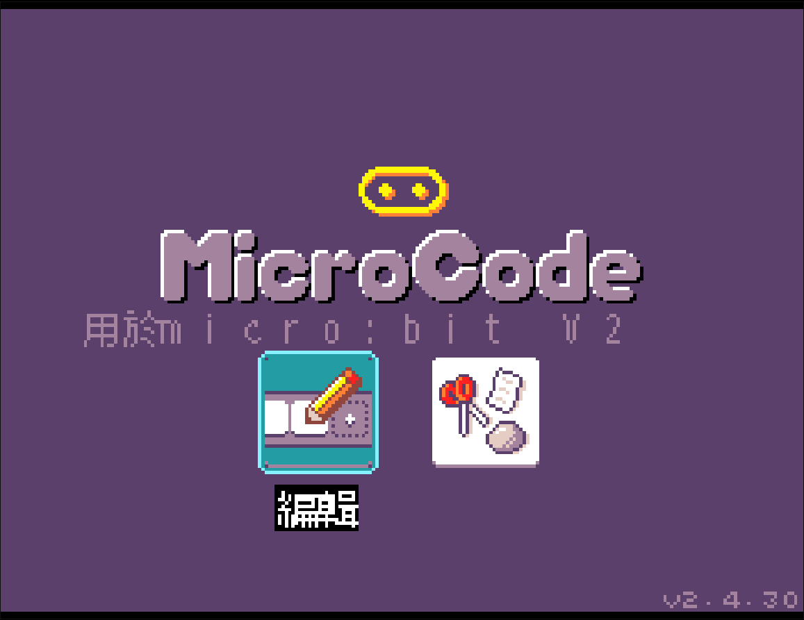
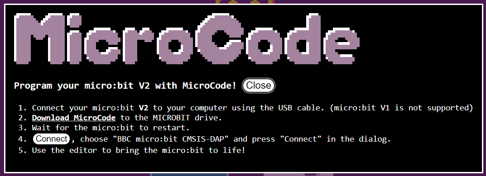
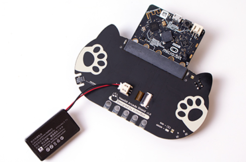
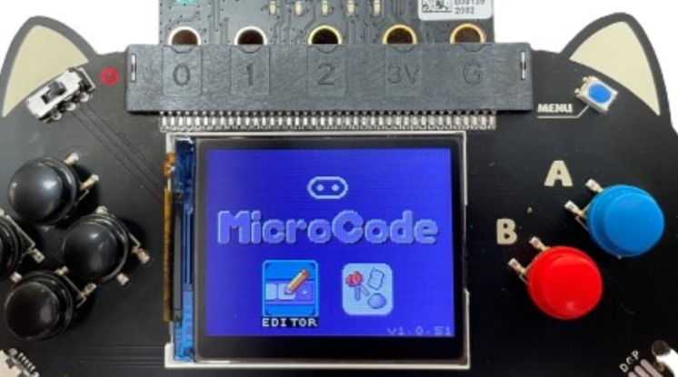
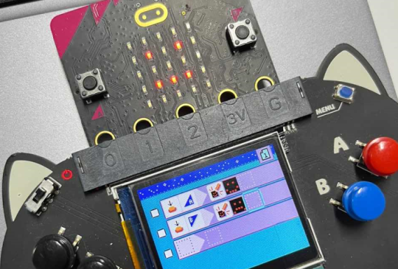
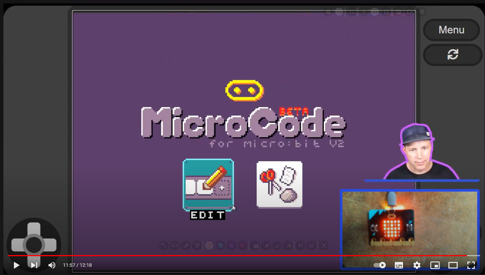

# MicroCode介紹

MicroCode是由Microsoft開發的編程平台，它設計的目的是為了讓更低年級的學生都可以接觸到編程教育。MicroCode使用了全圖像化的結構化編程語言，學生完全無需編程或電腦知識就可以編寫簡單的Micro:bit V2程式。

## [MicroCode官網](https://microsoft.github.io/microcode/#H4sIAEmiv2MAA32OWwuCMBiG/1JmB3aZIrXhFJmH5V1lwre0AhWdv75PZ9BVVy8PvKe7Zv2tJs/8mNZUvfe0OkBYtah0UY7aQDJ6IEUPkaC7TDMnTAzHhoMAWFGK4cdP//q5chwKyPEZpFw1+CPG/Svmt5Fghe8yZ+aHN3B35sDwSnMPu6aMbS2b5muZWsQ/4Tbght2SpVdMua939rhsnUs2XjLSUfWCQtEucDeaAyMf85b1ohABAAA=)

## MicroCode特色

- 全圖像化編程
    - 以圖示表達各種功能
    - 即使初小學生也能輕易掌握
    
- 簡易編程邏輯
    - 以輸入+輸出為核心的編程語言
    - 即使初小學生也能輕易掌握
    
- 實時編程+運行
    - 在電腦上的編程會在Micro:bit上實時同步下載
    - 亦實現可以離線編程

- 支援Newbit Arcade Shield
    - 能透過Newbit Arcade Shield脫離電腦下進行編程
    - [Newbit Arcade Shield介紹](https://kittenbothk.readthedocs.io/en/latest/Microbit_eboard/arcade_shield/arcadeshield.html)
    
- 支援Jacdac模組
    - 連接Jacdac模組加入更多玩法
    - [Jacdac介紹](https://kittenbothk.readthedocs.io/en/latest/jacdac/index.html)
  
- 儲存功能
    - 寫好的程式會儲存在Micro:bit上，即使斷電再開也不會遺失進度
    
## MicroCode用法

MicroCode支援Micro:bit V2，用家只需要將MicroCode下載到Micro:bit就可以開始使用。

[MicroCode官網](https://microsoft.github.io/microcode/#H4sIAMDPv2MAA32OWwuCMBiG/1JmB3aZIrXhFJmH5V1lwre0AhWdv75PZ9BVVy8PvKe7Zv2tJs/8mNZUvfe0OkBYtah0UY7aQDJ6IEUPkaC7TDMnTAzHhoMAWFGK4cdP//q5chwKyPEZpFw1+CPG/Svmt5Fghe8yZ+aHN3B35sDwSnMPu6aMbS2b5muZWsQ/4Tbght2SpVdMua939rhsnUs2XjLSUfWCQtEucDeaAyMf85b1ohABAAA=)

[下載MicroCode](https://microsoft.github.io/microcode/assets/hex/microcode-zh-hk.hex)

### 在線使用

首先用USB線將Micro:bit連接到電腦。

前往MicroCode官網。

假如還未下載MicroCode到Micro:bit上，可以按連結下載。

點擊視窗裡的Connect按鈕，然後選擇Micro:bit CMSIS-DAP。

連接成功後就可以開始編程。

### 離線使用

MicroCode的離線使用需要用到Micro:bit V2和Newbit Arcade Shield。

將MicroCode下載到Micro:bit V2。

打開電源後屏幕就會顯示MicroCode的介面。

然後就可以開始編程。

## 編程教學

在MicroCode的主頁有2個選項，第一是編寫程式，第二是打開範例。

使用Newbit的方向鍵選擇，按A確認。

進入編程的頁面後就會顯示先前儲存的程式，您可以繼續更改。

進入範例頁面就可以打開各種示範程式，或者建立新程式。選擇或建立程式後就會打開該程式的編程頁面。

## 微軟官方示範短片

[MicroCode示範影片](https://www.youtube.com/watch?time_continue=717&v=mbF-HU9IZ-A&feature=emb_title)